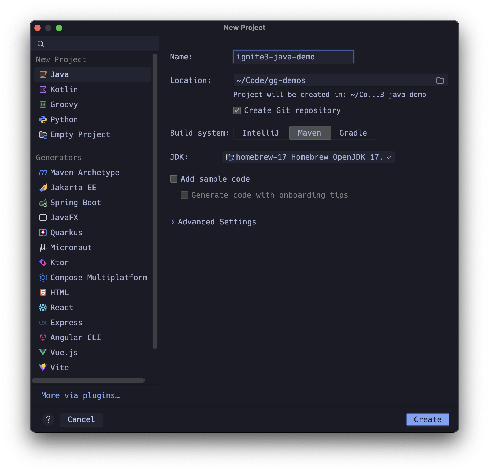
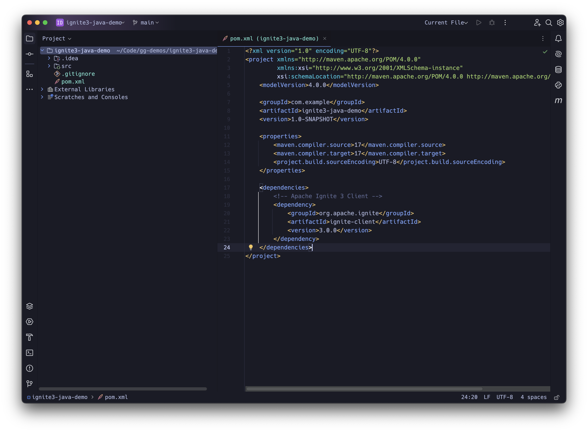
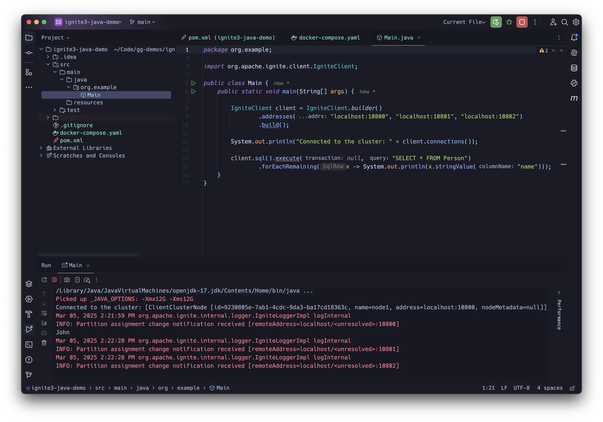

# Getting Started with Apache Ignite 3 Using Java API

This guide walks you through creating a Java application that connects to an Apache Ignite 3 cluster, demonstrating how to use Ignite's Java API to work with data.

## Prerequisites

* JDK 17 or later
* IntelliJ IDEA
* Docker and Docker Compose

## Setting Up Your Java Project in IntelliJ IDEA

### Create a New Java Project

* Open IntelliJ IDEA and select "New Project"
* Choose "Java" as the project type
* Select JDK 17 (or later) for your project SDK
* Name your project (e.g., "ignite3-java-demo")
* Click "Create"



### Configure Maven Dependencies

* Open the generated `pom.xml` file and add the following:

```xml
    <dependencies>
        <!-- Apache Ignite 3 Client -->
        <dependency>
            <groupId>org.apache.ignite</groupId>
            <artifactId>ignite-client</artifactId>
            <version>3.0.0</version>
        </dependency>
    </dependencies>
```

* Refresh Maven to download the dependencies



## Setting Up a Docker Compose File for Ignite 3

Now let's create a Docker Compose file inside our project to set up a local three-node Ignite 3 cluster:

* Create a file named `docker-compose.yml` in the root directory of your project
* Add the following content:

```yaml
# Docker Compose file for running an Apache Ignite 3 cluster.  
#  
# Usage:  
# - To start only the Ignite nodes (default behavior):  
#     docker compose up  
#  
# - To start the Ignite nodes along with the optional cloud-connector:  
#     docker compose --profile cloud-connector up  
#  
# The cloud-connector service is disabled by default and will only start if the "cloud-connector" profile is specified.  
#  
# - To start the CLI:  
#     docker run --rm -it --network=host -e LANG=C.UTF-8 -e LC_ALL=C.UTF-8 apacheignite/ignite:3.0.0 cli  
#  
# - To initialize the cluster  
#     cluster init --name=ignite3 --metastorage-group=node1,node2,node3  
#  
  
name: ignite3  
  
x-ignite-def: &ignite-def  
  image: apacheignite/ignite:3.0.0  
  environment:  
    JVM_MAX_MEM: "4g"  
    JVM_MIN_MEM: "4g"  
  configs:  
    - source: node_config  
      target: /opt/ignite/etc/ignite-config.conf  
  
services:  
  node1:  
    <<: *ignite-def  
    command: --node-name node1  
    ports:  
      - "10300:10300"  
      - "10800:10800"  
  node2:  
    <<: *ignite-def  
    command: --node-name node2  
    ports:  
      - "10301:10300"  
      - "10801:10800"  
  node3:  
    <<: *ignite-def  
    command: --node-name node3  
    ports:  
      - "10302:10300"  
      - "10802:10800"  
  
configs:  
  node_config:  
    content: |  
      ignite {  
        network {  
          port: 3344  
          nodeFinder.netClusterNodes = ["node1:3344", "node2:3344", "node3:3344"]  
        }  
      }
```

### Starting the Ignite Cluster

* Open a terminal in the directory containing your `docker-compose.yml` file
* Run: `docker compose up -d && docker compose logs -f`
* Check the status with: `docker compose ps`

### Initializing the Cluster

* Open a second terminal in the directory containing your `docker-compose.yml` file
* Run the Ignite CLI:

  ```bash
  docker run --rm -it --network=host -e LANG=C.UTF-8 -e LC_ALL=C.UTF-8 apacheignite/ignite:3.0.0 cli
  ```

* Connect to the default node by selecting Yes or `connect http://localhost:10300`
* Inside the CLI, initialize the cluster:

  ```shell
  cluster init --name=ignite3 --metastorage-group=node1,node2,node3
  ```

* Enter SQL cli mode by typing `sql`
* Create a "Person" table:

  ```sql
  CREATE TABLE Person (id INT PRIMARY KEY, name VARCHAR);
  INSERT INTO Person (id, name) VALUES (1, 'John');
  ```
  
* Exit sql cli mode by typing `exit;`

```text
           #              ___                         __
         ###             /   |   ____   ____ _ _____ / /_   ___
     #  #####           / /| |  / __ \ / __ `// ___// __ \ / _ \
   ###  ######         / ___ | / /_/ // /_/ // /__ / / / // ___/
  #####  #######      /_/  |_|/ .___/ \__,_/ \___//_/ /_/ \___/
  #######  ######            /_/
    ########  ####        ____               _  __           _____
   #  ########  ##       /  _/____ _ ____   (_)/ /_ ___     |__  /
  ####  #######  #       / / / __ `// __ \ / // __// _ \     /_ <
   #####  #####        _/ / / /_/ // / / // // /_ / ___/   ___/ /
     ####  ##         /___/ \__, //_/ /_//_/ \__/ \___/   /____/
       ##                  /____/

                      Apache Ignite CLI version 3.0.0


You appear to have not connected to any node yet. Do you want to connect to the default node http://localhost:10300? [Y/n] n
[disconnected]> connect http://localhost:10300
Connected to http://localhost:10300
The cluster is not initialized. Run cluster init command to initialize it.
[node1]>   cluster init --name=ignite3 --metastorage-group=node1,node2,node3
Cluster was initialized successfully
[node1]> sql
sql-cli> CREATE TABLE Person (id INT PRIMARY KEY, name VARCHAR);
> INSERT INTO Person (id, name) VALUES (1, 'John');
Updated 0 rows.
Updated 1 rows.

sql-cli> exit;
[node1]> 
```

## Building Your Main Application Class

Now let's create the Main class and build our application step by step. As we add each code block, IntelliJ will prompt you to import the required dependencies.

### Create the Main Class

* Right-click on the `src/main/java` directory
* Select "New" > "Package" and name it `org.example`
* Right-click on the new package and select "New" > "Java Class"
* Name the class "Main"

### Setting Up the Boilerplate

Start with a basic Main class structure:

```java
package org.example;

public class Main {
    public static void main(String[] args) {
        // We'll add our code here
    }
}
```

### Connecting to the Ignite Cluster

> Let IntelliJ automatically add the import for `IgniteClient`.

First, establish a connection to our Ignite cluster using the client API:

```java
IgniteClient client = IgniteClient.builder()
        .addresses("localhost:10800", "localhost:10801", "localhost:10802")
        .build();

System.out.println("Connected to the cluster: " + client.connections());
```

This creates a client that connects to the three nodes we've set up with Docker. The ports (10800, 10801, 10802) match the ports we exposed in our Docker Compose file.

### Querying an Existing Table

Next, let's query the "Person" table we created during the cluster setup:

```java
client.sql().execute(null, "SELECT * FROM Person")
        .forEachRemaining(x -> System.out.println(x.stringValue("name")));
```

This executes a SQL query against the cluster and prints the name of each person. The first parameter (`null`) is for transactions - we're not using one here.



### Creating a New Table Using Java API

Now, let's create a new table using Ignite's Java API:

```java
Table table = client.catalog().createTable(TableDefinition.builder("Person2")
        .ifNotExists()
        .columns(
                ColumnDefinition.column("ID", ColumnType.INT32),
                ColumnDefinition.column("NAME", ColumnType.VARCHAR))
        .primaryKey("ID")
        .build());
```

This code:

* Creates a table named "Person2"
* Adds two columns: ID (integer) and NAME (string)
* Sets ID as the primary key
* Uses `ifNotExists()` to avoid errors if the table already exists

### Adding Data Using Record View with Tuples

There are multiple ways to interact with tables in Ignite 3. First, let's use the RecordView with Tuples:

```java
RecordView<Tuple> recordView = table.recordView();
recordView.upsert(null, Tuple.create().set("id", 2).set("name", "Jane"));
```

This creates a Tuple with id=2 and name="Jane" and inserts it into the table.

### Adding Data Using Record View with POJOs

For this, we need a POJO (Plain Old Java Object) class to represent our data. This should be inside the Main class:

```java
public static class Person {
    public Person() { }

    public Person(Integer id, String name) {
        this.id = id;
        this.name = name;
    }

    Integer id;
    String name;
}
```

Now use the Person class with the RecordView to insert data:

```java
RecordView<Person> pojoView = table.recordView(Person.class);
pojoView.upsert(null, new Person(3, "Jack"));
```

This inserts a new Person with id=3 and name="Jack".

### Adding Data Using Key-Value View with Tuples

The KeyValueView treats the table as a key-value store:

```java
KeyValueView<Tuple, Tuple> keyValueView = table.keyValueView();
keyValueView.put(null, Tuple.create().set("id", 4), Tuple.create().set("name", "Jill"));
```

Here we insert a record with id=4 and name="Jill" using key-value semantics.

### Adding Data Using Key-Value View with Native Types

We can also use native Java types with KeyValueView:

```java
KeyValueView<Integer, String> keyValuePojoView = table.keyValueView(Integer.class, String.class);
keyValuePojoView.put(null, 5, "Joe");
```

This inserts a record with id=5 and name="Joe" using native types.

### Querying the New Table

Add code to query our newly created table:

```java
client.sql().execute(null, "SELECT * FROM Person2")
        .forEachRemaining(x -> System.out.println(x.stringValue("name")));
```

### Closing the Client

Always close your client when you're done:

```java
client.close();
```

This releases resources and closes the connection to the cluster.

### Complete Main.java File

After adding all the pieces, your complete `Main.java` file should look like this:

```java
package org.example;

import org.apache.ignite.catalog.ColumnType;
import org.apache.ignite.catalog.definitions.ColumnDefinition;
import org.apache.ignite.catalog.definitions.TableDefinition;
import org.apache.ignite.client.IgniteClient;
import org.apache.ignite.table.KeyValueView;
import org.apache.ignite.table.RecordView;
import org.apache.ignite.table.Table;
import org.apache.ignite.table.Tuple;

public class Main {
    public static void main(String[] args) {
        IgniteClient client = IgniteClient.builder()
                .addresses("localhost:10800", "localhost:10801", "localhost:10802")
                .build();

        System.out.println("Connected to the cluster: " + client.connections());

        // SQL API (use table created in CLI).
        client.sql().execute(null, "SELECT * FROM Person")
                .forEachRemaining(x -> System.out.println(x.stringValue("name")));

        // Java APIs
        Table table = client.catalog().createTable(TableDefinition.builder("Person2")
                .ifNotExists()
                .columns(
                        ColumnDefinition.column("ID", ColumnType.INT32),
                        ColumnDefinition.column("NAME", ColumnType.VARCHAR))
                .primaryKey("ID")
                .build());

        // All table view types provide identical capabilities.
        RecordView<Tuple> recordView = table.recordView();
        recordView.upsert(null, Tuple.create().set("id", 2).set("name", "Jane"));

        RecordView<Person> pojoView = table.recordView(Person.class);
        pojoView.upsert(null, new Person(3, "Jack"));

        KeyValueView<Tuple, Tuple> keyValueView = table.keyValueView();
        keyValueView.put(null, Tuple.create().set("id", 4), Tuple.create().set("name", "Jill"));

        KeyValueView<Integer, String> keyValuePojoView = table.keyValueView(Integer.class, String.class);
        keyValuePojoView.put(null, 5, "Joe");

        // Mix and match APIs.
        client.sql().execute(null, "SELECT * FROM Person2")
                .forEachRemaining(x -> System.out.println(x.stringValue("name")));

        // Close the client to release resources
        client.close();
    }

    public static class Person {
        public Person() { }

        public Person(Integer id, String name) {
            this.id = id;
            this.name = name;
        }

        Integer id;
        String name;
    }
}
```

## Running Your Application

To run your application in IntelliJ IDEA:

* Make sure your Ignite cluster is running (check with `docker compose ps`)
* Click the green "Run" button next to the `main` method in your IntelliJ IDEA

_[Screenshot: IntelliJ Run Configuration window]_

## Expected Output

If everything is set up correctly, you should see output similar to:

```text
Connected to the cluster: Connections{active=1, total=1}
John
Jane
Jack
Jill
Joe
```

## Stopping the Ignite Cluster

Stop your Ignite cluster once you are done with this exercise.

* Exit completely from the Ignite 3 CLI and close the terminal window.
* In the terminal window that you used to launch the cluster, use ctrl-c to exit log view.
* Stop the cluster with `docker compose down`

```shell
docker compose down

[+] Running 4/4
 ✔ Container ignite3-node2-1  Removed                                   2.4s 
 ✔ Container ignite3-node1-1  Removed                                   2.3s 
 ✔ Container ignite3-node3-1  Removed                                   2.3s 
 ✔ Network ignite3_default    Removed                                   0.3s 
```

## Troubleshooting

### Connection Issues

If you receive a connection error like `Connection refused`, make sure:

* Your Ignite 3 Docker containers are running
* The ports in the docker-compose file match the ports in your client configuration
* No firewall is blocking the connections

### Table Not Found

If you see a `Table not found` error for the "Person" table, make sure you've created it on your Ignite cluster using the CLI before running the application.

### Docker Network Issues

If you're having trouble connecting to the Ignite nodes, try:

* Using the Docker container IPs instead of localhost (run `docker inspect [container_name]` to find the IP)
* Making sure your host machine can access the mapped ports

## Understanding the Key Concepts

### Table Views

Ignite 3 provides several ways to interact with tables:

* **RecordView**: Views the table as a collection of records, allowing you to work with the entire record at once.
  * With Tuples: Uses generic Tuple objects to represent records
  * With POJOs: Maps records to your custom Java classes

* **KeyValueView**: Views the table as a key-value store, similar to a Map.
  * With Tuples: Uses Tuple objects for both keys and values
  * With Native Types: Uses Java types directly (e.g., Integer, String)

### Java API vs. SQL

Ignite 3 provides both a rich Java API and SQL support:

* **Java API**: Provides type safety and integration with Java code
* **SQL**: Provides a familiar query language and is often more concise for complex queries

The example demonstrates that you can mix and match these approaches in your application.

## Next Steps

Now that you've set up a basic Ignite 3 Java application and connected to a cluster, you can:

* Explore Ignite's transaction capabilities
* Work with more complex schemas and data types
* Try different partitioning strategies for your tables
* Experiment with Ignite's compute features for distributed processing

For more details, refer to the [Apache Ignite 3 Java API documentation](https://ignite.apache.org/releases/3.0.0/javadoc/index.html).
