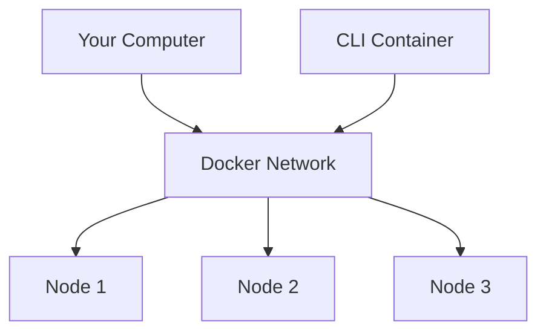
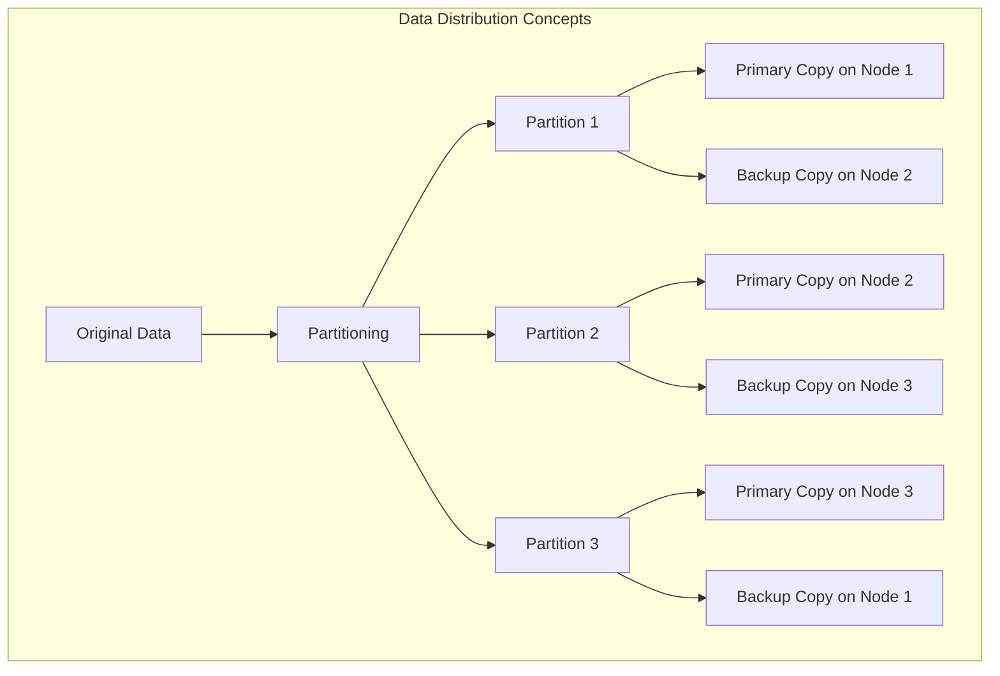
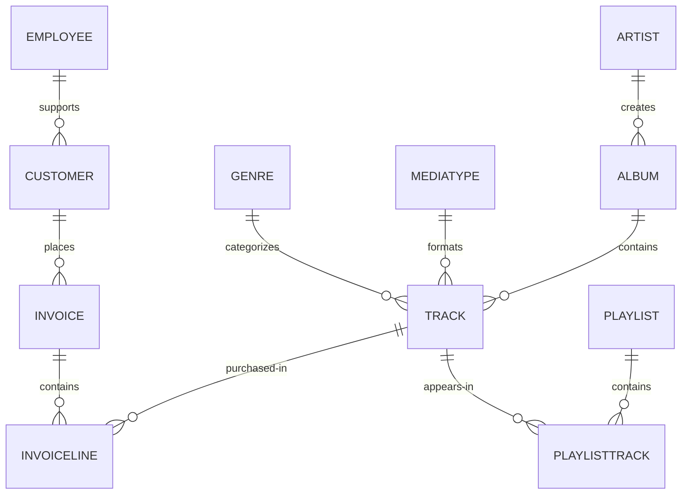
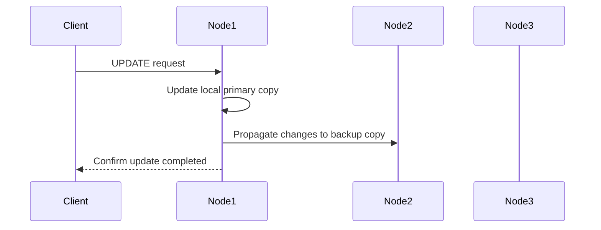
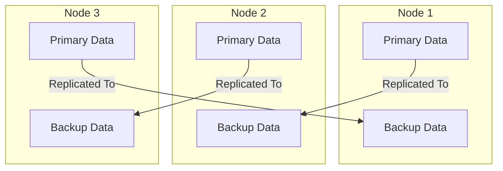
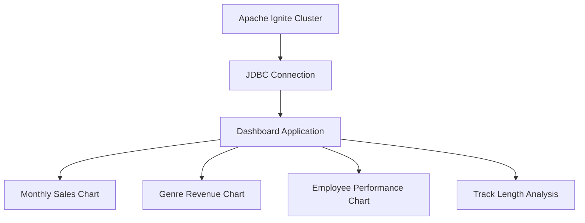

# Getting Started with Apache Ignite 3 SQL

This guide walks you through using Apache Ignite 3's SQL capabilities via the command-line interface. You'll set up a distributed Apache Ignite cluster, create and manipulate the Chinook database (a sample database representing a digital media store), and learn to leverage Ignite's powerful SQL features.

## Prerequisites

* Docker and Docker Compose installed on your system
* Basic familiarity with SQL
* Command-line terminal access
* 8GB+ of available RAM for running the containers
* SQL directory with Chinook Database files downloaded

> [!WARNING]
> Before starting, make sure you've downloaded the `docker-compose.yml` and `sql` directory from this repository and place them in the same directory where you'll be running the Docker CLI commands. The tutorial expects these SQL files to be available and mounted to the container. Without these files, you won't be able to load the sample data needed for the exercises.

## Setting Up an Apache Ignite 3 Cluster

Before we can start using SQL, we need to set up a multi-node Ignite cluster. We'll use Docker Compose to create a three-node cluster.



### Starting the Cluster

Open a terminal in the directory containing this guide and locate your `docker-compose.yml` file and start the cluster:

```bash
docker compose up -d
```

This command starts the cluster in detached mode and follows the logs. You should see startup messages from all three nodes. When they're ready, you'll see messages indicating that the servers have started successfully.

```bash
docker compose up -d 

[+] Running 4/4
 ✔ Network ignite3_default    Created
 ✔ Container ignite3-node2-1  Started 
 ✔ Container ignite3-node1-1  Started
 ✔ Container ignite3-node3-1  Started
```

Once the cluster is running, press Ctrl+C to exit the log view. You can check that all containers are running with:

```bash
docker compose ps
```

You should see all three nodes with a "running" status.

> [!TIP]
> **Checkpoint**: Verify that all three nodes are showing as "running" before continuing. This ensures your cluster is properly set up for the following steps.

## Connecting to the Cluster Using Ignite CLI

Now we'll connect to our running cluster using Ignite's command-line interface (CLI).

### Starting the CLI

In your terminal, run:

```bash
docker run --rm -it \
  --network=ignite3_default \
  -e LANG=C.UTF-8 \
  -e LC_ALL=C.UTF-8 \
  -v ./sql/:/opt/ignite/downloads/ \
  apacheignite/ignite:3.0.0 \
  cli
```

This starts an interactive CLI container connected to the same Docker network as our cluster and mounts a volume containing the sql files for the Chinook Database. When prompted, connect to the first node by entering:

```
connect http://node1:10300
```

You should see a message that you're connected to `http://node1:10300` and possibly a note that the cluster is not initialized.

> [!NOTE]
> The CLI container runs separately from your cluster nodes but connects to them over the Docker network. This separation follows best practices for management interfaces.

### Initializing the Cluster

Before we can use the cluster, we need to initialize it:

```
cluster init --name=ignite3 --metastorage-group=node1,node2,node3
```

```bash


           #              ___                         __
         ###             /   |   ____   ____ _ _____ / /_   ___
     #  #####           / /| |  / __ \ / __ `// ___// __ \ / _ \
   ###  ######         / ___ | / /_/ // /_/ // /__ / / / // ___/
  #####  #######      /_/  |_|/ .___/ \__,_/ \___//_/ /_/ \___/
  #######  ######            /_/
    ########  ####        ____               _  __           _____
   #  ########  ##       /  _/____ _ ____   (_)/ /_ ___     |__  /
  ####  #######  #       / / / __ `// __ \ / // __// _ \     /_ <
   #####  #####        _/ / / /_/ // / / // // /_ / ___/   ___/ /
     ####  ##         /___/ \__, //_/ /_//_/ \__/ \___/   /____/
       ##                  /____/

                      Apache Ignite CLI version 3.0.0


You appear to have not connected to any node yet. Do you want to connect to the default node http://localhost:10300? [Y/n] n
[disconnected]> connect http://node1:10300
Connected to http://node1:10300
The cluster is not initialized. Run cluster init command to initialize it.
[node1]> cluster init --name=ignite3 --metastorage-group=node1,node2,node3
Cluster was initialized successfully
[node1]> 
```

> [!TIP]
> **Checkpoint**: You should see the "Cluster was initialized successfully" message before proceeding. This confirms that your cluster is properly initialized and ready for database operations.

## Understanding Distributed Database Concepts

Before we dive into creating the schema, let's understand how Apache Ignite distributes data across the cluster:



> [!IMPORTANT]
> In Apache Ignite, data is distributed across nodes for scalability and fault tolerance. Distribution zones control how many copies (replicas) of your data exist and on which nodes they're stored. Colocation ensures that related data is kept on the same node to optimize joins.

## Creating the Chinook Database Schema

Now that our cluster is running and initialized, we can start using SQL to create and work with data. The Chinook database represents a digital music store, with tables for artists, albums, tracks, customers, and sales.

### Entering SQL Mode

To start working with SQL, enter SQL mode in the CLI:

```
sql
```

Your prompt should change to `sql-cli>` indicating you're now in SQL mode.

```text
[node1]> sql
sql-cli> 
```

### Creating Distribution Zones

Before we create tables, let's set up distribution zones to control how our data is distributed and replicated across the cluster:

```sql
CREATE ZONE IF NOT EXISTS Chinook WITH replicas=2, storage_profiles='default';
CREATE ZONE IF NOT EXISTS ChinookReplicated WITH replicas=3, partitions=25, storage_profiles='default';
```

These commands create two zones:

* `Chinook` - Standard zone with 2 replicas for most tables
* `ChinookReplicated` - Zone with 3 replicas for frequently accessed reference data

> [!NOTE]
> We use 2 replicas for most tables to balance data safety with storage efficiency. For small, frequently accessed reference tables like `Genre` and `MediaType`, we use 3 replicas (one on each node) to maximize read performance.

### Database Entity Relationship

Here's the entity relationship diagram for our Chinook database:



### Creating Core Tables

Now let's create the main tables for the Chinook database. We'll start with the Artist and Album tables:

```sql
CREATE TABLE Artist (
    ArtistId INT NOT NULL,
    Name VARCHAR(120),
    PRIMARY KEY (ArtistId)
) ZONE Chinook;

CREATE TABLE Album (
    AlbumId INT NOT NULL,
    Title VARCHAR(160) NOT NULL,
    ArtistId INT NOT NULL,
    ReleaseYear INT,
    PRIMARY KEY (AlbumId, ArtistId)
) COLOCATE BY (ArtistId) ZONE Chinook;
```

> [!NOTE]
> The `COLOCATE BY` clause in the Album table ensures that albums by the same artist are stored on the same nodes. This optimizes joins between Artist and Album tables by eliminating the need for network transfers during queries.

Next, let's create the Genre and MediaType reference tables:

```sql
CREATE TABLE Genre (
    GenreId INT NOT NULL,
    Name VARCHAR(120),
    PRIMARY KEY (GenreId)
) ZONE ChinookReplicated;

CREATE TABLE MediaType (
    MediaTypeId INT NOT NULL,
    Name VARCHAR(120),
    PRIMARY KEY (MediaTypeId)
) ZONE ChinookReplicated;
```

> [!NOTE]
> These reference tables are placed in the `ChinookReplicated` zone with 3 replicas because they contain static data that is frequently joined with other tables. Having a copy on each node improves read performance.

Now, let's create the Track table, which references the Album, Genre, and MediaType tables:

```sql
CREATE TABLE Track (
    TrackId INT NOT NULL,
    Name VARCHAR(200) NOT NULL,
    AlbumId INT,
    MediaTypeId INT NOT NULL,
    GenreId INT,
    Composer VARCHAR(220),
    Milliseconds INT NOT NULL,
    Bytes INT,
    UnitPrice NUMERIC(10,2) NOT NULL,
    PRIMARY KEY (TrackId, AlbumId)
) COLOCATE BY (AlbumId) ZONE Chinook;
```

> [!NOTE]
> Tracks are colocated by AlbumId, not by TrackId, because most queries join tracks with their albums. This colocation optimizes these common join patterns.

Let's also create tables to manage customers, employees, and sales:

```sql
CREATE TABLE Employee (
    EmployeeId INT NOT NULL,
    LastName VARCHAR(20) NOT NULL,
    FirstName VARCHAR(20) NOT NULL,
    Title VARCHAR(30),
    ReportsTo INT,
    BirthDate DATE,
    HireDate DATE,
    Address VARCHAR(70),
    City VARCHAR(40),
    State VARCHAR(40),
    Country VARCHAR(40),
    PostalCode VARCHAR(10),
    Phone VARCHAR(24),
    Fax VARCHAR(24),
    Email VARCHAR(60),
    PRIMARY KEY (EmployeeId)
) ZONE Chinook;

CREATE TABLE Customer (
    CustomerId INT NOT NULL,
    FirstName VARCHAR(40) NOT NULL,
    LastName VARCHAR(20) NOT NULL,
    Company VARCHAR(80),
    Address VARCHAR(70),
    City VARCHAR(40),
    State VARCHAR(40),
    Country VARCHAR(40),
    PostalCode VARCHAR(10),
    Phone VARCHAR(24),
    Fax VARCHAR(24),
    Email VARCHAR(60) NOT NULL,
    SupportRepId INT,
    PRIMARY KEY (CustomerId)
) ZONE Chinook;

CREATE TABLE Invoice (
    InvoiceId INT NOT NULL,
    CustomerId INT NOT NULL,
    InvoiceDate DATE NOT NULL,
    BillingAddress VARCHAR(70),
    BillingCity VARCHAR(40),
    BillingState VARCHAR(40),
    BillingCountry VARCHAR(40),
    BillingPostalCode VARCHAR(10),
    Total NUMERIC(10,2) NOT NULL,
    PRIMARY KEY (InvoiceId, CustomerId)
) COLOCATE BY (CustomerId) ZONE Chinook;

CREATE TABLE InvoiceLine (
    InvoiceLineId INT NOT NULL,
    InvoiceId INT NOT NULL,
    TrackId INT NOT NULL,
    UnitPrice NUMERIC(10,2) NOT NULL,
    Quantity INT NOT NULL,
    PRIMARY KEY (InvoiceLineId, InvoiceId)
) COLOCATE BY (InvoiceId) ZONE Chinook;
```

> [!NOTE]
> Invoices are colocated by CustomerId and InvoiceLines are colocated by InvoiceId. This creates an efficient chain of locality: Customer → Invoice → InvoiceLine, optimizing queries that analyze customer purchase history.

Finally, let's create the playlist-related tables:

```sql
CREATE TABLE Playlist (
    PlaylistId INT NOT NULL,
    Name VARCHAR(120),
    PRIMARY KEY (PlaylistId)
) ZONE Chinook;

CREATE TABLE PlaylistTrack (
    PlaylistId INT NOT NULL,
    TrackId INT NOT NULL,
    PRIMARY KEY (PlaylistId, TrackId)
) ZONE Chinook;
```

> [!CAUTION]
> Note that PlaylistTrack is not colocated with Track. This is a design decision that prioritizes playlist operations over joining with track details. In a real-world scenario, you might make a different colocation choice depending on your most common query patterns.

### Verifying Table Creation

Let's confirm that all our tables were created successfully:

```sql
SELECT * FROM system.tables WHERE schema = 'PUBLIC';
```

This query checks the system tables to verify that our tables exist. You should see a list of all the tables we've created.

```bash
sql-cli> SELECT * FROM system.tables WHERE schema = 'PUBLIC';
╔════════╤═══════════════╤════╤═════════════╤═══════════════════╤═════════════════╤══════════════════════╗
║ SCHEMA │ NAME          │ ID │ PK_INDEX_ID │ ZONE              │ STORAGE_PROFILE │ COLOCATION_KEY_INDEX ║
╠════════╪═══════════════╪════╪═════════════╪═══════════════════╪═════════════════╪══════════════════════╣
║ PUBLIC │ ALBUM         │ 20 │ 21          │ CHINOOK           │ default         │ ARTISTID             ║
╟────────┼───────────────┼────┼─────────────┼───────────────────┼─────────────────┼──────────────────────╢
║ PUBLIC │ GENRE         │ 22 │ 23          │ CHINOOKREPLICATED │ default         │ GENREID              ║
╟────────┼───────────────┼────┼─────────────┼───────────────────┼─────────────────┼──────────────────────╢
║ PUBLIC │ ARTIST        │ 18 │ 19          │ CHINOOK           │ default         │ ARTISTID             ║
╟────────┼───────────────┼────┼─────────────┼───────────────────┼─────────────────┼──────────────────────╢
║ PUBLIC │ TRACK         │ 26 │ 27          │ CHINOOK           │ default         │ ALBUMID              ║
╟────────┼───────────────┼────┼─────────────┼───────────────────┼─────────────────┼──────────────────────╢
║ PUBLIC │ PLAYLIST      │ 36 │ 37          │ CHINOOK           │ default         │ PLAYLISTID           ║
╟────────┼───────────────┼────┼─────────────┼───────────────────┼─────────────────┼──────────────────────╢
║ PUBLIC │ PLAYLISTTRACK │ 38 │ 39          │ CHINOOK           │ default         │ PLAYLISTID, TRACKID  ║
╟────────┼───────────────┼────┼─────────────┼───────────────────┼─────────────────┼──────────────────────╢
║ PUBLIC │ MEDIATYPE     │ 24 │ 25          │ CHINOOKREPLICATED │ default         │ MEDIATYPEID          ║
╟────────┼───────────────┼────┼─────────────┼───────────────────┼─────────────────┼──────────────────────╢
║ PUBLIC │ INVOICELINE   │ 34 │ 35          │ CHINOOK           │ default         │ INVOICEID            ║
╟────────┼───────────────┼────┼─────────────┼───────────────────┼─────────────────┼──────────────────────╢
║ PUBLIC │ EMPLOYEE      │ 28 │ 29          │ CHINOOK           │ default         │ EMPLOYEEID           ║
╟────────┼───────────────┼────┼─────────────┼───────────────────┼─────────────────┼──────────────────────╢
║ PUBLIC │ CUSTOMER      │ 30 │ 31          │ CHINOOK           │ default         │ CUSTOMERID           ║
╟────────┼───────────────┼────┼─────────────┼───────────────────┼─────────────────┼──────────────────────╢
║ PUBLIC │ INVOICE       │ 32 │ 33          │ CHINOOK           │ default         │ CUSTOMERID           ║
╚════════╧═══════════════╧════╧═════════════╧═══════════════════╧═════════════════╧══════════════════════╝
```

> [!TIP]
> **Checkpoint**: Verify that all tables appear in the system.tables output with their proper zones and colocation settings before proceeding to the next section.

## Inserting Sample Data

Now that we have our tables set up, let's populate them with sample data.

### Adding Artists and Albums

Let's start by adding some artists. Exit the `sql-cli>` by typing `exit;`. Then load the current store catalog from the sql data file.

```bash
sql --file=/opt/ignite/downloads/current_catalog.sql
```

```bash
sql-cli> exit;
[node1]> sql --file=/opt/ignite/downloads/current_catalog.sql
Updated 275 rows.
Updated 347 rows.
```

### Adding Genres and Media Types

Let's populate our reference tables the same way:

```bash
sql --file=/opt/ignite/downloads/media_and_genre.sql
```

```bash
[node1]> sql --file=/opt/ignite/downloads/media_and_genre.sql
Updated 25 rows.
Updated 5 rows.
```

### Adding Tracks

Now let's add some tracks to our albums:

```bash
sql --file=/opt/ignite/downloads/tracks.sql
```

```bash
[node1]> sql --file=/opt/ignite/downloads/tracks.sql
Updated 1000 rows.
Updated 1000 rows.
Updated 1000 rows.
Updated 503 rows.
```

### Adding Employees and Customers

Let's add some employee and customer data:

```bash
sql --file=/opt/ignite/downloads/ee_and_cust.sql
```

```bash
[node1]> sql --file=/opt/ignite/downloads/ee_and_cust.sql
Updated 8 rows.
Updated 59 rows.
```

### Adding Invoices and Invoice Lines

Finally, let's add some sales data:

```bash
sql --file=/opt/ignite/downloads/invoices.sql
```

```bash
[node1]> sql --file=/opt/ignite/downloads/invoices.sql
Updated 412 rows.
Updated 1000 rows.
Updated 1000 rows.
Updated 240 rows.
Updated 18 rows.
Updated 1000 rows.
Updated 1000 rows.
Updated 1000 rows.
Updated 1000 rows.
Updated 1000 rows.
Updated 1000 rows.
Updated 1000 rows.
Updated 1000 rows.
Updated 715 rows.
```

> [!TIP]
> **Checkpoint**: Verify that all the data has been loaded successfully by checking that the "Updated X rows" messages match the expected row counts for each file.

## Querying Data in Ignite SQL

Now that we have data in our tables, let's run some SQL queries to explore the Chinook database.

### Basic Queries

Let's return to the `sql-cli>` and start with some simple SELECT queries:

```bash
sql
```

```sql
-- Get all artists
SELECT * FROM Artist;

-- Get all albums for a specific artist
SELECT * FROM Album WHERE ArtistId = 3;

-- Get all tracks for a specific album
SELECT * FROM Track WHERE AlbumId = 133;
```

```bash
sql-cli> SELECT * FROM Track WHERE AlbumId = 133;
╔═════════╤═════════════════════════════════════════╤═════════╤═════════════╤═════════╤════════════════════════════════════════════════════════╤══════════════╤══════════╤═══════════╗
║ TRACKID │ NAME                                    │ ALBUMID │ MEDIATYPEID │ GENREID │ COMPOSER                                               │ MILLISECONDS │ BYTES    │ UNITPRICE ║
╠═════════╪═════════════════════════════════════════╪═════════╪═════════════╪═════════╪════════════════════════════════════════════════════════╪══════════════╪══════════╪═══════════╣
║ 1633    │ Ramble On                               │ 133     │ 1           │ 1       │ Jimmy Page, Robert Plant                               │ 275591       │ 9199710  │ 0.99      ║
╟─────────┼─────────────────────────────────────────┼─────────┼─────────────┼─────────┼────────────────────────────────────────────────────────┼──────────────┼──────────┼───────────╢
║ 1628    │ What Is And What Should Never Be        │ 133     │ 1           │ 1       │ Jimmy Page, Robert Plant                               │ 287973       │ 9369385  │ 0.99      ║
╟─────────┼─────────────────────────────────────────┼─────────┼─────────────┼─────────┼────────────────────────────────────────────────────────┼──────────────┼──────────┼───────────╢
║ 1631    │ Heartbreaker                            │ 133     │ 1           │ 1       │ Jimmy Page, Robert Plant, John Paul Jones, John Bonham │ 253988       │ 8387560  │ 0.99      ║
╟─────────┼─────────────────────────────────────────┼─────────┼─────────────┼─────────┼────────────────────────────────────────────────────────┼──────────────┼──────────┼───────────╢
║ 1630    │ Thank You                               │ 133     │ 1           │ 1       │ Jimmy Page, Robert Plant                               │ 287791       │ 9337392  │ 0.99      ║
╟─────────┼─────────────────────────────────────────┼─────────┼─────────────┼─────────┼────────────────────────────────────────────────────────┼──────────────┼──────────┼───────────╢
║ 1627    │ Whole Lotta Love                        │ 133     │ 1           │ 1       │ Jimmy Page, Robert Plant, John Paul Jones, John Bonham │ 334471       │ 11026243 │ 0.99      ║
╟─────────┼─────────────────────────────────────────┼─────────┼─────────────┼─────────┼────────────────────────────────────────────────────────┼──────────────┼──────────┼───────────╢
║ 1629    │ The Lemon Song                          │ 133     │ 1           │ 1       │ Jimmy Page, Robert Plant, John Paul Jones, John Bonham │ 379141       │ 12463496 │ 0.99      ║
╟─────────┼─────────────────────────────────────────┼─────────┼─────────────┼─────────┼────────────────────────────────────────────────────────┼──────────────┼──────────┼───────────╢
║ 1632    │ Living Loving Maid (She's Just A Woman) │ 133     │ 1           │ 1       │ Jimmy Page, Robert Plant                               │ 159216       │ 5219819  │ 0.99      ║
╟─────────┼─────────────────────────────────────────┼─────────┼─────────────┼─────────┼────────────────────────────────────────────────────────┼──────────────┼──────────┼───────────╢
║ 1634    │ Moby Dick                               │ 133     │ 1           │ 1       │ John Bonham, John Paul Jones, Jimmy Page               │ 260728       │ 8664210  │ 0.99      ║
╟─────────┼─────────────────────────────────────────┼─────────┼─────────────┼─────────┼────────────────────────────────────────────────────────┼──────────────┼──────────┼───────────╢
║ 1635    │ Bring It On Home                        │ 133     │ 1           │ 1       │ Jimmy Page, Robert Plant                               │ 259970       │ 8494731  │ 0.99      ║
╚═════════╧═════════════════════════════════════════╧═════════╧═════════════╧═════════╧════════════════════════════════════════════════════════╧══════════════╧══════════╧═══════════╝
```

> [!TIP]
> **Checkpoint**: Run each of these basic queries and verify that you're getting reasonable results before moving on to more complex queries.

### Joins

Now let's try some more complex queries with joins:

```sql
-- Get all tracks with artist and album information
SELECT 
    t.Name AS TrackName, 
    a.Title AS AlbumTitle, 
    ar.Name AS ArtistName
FROM 
    Track t
    JOIN Album a ON t.AlbumId = a.AlbumId
    JOIN Artist ar ON a.ArtistId = ar.ArtistId
LIMIT 10;
```

> [!NOTE]
> This complex query uses multiple CTEs to achieve what would typically be done with the RANK() window function. We first count tracks per album, then determine the maximum track count per artist, and finally join these results to identify albums with the most tracks for each artist.

> [!TIP]
> **Checkpoint**: Execute each of these more complex queries to ensure they run successfully. Pay attention to the results to verify they match what you'd expect based on the database structure and relationships.

## Data Manipulation in Ignite SQL

Let's explore how to modify data using SQL in Ignite.

### Understanding Distributed Updates

When you update data in a distributed database, the changes need to be coordinated across multiple nodes:



### Inserting New Data

Let's add a new artist and album:

```sql
-- Insert a new artist
INSERT INTO Artist (ArtistId, Name) 
VALUES (276, 'New Discovery Band');

-- Insert a new album for this artist
INSERT INTO Album (AlbumId, Title, ArtistId, ReleaseYear) 
VALUES (348, 'First Light', 276, 2023);

-- Verify the insertions
SELECT * FROM Artist WHERE ArtistId = 276;
SELECT * FROM Album WHERE AlbumId = 348;
```

### Updating Existing Data

Now let's update some of our existing data:

```sql
-- Update the album release year
UPDATE Album 
SET ReleaseYear = 2024 
WHERE AlbumId = 348;

-- Update the artist name
UPDATE Artist 
SET Name = 'New Discovery Ensemble' 
WHERE ArtistId = 276;

-- Verify the updates
SELECT * FROM Artist WHERE ArtistId = 276;
SELECT * FROM Album WHERE AlbumId = 348;
```

> [!NOTE]
> In a distributed database like Ignite, these updates are automatically propagated to all replicas. The primary copy is updated first, then the changes are sent to the backup copies on other nodes.

### Deleting Data

Finally, let's clean up by deleting the data we added:

```sql
-- Delete the album
DELETE FROM Album WHERE AlbumId = 348;

-- Delete the artist
DELETE FROM Artist WHERE ArtistId = 276;

-- Verify the deletions
SELECT * FROM Artist WHERE ArtistId = 276;
SELECT * FROM Album WHERE AlbumId = 348;
```

## Advanced SQL Features

Let's explore some of Ignite's more advanced SQL features.

### Querying System Views

Ignite provides system views that let you inspect cluster metadata:

```sql
-- View all tables in the cluster
SELECT * FROM system.tables;

-- View all zones
SELECT * FROM system.zones;

-- View all columns for a specific table
SELECT * FROM system.table_columns WHERE TABLE_NAME = 'TRACK';
```

> [!NOTE]
> System views provide important metadata about your cluster configuration. They're essential for monitoring and troubleshooting in production environments.

### Distribution of Data in the Cluster



### Creating Indexes for Better Performance

Let's add some indexes to improve query performance:

```sql
-- Create an index on the Name column of the Track table
CREATE INDEX idx_track_name ON Track (Name);

-- Create a composite index on Artist and Album
CREATE INDEX idx_album_artist ON Album (ArtistId, Title);

-- Create a hash index for lookups by email
CREATE INDEX idx_customer_email ON Customer USING HASH (Email);

-- Check index information
SELECT * FROM system.indexes;
```

> [!IMPORTANT]
> Indexes improve query performance but come with maintenance costs. Each write operation must also update all indexes. Choose indexes that support your most common query patterns rather than indexing everything.

## Creating a Dashboard Using SQL

Let's create SQL queries that could be used for a music store dashboard. These queries could be saved and run periodically to generate reports.

### Monthly Sales Summary

```sql
-- Monthly sales summary for the last 12 months
SELECT 
    CAST(EXTRACT(YEAR FROM i.InvoiceDate) AS VARCHAR) || '-' || 
    CASE 
        WHEN EXTRACT(MONTH FROM i.InvoiceDate) < 10 
        THEN '0' || CAST(EXTRACT(MONTH FROM i.InvoiceDate) AS VARCHAR)
        ELSE CAST(EXTRACT(MONTH FROM i.InvoiceDate) AS VARCHAR)
    END AS YearMonth,
    COUNT(DISTINCT i.InvoiceId) AS InvoiceCount,
    COUNT(DISTINCT i.CustomerId) AS CustomerCount,
    SUM(i.Total) AS MonthlyRevenue,
    AVG(i.Total) AS AverageOrderValue
FROM 
    Invoice i
GROUP BY 
    EXTRACT(YEAR FROM i.InvoiceDate), EXTRACT(MONTH FROM i.InvoiceDate)
ORDER BY 
    YearMonth DESC;
```

> [!NOTE]
> This query formats the year and month into a sortable string (YYYY-MM) while calculating several key business metrics. This is a common pattern for time-series dashboards.

### Top Selling Genres

```sql
-- Top selling genres by revenue
SELECT
    g.Name AS Genre,
    SUM(il.UnitPrice * il.Quantity) AS Revenue
FROM
    InvoiceLine il
    JOIN Track t ON il.TrackId = t.TrackId
    JOIN Genre g ON t.GenreId = g.GenreId
GROUP BY
    g.Name
ORDER BY
    Revenue DESC;
```

### Sales Performance by Employee

```sql
-- Sales performance by employee
SELECT 
    e.EmployeeId,
    e.FirstName || ' ' || e.LastName AS EmployeeName,
    COUNT(DISTINCT i.InvoiceId) AS TotalInvoices,
    COUNT(DISTINCT i.CustomerId) AS UniqueCustomers,
    SUM(i.Total) AS TotalSales
FROM 
    Employee e
    JOIN Customer c ON e.EmployeeId = c.SupportRepId
    JOIN Invoice i ON c.CustomerId = i.CustomerId
GROUP BY 
    e.EmployeeId, e.FirstName, e.LastName
ORDER BY 
    TotalSales DESC;
```

### Top 20 Longest Tracks with Genres

```sql
-- Top 20 longest tracks with genre information
SELECT
    t.trackid,
    t.name AS track_name,
    g.name AS genre_name,
    ROUND(t.milliseconds / (1000 * 60), 2) AS duration_minutes
FROM
    track t
    JOIN genre g ON t.genreId = g.genreId
WHERE
    t.genreId < 17
ORDER BY
    duration_minutes DESC
LIMIT
    20;
```

### Visualizing Query Results

Dashboard applications can connect to Ignite using JDBC drivers and visualize the results of these queries:



### Customer Purchase Patterns by Month

```sql
-- Customer purchase patterns by month
SELECT 
    c.CustomerId,
    c.FirstName || ' ' || c.LastName AS CustomerName,
    CAST(EXTRACT(YEAR FROM i.InvoiceDate) AS VARCHAR) || '-' || 
    CASE 
        WHEN EXTRACT(MONTH FROM i.InvoiceDate) < 10 
        THEN '0' || CAST(EXTRACT(MONTH FROM i.InvoiceDate) AS VARCHAR)
        ELSE CAST(EXTRACT(MONTH FROM i.InvoiceDate) AS VARCHAR)
    END AS YearMonth,
    COUNT(DISTINCT i.InvoiceId) AS NumberOfPurchases,
    SUM(i.Total) AS TotalSpent,
    SUM(i.Total) / COUNT(DISTINCT i.InvoiceId) AS AveragePurchaseValue
FROM 
    Customer c
    JOIN Invoice i ON c.CustomerId = i.CustomerId
GROUP BY 
    c.CustomerId, c.FirstName, c.LastName, 
    EXTRACT(YEAR FROM i.InvoiceDate), EXTRACT(MONTH FROM i.InvoiceDate)
ORDER BY 
    c.CustomerId, YearMonth;
```

> [!TIP]
> **Checkpoint**: Execute these dashboard queries and examine the output to understand how they could be used in a business intelligence application. Think about how you might visualize each result set.

## Performance Tuning with Colocated Tables

One of the key advantages of Ignite is its ability to optimize joins through data colocation. Let's explore this with our existing colocated tables.

### Verifying Colocated Queries

To see if a query benefits from colocation, you can check the execution plan:

```sql
EXPLAIN PLAN FOR
SELECT 
    il.InvoiceId,
    COUNT(il.InvoiceLineId) AS LineItemCount,
    SUM(il.UnitPrice * il.Quantity) AS InvoiceTotal,
    t.Name AS TrackName,
    a.Title AS AlbumTitle
FROM 
    InvoiceLine il
    JOIN Track t ON il.TrackId = t.TrackId
    JOIN Album a ON t.AlbumId = a.AlbumId
WHERE 
    il.InvoiceId = 1
GROUP BY 
    il.InvoiceId, t.Name, a.Title;
```

```bash
╔═════════════════════════════════════════════════════════════════════════════════════════════════════════════════════════════════════════════════════════════════════════════════════════════════════════════════════════════════════════════╗
║ PLAN                                                                                                                                                                                                                                        ║
╠═════════════════════════════════════════════════════════════════════════════════════════════════════════════════════════════════════════════════════════════════════════════════════════════════════════════════════════════════════════════╣
║ Project(INVOICEID=[$0], LINEITEMCOUNT=[$3], INVOICETOTAL=[$4], TRACKNAME=[$1], ALBUMTITLE=[$2]): rowcount = 1.0, cumulative cost = IgniteCost [rowCount=50.3, cpu=105.2, memory=58.136, io=2.0, network=150.0], id = 18992                  ║
║   ColocatedHashAggregate(group=[{0, 1, 2}], LINEITEMCOUNT=[COUNT()], INVOICETOTAL=[SUM($3)]): rowcount = 1.0, cumulative cost = IgniteCost [rowCount=48.3, cpu=103.2, memory=57.136, io=1.0, network=149.0], id = 18991                     ║
║     Project(INVOICEID=[$5], TRACKNAME=[$3], ALBUMTITLE=[$1], $f4=[*($7, $8)]): rowcount = 1.0, cumulative cost = IgniteCost [rowCount=47.3, cpu=102.2, memory=46.400000000000006, io=1.0, network=149.0], id = 18990                        ║
║       NestedLoopJoin(condition=[=($4, $0)], joinType=[inner]): rowcount = 1.0, cumulative cost = IgniteCost [rowCount=45.3, cpu=100.2, memory=45.400000000000006, io=0.0, network=148.0], id = 18989                                        ║
║         Exchange(distribution=[single]): rowcount = 6.0, cumulative cost = IgniteCost [rowCount=12.0, cpu=12.0, memory=0.0, io=0.0, network=48.0], id = 18983                                                                               ║
║           TableScan(table=[[PUBLIC, ALBUM]], tableId=[20], requiredColumns=[{0, 1}]): rowcount = 6.0, cumulative cost = IgniteCost [rowCount=6.0, cpu=6.0, memory=0.0, io=0.0, network=0.0], id = 18982                                     ║
║         NestedLoopJoin(condition=[=($4, $0)], joinType=[inner]): rowcount = 1.05, cumulative cost = IgniteCost [rowCount=27.0, cpu=63.0, memory=16.0, io=0.0, network=100.0], id = 18988                                                    ║
║           Exchange(distribution=[single]): rowcount = 7.0, cumulative cost = IgniteCost [rowCount=14.0, cpu=14.0, memory=0.0, io=0.0, network=84.0], id = 18985                                                                             ║
║             TableScan(table=[[PUBLIC, TRACK]], tableId=[26], requiredColumns=[{0, 1, 2}]): rowcount = 7.0, cumulative cost = IgniteCost [rowCount=7.0, cpu=7.0, memory=0.0, io=0.0, network=0.0], id = 18984                                ║
║           Exchange(distribution=[single]): rowcount = 1.0, cumulative cost = IgniteCost [rowCount=6.0, cpu=21.0, memory=0.0, io=0.0, network=16.0], id = 18987                                                                              ║
║             TableScan(table=[[PUBLIC, INVOICELINE]], tableId=[34], filters=[=($t0, 1)], requiredColumns=[{1, 2, 3, 4}]): rowcount = 1.0, cumulative cost = IgniteCost [rowCount=5.0, cpu=20.0, memory=0.0, io=0.0, network=0.0], id = 18986 ║
╚═════════════════════════════════════════════════════════════════════════════════════════════════════════════════════════════════════════════════════════════════════════════════════════════════════════════════════════════════════════════╝
```

This execution plan demonstrates how Apache Ignite processes a query involving multiple joined tables with defined colocation relationships:

#### Key Observations in the Execution Plan

**ColocatedHashAggregate Operation**: The plan uses a `ColocatedHashAggregate` operation, which indicates Ignite recognizes that portions of the aggregation can happen on colocated data before results are combined. This reduces network transfer during the GROUP BY operation.

**Exchange Operations**: Several `Exchange(distribution=[single])` operations appear in the plan, indicating data movement between nodes is still necessary. These operations are applied to:

* Album table results
* Track table results
* InvoiceLine filtered results

**NestedLoopJoin Implementation**: The plan shows two `NestedLoopJoin` operations rather than hash joins, which suggests the optimizer has determined this is more efficient for the data volumes involved.

**Filter Pushdown**: The filter `il.InvoiceId = 1` is pushed down to the TableScan operation on InvoiceLine, which is an important optimization that minimizes the data being processed.

#### Colocation Impact

While full colocation benefits aren't visible in this specific plan (possibly due to limited test data), there are aspects that show Ignite is considering colocation:

* The `ColocatedHashAggregate` operation specifically leverages colocation for the aggregation phase.
* The query execution begins with individual table scans before joining, allowing each node to work with its local data first.
* The execution metrics show relatively modest network costs, indicating some colocation benefits.

> [!IMPORTANT]
> The relatively high network costs in this plan (compared to CPU and IO) suggest that in this specific query, data is being moved between nodes. In a larger production cluster with more data, you would likely see more significant benefits from colocation.

#### Optimizing for Better Colocation

To further leverage colocation benefits:

* Ensure your data volume is significant enough to make distributed optimization worthwhile.
* Design queries that filter on the colocation keys when possible.
* Consider modifying the colocation strategy if certain join patterns are very common in your workload.

In production environments with larger datasets distributed across many nodes, the performance improvements from colocation become much more significant than in test environments.

### Custom Colocation Strategies

When creating tables, we can specify colocation to optimize specific query patterns. We've already done this with our schema, but here's a reminder of the patterns used:

* Albums are colocated by ArtistId (optimizes Artist-Album joins)
* Tracks are colocated by AlbumId (optimizes Album-Track joins)
* Invoices are colocated by CustomerId (optimizes Customer-Invoice joins)
* InvoiceLines are colocated by InvoiceId (optimizes Invoice-InvoiceLine joins)

This colocation ensures that related data is stored on the same cluster nodes, minimizing network transfer during joins.

> [!TIP]
> **Checkpoint**: Try running EXPLAIN PLAN on several of your own queries, especially those involving joins between colocated tables. Look for the presence of `ColocatedHashAggregate` and low network costs to identify queries that benefit from colocation.

## Cleaning Up

When you're finished with the Ignite SQL CLI, you can exit by typing:

```sql
exit;
```

This will return you to the Ignite CLI. To exit the Ignite CLI, type:

```
exit
```

To stop the Ignite cluster, run the following command in your terminal:

```bash
docker compose down
```

This will stop and remove the Docker containers for your Ignite cluster.

## Best Practices for Ignite SQL

To get the most out of Ignite SQL, follow these best practices:

### Schema Design

* Use appropriate colocation for tables that are frequently joined
* Choose primary keys that distribute data evenly across the cluster
* Design with query patterns in mind, especially for large-scale deployments

### Query Optimization

* Create indexes for columns used in WHERE, JOIN, and ORDER BY clauses
* Use the EXPLAIN statement to analyze and optimize your queries
* Avoid cartesian products and inefficient join conditions

### Transaction Management

* Keep transactions as short as possible
* Don't hold transactions open during user think time
* Group related operations into a single transaction for atomicity

### Resource Management

* Monitor query performance in production
* Consider partitioning strategies for very large tables
* Use appropriate data types to minimize storage requirements

## Summary

In this guide, you've learned:

1. How to set up and initialize an Apache Ignite 3 cluster using Docker
2. How to create a distributed database schema with appropriate zones and colocation
3. How to load and query data using SQL
4. How to optimize queries with indexes and understand execution plans
5. How to leverage advanced SQL features like CTEs and alternatives to window functions
6. How to perform data manipulation operations in a distributed environment
7. How to design analytical queries for business intelligence dashboards

## What's Next

Now that you've completed this tutorial, here are some suggested next steps:

1. **Expand Your Ignite Knowledge**: Explore other Ignite features such as compute grid, machine learning, and streaming.
2. **Build a Complete Application**: Create a full-stack application that uses Ignite as the backend database.
3. **Explore Advanced Distributed Features**: Learn about partition awareness, affinity functions, and more complex topology configurations.
4. **Performance Tuning**: Experiment with different configuration settings to optimize performance for your specific workload.
5. **Integrate with Big Data Tools**: Connect Ignite to Hadoop, Spark, or other big data technologies.

## Conclusion

Apache Ignite's SQL capabilities make it a powerful platform for building distributed applications that require high throughput, low latency, and strong consistency. By following the patterns and practices in this guide, you can leverage Ignite SQL to build scalable, resilient systems.

Remember that Ignite is not just a SQL database—it's a comprehensive distributed computing platform with capabilities beyond what we've covered here. As you become more comfortable with Ignite SQL, you may want to explore other features such as compute grid, machine learning, and stream processing.

Happy querying!
