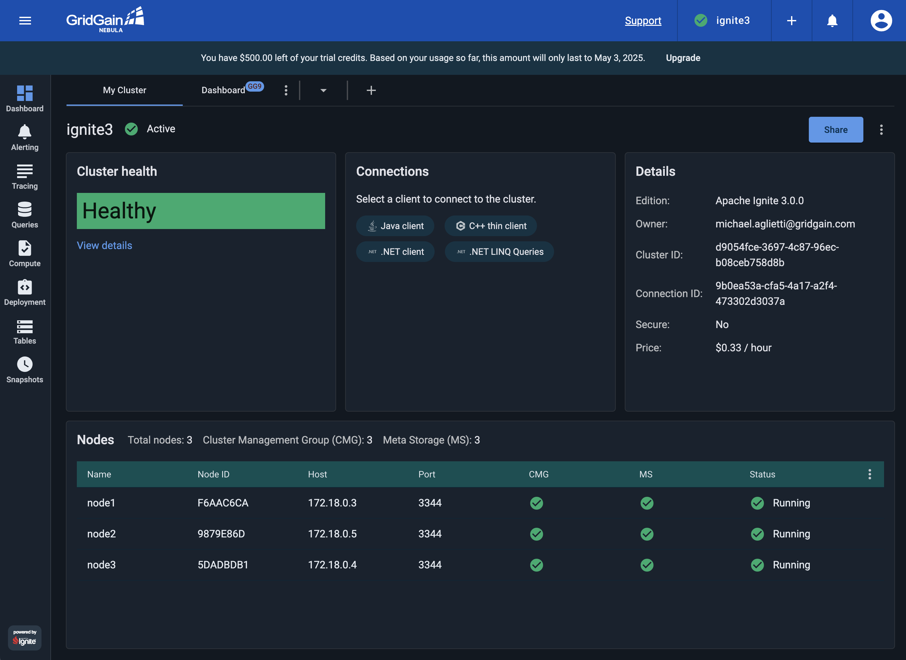

# Connecting Apache Ignite 3 to GridGain Control Center

This guide explains how to set up a local Apache Ignite 3 cluster running in Docker and connect it to GridGain Control Center (Nebula) for monitoring and management. GridGain Control Center provides a web-based interface for monitoring cluster performance, executing SQL queries, and analyzing metrics.

## Prerequisites

* Docker and Docker Compose installed on your system
* A GridGain Control Center account
* Basic knowledge of Docker and Apache Ignite

## Step 1: Create a GridGain Control Center Account

If you don't already have a GridGain Control Center account, you'll need to create one:

* Visit [GridGain Control Center Signup](https://portal.gridgain.com/auth/signup)
* Complete the registration process
* Verify your email and set up your account

Once registered, you'll have access to the GridGain Control Center portal at [https://portal.gridgain.com](https://portal.gridgain.com).

## Step 2: Set Up Environment Variables

The cloud connector requires authentication with your GridGain Control Center credentials. Set up environment variables for your username and password:

**For Linux/macOS:**

```bash
export CC_USERNAME=your_email@example.com
export CC_PASSWORD=your_password
```

**For Windows (Command Prompt):**

```cmd
set CC_USERNAME=your_email@example.com
set CC_PASSWORD=your_password
```

**For Windows (PowerShell):**

```powershell
$env:CC_USERNAME="your_email@example.com"
$env:CC_PASSWORD="your_password"
```

These environment variables will be used by Docker Compose to pass your credentials to the cloud connector service.

## Step 3: Create the Docker Compose File

Create a file named `docker-compose.yml` with the following content:

```yaml
name: ignite3

x-ignite-def: &ignite-def
  image: apacheignite/ignite:3.0.0
  environment:
    JVM_MAX_MEM: "4g"
    JVM_MIN_MEM: "4g"
  configs:
    - source: node_config
      target: /opt/ignite/etc/ignite-config.conf

x-cloud-connector-def: &cloud-connector-def
  image: gridgain/cloud-connector:2025-02-14
  environment:
    - CONNECTOR_CC_URL=https://portal.gridgain.com
    - CONNECTOR_BASE_URL=http://cloud-connector:3200
    - CONNECTOR_NAME=Ignite3
    - CONNECTOR_USERNAME=${CC_USERNAME}
    - CONNECTOR_PASSWORD=${CC_PASSWORD}

services:
  node1:
    <<: *ignite-def
    command: --node-name node1
    ports:
      - "10300:10300"
      - "10800:10800"
  node2:
    <<: *ignite-def
    command: --node-name node2
    ports:
      - "10301:10300"
      - "10801:10800"
  node3:
    <<: *ignite-def
    command: --node-name node3
    ports:
      - "10302:10300"
      - "10802:10800"
  cloud-connector:
    <<: *cloud-connector-def
    profiles:
      - cloud-connector

configs:
  node_config:
    content: |
      ignite {
        network {
          port: 3344
          nodeFinder.netClusterNodes = ["node1:3344", "node2:3344", "node3:3344"]
        }
      }
```

This configuration sets up:

* Three Apache Ignite 3 nodes
* A cloud connector service that connects your cluster to GridGain Control Center
* The cloud connector service is defined in a separate profile for flexibility

## Step 4: Start the Cluster with Cloud Connector

Launch the Ignite cluster with the cloud connector enabled:

```bash
docker compose up -d
```

This command starts the three Ignite nodes and the cloud connector service in detached mode.

You can view the logs of all services to ensure they're starting properly:

```bash
docker compose logs -f
```

Look for messages indicating successful startup of all nodes and the cloud connector.

## Step 5: Initialize the Ignite Cluster

Open a new terminal window and start the Ignite CLI:

```bash
docker run --rm -it --network=ignite3_default -e LANG=C.UTF-8 -e LC_ALL=C.UTF-8 apacheignite/ignite:3.0.0 cli
```

When prompted, connect to the first node:

```
connect http://node1:10300
```

Initialize the cluster:

```
cluster init --name=ignite3 --metastorage-group=node1,node2,node3
```

You should see a message confirming that the cluster was initialized successfully.

## Step 6: Access GridGain Control Center

Now, log in to your GridGain Control Center account:

* Go to [https://portal.gridgain.com](https://portal.gridgain.com)
* Enter your credentials



You should see your Ignite3 cluster appearing in the list of clusters. It may take a minute or two for the connection to be established and for data to start flowing.

## Step 7: Explore the Cluster in Control Center

Once your cluster appears, click on it to access the dashboard. From here, you can:

* View cluster topology and node status
* Monitor performance metrics including CPU, memory, and network usage
* Execute SQL queries through the web interface
* Analyze cache and table data
* Access detailed performance metrics and history

## Troubleshooting Connection Issues

If your cluster doesn't appear in the Control Center:

* Check that the environment variables are set correctly
* Examine the cloud connector logs for any error messages:

```bash
docker compose logs cloud-connector
```

* Verify that your GridGain Control Center account is active
* Make sure the cloud connector can access the internet to reach the GridGain portal
* Check if there are any network restrictions or proxies in your environment

## Shutting Down

To stop the cluster and the cloud connector:

```bash
docker compose down
```

This command stops and removes all containers defined in the Docker Compose file.

## Advanced Configuration

For production deployments, you might want to customize several aspects:

* Configure data persistence for the Ignite nodes
* Adjust memory allocation based on your workload
* Set up node attributes for better resource management
* Configure additional security settings

Refer to the [GridGain Control Center documentation](https://www.gridgain.com/products/control-center) for more advanced configuration options and best practices.

With this setup, you now have a local Apache Ignite 3 cluster that's fully monitored and manageable through the GridGain Control Center web interface.
