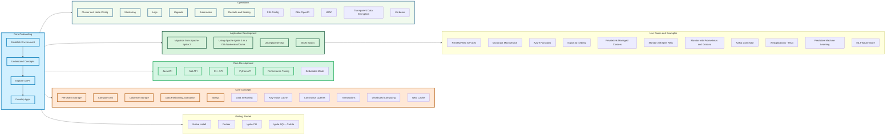

# Onboarding

```mermaid
flowchart LR
    subgraph Core[Core Onboarding]
        C1[Establish Environment] --> C2
        C2[Understand Concepts] --> C3
        C3[Explore UVPs] --> C4
        C4[Develop Apps]
    end

    Core --> Start
    Core --> DataMgmt
    Core --> Dev
    Core --> RefApp
    Core --> Ops

    subgraph Start[Getting Started]
        direction TB
        S1[Native Install]
        S2[Docker]
        S3[Ignite CLI]
        S4[Ignite SQL - Calcite]
    end

    subgraph DataMgmt[Core Concepts]
        direction TB
        D2[Persistent Storage]
        D1[Compute Grid]
        D3[Columnar Storage]
        D4[Data Partitioning, colocation]
        D5[NoSQL]
        D6[Data Streaming]
        D7[Key-Value Cache]
        D8[Continuous Queries]
        D9[Transactions]
        D10[Distributed Computing]
        D11[Vector Search]
        D11[Near Cache]
    end

    subgraph Dev[Core Development]
        direction TB
        A1[Java API]
        A2[.Net API]
        A3[C++ API]
        A4[Python API]
        A5[Performance Tuning]
        A6[Embedded Mode]
    end
    
    subgraph RefApp[Application Development]
        direction TB
        R1[Migration from Apache Ignite 2]  
        R2[Using Apache Ignite 3 as a DB Accelerator/Cache]
        R3[UriDeploymentSpi]
        R4[JSON Basics]
    end

    subgraph Ops[Operations]
        direction TB
        O1[Cluster and Node Config]
        O2[Monitoring]
        O3[Logs]
        O4[Upgrade]
        O5[Kubernetes]
        O6[Restarts and Scaling]
        O7[SSL Config]
        O8[Okta OpenID]
        O9[LDAP]
        O11[Transparent Data Encryption]
        O13[Kerberos]

    end

    RefApp --> Cases

    subgraph Cases[Use Cases and Examples]
        direction TB
        X1[RESTful Web Services]
        X2[Micronaut Microservice]
        X3[Azure Functions]
        X4[Export to Iceberg]
        X5[PrivateLink Managed Clusters]
        X6[Monitor with New Relic]
        X7[Monitor with Prometheus and Grafana]
        X8[Kafka Connector]
        X9[AI Applications - RAG]
        X10[Predictive Machine Learning]
        X11[ML Feature Store]
    end

    Core:::core
    Start:::start
    DataMgmt:::data
    Dev:::dev
    RefApp:::app
    Ops:::ops
    Cases:::cases
    
    classDef core fill:#d1f0ff,stroke:#0077b6,stroke-width:3px
    classDef data fill:#ffe8d6,stroke:#bc6c25,stroke-width:3px
    classDef dev fill:#d5f5e3,stroke:#27ae60,stroke-width:3px
    classDef app fill:#d8f3dc,stroke:#2d6a4f,stroke-width:3px
    classDef ops fill:#f1faee,stroke:#457b9d,stroke-width:3px

    class C1,C2,C3,C4,C5 core
    class D1,D2,D3,D4,D5 data
    class A1,A2,A3,A4,A5 dev
    class R1,R2,R3,R4,R5 app
    class O1,O2,O3,O4,O5,O6 ops
```
