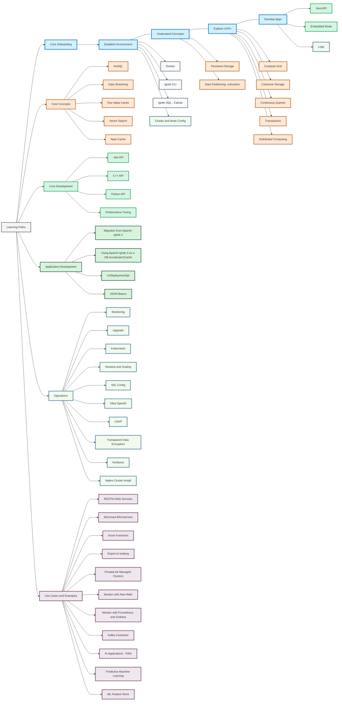

# Tree

```mermaid
graph LR
    %% Root node
    Root[Learning Paths]
    
    %% Main branches
    Root --> Core
    Root --> DataMgmt
    Root --> Dev
    Root --> RefApp
    Root --> Ops
    Root --> Cases
    
    %% Core Onboarding - connected with arrows to show progression
    Core[Core Onboarding] --> C1
    C1[Establish Environment]
    C2[Understand Concepts]
    C3[Explore UVPs]
    C4[Develop Apps]

    %% Force straight line with ranks
    subgraph CoreLine[" "]
        C1 --- C2 --- C3 --- C4
    end
    
    classDef invisible fill:none,stroke:none
    class CoreLine invisible

    %% Getting Started items
    C1 --> S2[Docker]
    C1 --> S3[Ignite CLI]
    C1 --> S4[Ignite SQL - Calcite]
    
    %% Core Concepts items
    DataMgmt[Core Concepts]
    C3 --> D1[Compute Grid]
    C2 --> D2[Persistent Storage]
    C3 --> D3[Columnar Storage]
    C2 --> D4[Data Partitioning, colocation]
    DataMgmt --> D5[NoSQL]
    DataMgmt --> D6[Data Streaming]
    DataMgmt --> D7[Key-Value Cache]
    C3 --> D8[Continuous Queries]
    C3 --> D9[Transactions]
    C3 --> D10[Distributed Computing]
    DataMgmt --> D11[Vector Search]
    DataMgmt --> D12[Near Cache]
    
    %% Core Development items
    Dev[Core Development]
    C4 --> A1[Java API]
    Dev --> A2[.Net API]
    Dev --> A3[C++ API]
    Dev --> A4[Python API]
    Dev --> A5[Performance Tuning]
    C4 --> A6[Embedded Mode]
    
    %% Application Development items
    RefApp[Application Development]
    RefApp --> R1[Migration from Apache Ignite 2]
    RefApp --> R2[Using Apache Ignite 3 as a DB Accelerator/Cache]
    RefApp --> R3[UriDeploymentSpi]
    RefApp --> R4[JSON Basics]
    
    %% Operations items
    Ops[Operations]
    C1 --> O1[Cluster and Node Config]
    Ops --> O2[Monitoring]
    C4 --> O3[Logs]
    Ops --> O4[Upgrade]
    Ops --> O5[Kubernetes]
    Ops --> O6[Restarts and Scaling]
    Ops --> O7[SSL Config]
    Ops --> O8[Okta OpenID]
    Ops --> O9[LDAP]
    Ops --> O10[Transparent Data Encryption]
    Ops --> O11[Kerberos]
    Ops --> O12[Native Cluster Install]
    
    %% Use Cases items
    Cases[Use Cases and Examples]
    Cases --> X1[RESTful Web Services]
    Cases --> X2[Micronaut Microservice]
    Cases --> X3[Azure Functions]
    Cases --> X4[Export to Iceberg]
    Cases --> X5[PrivateLink Managed Clusters]
    Cases --> X6[Monitor with New Relic]
    Cases --> X7[Monitor with Prometheus and Grafana]
    Cases --> X8[Kafka Connector]
    Cases --> X9[AI Applications - RAG]
    Cases --> X10[Predictive Machine Learning]
    Cases --> X11[ML Feature Store]
    
    %% Styling
    classDef root fill:#f5f5f5,stroke:#333,stroke-width:2px
    classDef core fill:#d1f0ff,stroke:#0077b6,stroke-width:3px
    classDef start fill:#f8f9fa,stroke:#6c757d,stroke-width:3px
    classDef data fill:#ffe8d6,stroke:#bc6c25,stroke-width:3px
    classDef dev fill:#d5f5e3,stroke:#27ae60,stroke-width:3px
    classDef app fill:#d8f3dc,stroke:#2d6a4f,stroke-width:3px
    classDef ops fill:#f1faee,stroke:#457b9d,stroke-width:3px
    classDef cases fill:#f0e6ef,stroke:#774c60,stroke-width:3px
    
    %% Apply styles
    class Root root
    class Core,C1,C2,C3,C4 core
    class Start,S1,S2,S3,S4 start
    class DataMgmt,D1,D2,D3,D4,D5,D6,D7,D8,D9,D10,D11,D12 data
    class Dev,A1,A2,A3,A4,A5,A6 dev
    class RefApp,R1,R2,R3,R4 app
    class Ops,O1,O2,O3,O4,O5,O6,O7,O8,O9,O10,O11,O12 ops
    class Cases,X1,X2,X3,X4,X5,X6,X7,X8,X9,X10,X11 cases
```
