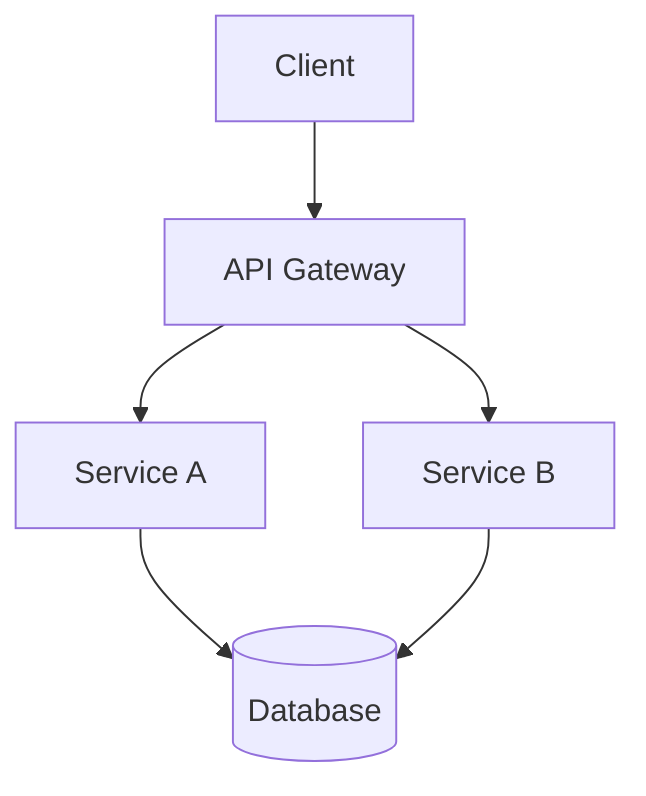

# Technical Documentation Style Guide

This style guide provides comprehensive standards to ensure consistency across all technical documentation. It follows the [Diátaxis framework](https://diataxis.fr/), which organizes documentation into four distinct types: tutorials, how-to guides, reference documentation, and explanation. Following these guidelines will help maintain a professional, accessible, and unified voice across all content while ensuring documentation meets users' specific needs at each stage of their journey.

## Core Principles

### Diátaxis Framework Principles

- **Separation of concerns**: Keep the four documentation types distinct
- **User-centered**: Focus on the user's needs at different stages
- **Purpose-driven**: Each documentation type serves a specific purpose
- **Progressive**: Support users as they move from learning to mastery

### Documentation Quality Principles

- **Clarity**: Present information in clear, unambiguous language
- **Conciseness**: Be direct and economical with words
- **Accuracy**: Ensure all technical information is correct and current
- **Consistency**: Maintain uniform terminology, formatting, and structure
- **Audience-awareness**: Keep the reader's needs and technical level in mind

## Voice and Tone

### Audience Considerations by Documentation Type

#### Tutorial Audience

- **Primary audience**: Beginners or those new to the specific technology
- **Technical level**: Assume minimal knowledge of the specific technology
- **Goal**: Learning and understanding fundamentals

#### How-to Guide Audience

- **Primary audience**: Users with basic competence seeking to accomplish specific tasks
- **Technical level**: Assume working knowledge of fundamentals
- **Goal**: Completing practical tasks efficiently

#### Reference Audience

- **Primary audience**: Active practitioners needing specific technical details
- **Technical level**: Assume significant competence with the technology
- **Goal**: Finding accurate information quickly

#### Explanation Audience

- **Primary audience**: Users seeking deeper understanding
- **Technical level**: Varies, but assumes interest in concepts
- **Goal**: Building mental models and understanding context

### Writing Style

- **Persona**: Write as a knowledgeable guide sharing practical insights
- **Voice**: Use second person ("you") when addressing the reader
- **Tone**: Professional but conversational
  - Avoid overly academic language
  - Avoid casual slang or colloquialisms
  - Avoid dramatic or flowery language
  - Use straightforward, precise language
  - Maintain an instructional focus without marketing language

### Language Guidelines

- Use active voice wherever possible
- Keep sentences concise (aim for 25 words or fewer)
- Use present tense for most descriptions
- Avoid jargon without explanation
- Define acronyms on first use
- Use parallel structure in lists and headings

## Diátaxis Framework

This documentation follows the [Diátaxis framework](https://diataxis.fr/), which organizes content into four distinct types based on user needs:


- **A tutorial is a lesson**, that takes a student by the hand through a learning experience. A tutorial is always _practical_: the user _does_ something, under the guidance of an instructor. A tutorial is designed around an encounter that the learner can make sense of, in which the instructor is responsible for the learner’s safety and success.
- **A how-to guide addresses a real-world goal or problem**, by providing practical directions to help the user who is in that situation. A how-to guide always addresses an already-competent user, who is expected to be able to use the guide to help them get their work done. In contrast to a tutorial, a how-to guide is concerned with _work_ rather than _study_.
- **Reference docs contain the technical description** - facts - that a user needs in order to do things correctly: accurate, complete, reliable information, free of distraction and interpretation. They contain _propositional or theoretical knowledge_, not guides to action.
- **Explanatory docs provide context and background.** They serve the need to understand and put things in a bigger picture. Explanation joins things together, and helps answer the question _why?_

### Tutorials (Learning-oriented)

Tutorials are lessons that guide users through a series of steps to learn something. They should:

- Be structured as a hands-on learning experience
- Take beginners through practical exercises with achievable goals
- Prioritize the learning process over the practical utility
- Build user confidence through successful completion of tasks
- Assume minimal prior knowledge while teaching foundations
- Use concrete, working examples rather than abstract concepts

### How-to Guides (Task-oriented)

How-to guides are practical directions for achieving real-world goals. They should:

- Focus on addressing specific problems or tasks
- Assume the reader is already competent and knowledgeable
- Provide clear, concrete steps to accomplish a goal
- Be structured around a sequence of actions
- Focus on completion rather than explanation
- Include error handling and troubleshooting guidance

### Reference Documentation (Information-oriented)

Reference documentation provides technical descriptions and factual information. It should:

- Present accurate, complete, and detailed information
- Be structured for quick information retrieval
- Remain free of instructional material or explanatory guidance
- Use consistent formatting and organization
- Focus on being comprehensive and precise
- Serve as a reliable source of truth about the system

### Explanation (Understanding-oriented)

Explanation provides background information and context. It should:

- Help users understand the bigger picture
- Explain concepts, principles, and approaches
- Provide context for why things work the way they do
- Link related concepts together
- Address the question "why?" rather than "how?"
- Support deeper understanding without focusing on practical tasks

### Document Structure Guidelines

Each type of documentation requires different structural elements to best serve its purpose:

#### Tutorial Structure

1. **Title**: Clear indication that this is a learning exercise
2. **Introduction**:
   - What the reader will learn
   - Required prerequisites
   - Expected time commitment
3. **Setup**: Environment preparation steps
4. **Sequential Steps**:
   - Break the learning into manageable chunks
   - Each step should build on previous steps
   - Include checkpoints to validate progress
5. **Summary**:
   - Recap what was learned
   - Suggest next learning steps

#### How-to Guide Structure

1. **Title**: Task-focused, often starting with "How to..."
2. **Problem Statement**: Brief description of the goal
3. **Prerequisites**: What's needed before starting
4. **Steps**:
   - Concise, actionable instructions
   - Focused solely on completing the task
5. **Outcome**: What to expect when done
6. **Troubleshooting**: Common issues and their solutions

#### Reference Structure

1. **Title**: Clear identifier of the reference content
2. **Brief Description**: One-line summary of the item
3. **Technical Details**:
   - Comprehensive information
   - Consistent formatting
   - Complete parameters, options, or properties
4. **Examples**: Minimal examples of usage without explanation
5. **Related Information**: Links to related reference items

#### Explanation Structure

1. **Title**: Concept-focused
2. **Overview**: Brief introduction to the concept
3. **Context**: How this concept fits into the larger system
4. **Detailed Explanation**:
   - Focus on principles and relationships
   - May include diagrams of concepts
   - Address common misconceptions
5. **Related Concepts**: Links to related explanatory content

### Section Headings

- Use sentence case for all headings (capitalize first word and proper nouns only)
- Keep headings concise and descriptive
- Maintain consistent heading hierarchy
- Avoid skipping heading levels (e.g., don't go from H2 to H4)

## Code Formatting

### General Principles

- Use complete, compilable examples whenever possible
- Format code consistently across all documentation
- Include error handling in examples
- Annotate key lines when necessary
- Prioritize readability over complexity in code examples
- Keep code as simple as possible to illustrate the concept
- Code developed for documentation should be minimal

### Code for Different Documentation Types

#### Tutorials

- Include complete, working code with thorough comments
- Break down code into sequential, learnable segments
- Focus on teaching patterns and concepts over optimal implementation
- Include comments that explain the "why" not just the "what"
- Avoid advanced techniques that might confuse beginners

#### How-to Guides

- Provide practical, working examples focused on completing tasks
- Include only code directly relevant to the task at hand
- Use realistic variable names and values
- Include error handling and validation
- Focus on usefulness over teaching concepts

#### Reference

- Include complete, correct syntax
- Document all parameters, return values, and data types
- Use consistent formatting and structure
- Include minimal, clear examples without extended explanation
- Be comprehensive but concise

#### Explanation

- Use code to illustrate concepts rather than to accomplish tasks
- May include simplified examples to demonstrate principles
- Focus on clarity over completeness
- Use comparison examples to highlight differences
- May include diagrams alongside code to illustrate concepts

### Java Code Blocks

- Include package declarations
- Include comprehensive Javadoc comments
- Use consistent indentation (4 spaces)
- Follow standard Java naming conventions

```java
/**
 * Class-level comment explaining purpose and context.
 * Include relationship to relevant concepts where appropriate.
 */
public class ExampleClass {

    /**
     * Method-level comment explaining what this method does.
     *
     * @param param1 Description of the parameter
     * @return Description of the return value
     * @throws SomeException When and why this exception might be thrown
     */
    public ReturnType methodName(Type param1) throws SomeException {
        // Inline comment for complex logic or specific considerations
        return result;
    }
}
```

### Python Code Blocks

- Include appropriate imports at the top
- Use consistent indentation (4 spaces)
- Follow PEP 8 style guidelines
- Include docstrings for functions and classes
- Use type hints where appropriate

```python
import logging
from typing import Dict, List, Optional

# Configure logging
logging.basicConfig(level=logging.INFO)
logger = logging.getLogger(__name__)

def process_data(data: List[Dict]) -> Optional[Dict]:
    """
    Process the input data and return aggregated results.
    
    Args:
        data: A list of dictionaries containing the raw data
        
    Returns:
        A dictionary with processed results or None if processing fails
    """
    if not data:
        logger.warning("Empty data received")
        return None
        
    # Process the data
    result = {"total": 0, "count": 0}
    
    for item in data:
        # Skip invalid items
        if "value" not in item:
            continue
            
        result["total"] += item["value"]
        result["count"] += 1
    
    # Calculate average if there are items
    if result["count"] > 0:
        result["average"] = result["total"] / result["count"]
    
    return result
```

### SQL Queries

- Format queries with consistent indentation
- Capitalize SQL keywords (SELECT, FROM, WHERE)
- Use line breaks for complex queries
- Include comments explaining the query's purpose

```sql
-- Find records that match specific criteria
SELECT column1, column2, column3, 
       FUNCTION(column4) as calculated_value
FROM table_name t
WHERE t.condition = 'value'
  AND FUNCTION(t.column) > threshold_value
ORDER BY calculated_value DESC
```

### JSON Examples

- Use consistent indentation (2 spaces recommended)
- Format multi-line for readability
- Include comments where supported
- Provide sample values that look realistic

```json
{
  "api_version": "v1",
  "metadata": {
    "name": "example-configuration",
    "environment": "production",
    "created_at": "2023-05-15T14:22:10Z"
  },
  "settings": {
    "timeout_ms": 5000,
    "retry_count": 3,
    "features": [
      "data_export",
      "advanced_analytics",
      "multi_user"
    ]
  },
  "connections": [
    {
      "id": "db-primary",
      "type": "postgresql",
      "parameters": {
        "host": "db.example.com",
        "port": 5432,
        "ssl": true
      }
    }
  ]
}
```

### HOCON Examples

- Use consistent indentation (2 spaces recommended)
- Leverage HOCON's flexibility for readability
- Include comments for clarity
- Group related settings together

```hocon
# Application configuration

application {
  name = "example-service"
  version = "1.2.3"
  
  # Server settings
  server {
    host = "0.0.0.0"
    port = 8080
    context-path = "/api"
    
    # Connection pool settings
    connection-pool {
      min-size = 10
      max-size = 100
      keep-alive = 60s
    }
  }
  
  # Security settings
  security {
    enabled = true
    
    # You can use substitution from environment variables
    secret-key = ${?APP_SECRET_KEY}
    
    cors {
      allowed-origins = [
        "https://example.com",
        "https://dev.example.com"
      ]
    }
  }
  
  # Database settings can include nested objects
  database {
    url = "jdbc:postgresql://localhost:5432/mydb"
    username = ${?DB_USERNAME}
    password = ${?DB_PASSWORD}
    
    # Advanced settings with defaults
    pool-size = 20
    timeout = 30s
  }
}

# Include external configuration files
include "logging.conf"
```

### Configuration Files

- Include complete examples for configuration files
- Annotate key settings
- Explain the impact of important configuration options

```yaml
# Example configuration with annotations
service:
  name: example-service  # Required: Service identifier
  port: 8080             # Default port for HTTP connections
  
  # Security settings
  security:
    enabled: true        # Enable authentication
    ssl: true            # Use HTTPS instead of HTTP
```

### Other Languages

- Follow language-specific conventions and best practices
- Maintain consistent formatting within each language
- Include comments explaining non-obvious code
- Use syntax highlighting where supported

## Visual Elements

### Diagrams

Use diagrams to illustrate:

- Architecture
- Data flow
- Process sequences
- Component relationships

Recommended diagram types using Mermaid syntax:



### Callouts

Use visual callouts for important information:

> **Note:** Use for helpful tips or additional context.

> **Important:** Use for critical information that shouldn't be missed.

> **Caution:** Use for potential pitfalls or common mistakes.

## Terminology Management

### Term Consistency

- Maintain a glossary of key terms for each product or project
- Use terms consistently throughout all documentation
- Capitalize product-specific terms according to official usage
- Avoid using different terms for the same concept

### Common Technical Terms

- **Node**: An instance of an application running in a process
- **Cluster**: Multiple nodes working together
- **Client**: An application connecting to a server or cluster
- **API**: Application Programming Interface
- **Schema**: The structure definition for a data store
- **Configuration**: Settings that control application behavior

### Versioning Terminology

- **Major version**: Significant changes that may break compatibility (e.g., 2.0, 3.0)
- **Minor version**: New features with backward compatibility (e.g., 2.1, 2.2)
- **Patch version**: Bug fixes and minor improvements (e.g., 2.1.1, 2.1.2)
- **Release candidate**: Pre-release version for testing (e.g., 3.0-RC1)
- **Deprecated**: Features that will be removed in a future version

## Lists and Tables

### Lists

- Use bulleted lists for unordered items
- Use numbered lists sparingly and only for sequential steps where order is critical
- Keep list items parallel in structure
- Start each item with a capital letter
- End each item with a period if it's a complete sentence

### Tables

- Include clear column headers
- Align content appropriately (left for text, right for numbers)
- Keep table content concise
- Provide a caption or introduction for context

Example markdown table:

| Feature | Basic Plan | Enterprise Plan | Notes |
|---------|------------|-----------------|-------|
| Clustering | Up to 3 nodes | Unlimited | High availability |
| Memory | 8GB max | Unlimited | Per node |
| Support | Community | 24/7 | Response times vary |

## Links and References

- Use descriptive link text that indicates the destination
- Avoid generic phrases like "click here" or "read more"
- For internal documentation, use relative links
- For external resources, include the full URL
- Consider link permanence; prefer stable URLs

Example:

- AVOID: For more information, [click here](https://example.com/docs).
- PREFERRED: See the [official documentation](https://example.com/docs) for more information.

## Transitions Between Sections

Different documentation types require different transition approaches:

### Tutorial Transitions

- Guide the reader through a learning journey
- Connect steps to reinforce learning:
  - "Now that you've created your first component, let's enhance it with..."
  - "With the basic functionality working, you're ready to add error handling..."
  - "Having mastered the fundamentals, let's explore a more complex example..."

### How-to Guide Transitions

- Focus on task completion and next steps:
  - "After configuring the connection, proceed to setting up authentication..."
  - "Once authentication is working, you can modify the access permissions..."
  - "With everything configured, the final step is to verify the setup..."

### Reference Transitions

- Minimize narrative transitions in favor of clear categorization
- Use consistent formatting and hierarchy to organize information
- When needed, use simple connective phrases:
  - "Related parameters include..."
  - "See also the following methods..."

### Explanation Transitions

- Connect concepts to build understanding:
  - "This architecture pattern relates to the principles discussed earlier..."
  - "Understanding these trade-offs helps explain why the system is designed this way..."
  - "This approach contrasts with the alternative pattern in several key ways..."

## Examples and Scenarios

### Examples for Different Documentation Types

#### Tutorial Examples

- Use concrete, realistic scenarios that build skills progressively
- Focus on teaching fundamental patterns rather than complex edge cases
- Use simplified data that helps learning rather than demonstrating all capabilities
- Ensure each example leads to a concrete, successful outcome

#### How-to Guide Examples

- Focus on practical, real-world tasks users need to accomplish
- Use realistic data that matches production scenarios
- Include common variations of the task
- Demonstrate best practices within implementation

#### Reference Examples

- Keep examples minimal and focused on demonstrating proper syntax
- Include diverse examples showing different parameter combinations
- Avoid narrative or extended explanations within examples
- Show both simple and more complex usage patterns

#### Explanation Examples

- Use examples to illustrate concepts rather than to accomplish tasks
- Employ comparative examples to highlight differences between approaches
- May use simplified or abstract examples to focus on principles
- Connect examples to the larger system architecture or design philosophy

### Consistency Across Documentation

- Use consistent example scenarios where appropriate across related documents
- Maintain the same sample data, variables, and naming conventions
- Ensure examples in different document types complement each other

## Revision and Quality Control

### Review Checklist by Documentation Type

#### Tutorial Review

- Can a beginner successfully complete all steps without outside help?
- Is the learning curve appropriate and progressive?
- Are all prerequisites clearly stated?
- Do exercises build the right foundational knowledge?
- Are success criteria clear at each checkpoint?

#### How-to Guide Review

- Does the guide solve a specific, practical problem?
- Are steps clear, concise, and focused on the task?
- Are prerequisites and requirements clearly stated?
- Is troubleshooting guidance provided for common issues?
- Does the guide avoid unnecessary explanation or teaching?

#### Reference Review

- Is all technical information accurate and complete?
- Is the structure consistent and navigable?
- Are all parameters, options, and return values documented?
- Is the formatting consistent throughout?
- Is the information free from tutorial or guide-like elements?

#### Explanation Review

- Does the content provide meaningful context and background?
- Are concepts clearly described without unnecessary jargon?
- Does the explanation connect to related concepts appropriately?
- Is the content focused on understanding rather than tasks?
- Does it answer the "why" questions users might have?

### General Review Criteria

For all documentation types:

- Technical accuracy verified by subject matter experts
- Code examples tested and functional
- Grammar and spelling checked
- Consistent terminology throughout
- Proper formatting of code, tables, and lists
- Links validated and working
- Adherence to style guide standards

### Collaborative Improvement

- Include document version or last updated date
- Provide mechanism for reader feedback
- Establish regular review cycles for documentation
- Consider each document as part of a larger ecosystem of content

## Specialized Documentation Types

### API Documentation

In the Diátaxis framework, API documentation spans multiple categories:

- **Reference**: Document endpoints, parameters, responses, and error codes
- **How-to Guides**: Provide task-based examples for common API operations
- **Tutorials**: Walk through a complete implementation for beginners
- **Explanation**: Describe authentication flows, rate limiting approaches, etc.

Format API documentation consistently:

- Include complete request/response examples
- Document all parameters, return values, and error codes
- Provide authentication requirements
- Show code examples in multiple languages when possible

### Troubleshooting Guides

Troubleshooting guides are specialized how-to guides:

- Clearly describe the problem or error
- List potential causes
- Provide step-by-step resolution procedures
- Include verification steps to confirm resolution

### Release Notes

Release notes bridge multiple documentation types:

- Use a reference-style format for listing changes
- Include how-to guidance for migration when necessary
- Provide explanatory context for major changes
- Organize by feature additions, improvements, and fixes
- Note any breaking changes prominently
- Reference relevant documentation for new features

## Inclusive Language

- Use gender-neutral language and pronouns
- Avoid culturally specific examples or metaphors
- Consider global audience understanding
- Be mindful of technical terminology that may not translate well

## Implementation Guide

### Structuring Your Documentation Repository

When implementing the Diátaxis framework:

1. Create clear top-level sections for each documentation type
2. Use consistent visual indicators for each type (icons, colors, etc.)
3. Implement navigation that helps users find the right type of content
4. Consider implementing special templates for each documentation type
5. Establish clear cross-referencing between related content across types

### Practical Application Tips

- Start by evaluating existing content against the framework
- Focus on improving one section at a time rather than restructuring everything at once
- When creating new content, begin with a clear understanding of which type it should be
- Consider the user's journey through all four types of documentation
- Review each document type with different criteria appropriate to its purpose
