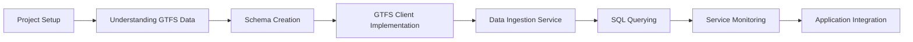

# Your First Ignite App with Java: Public Transit Monitoring System

## Introduction

In this hands-on tutorial, you'll build a real-time transit monitoring system that demonstrates Apache Ignite 3's distributed data capabilities. Through this practical project, you'll experience firsthand how Ignite enables rapid development of applications that require high throughput, low latency, and resilient data processing.

Transit data provides an ideal context for learning Ignite because it combines several challenging characteristics found in modern applications:

- **Real-time data streams** that must be continuously processed
- **Time-series data** requiring efficient storage and retrieval
- **Geospatial components** for tracking vehicle locations
- **Complex queries** for analyzing system performance
- **Continuous monitoring** for detecting service anomalies

By the end of this 40-minute tutorial, you'll have built a complete application that:

- Connects to industry-standard GTFS transit feeds to obtain live vehicle data
- Persists vehicle positions in a distributed Ignite database for real-time and historical access
- Executes complex SQL queries to extract actionable insights
- Monitors transit service disruptions through automated data analysis
- Presents system status through a simple dashboard interface

## What You'll Learn

Throughout this tutorial, you'll gain hands-on experience with key Apache Ignite 3 features:

### Data Modeling and Storage

- Creating tables using Ignite's Java API
- Defining appropriate schemas for time-series data
- Managing primary keys and indices for optimal performance

### Data Ingestion

- Building data pipelines with proper error handling
- Implementing efficient batch processing for high-throughput scenarios
- Using scheduled execution for continuous data updates

### Querying and Analysis

- Writing SQL queries against distributed data
- Using temporal functions for time-series analysis
- Implementing complex joins and aggregations for operational insights

### Monitoring and Alerting

- Creating monitoring systems using SQL-based polling
- Detecting anomalies in real-time data streams
- Building simple visualization components for system status

## Prerequisites

Before starting this tutorial, please ensure you have:

- **Java 11 or later** installed and properly configured
- **Maven or Gradle** for dependency management
- **Docker** for running the Ignite 3 cluster
- **Basic Java knowledge**, including familiarity with classes, interfaces, and collections
- **Some SQL experience** for understanding the query examples
- **Completed the "Use the Java API" How-To guide** (recommended but not required)

## Tutorial Flow

This tutorial is designed as a progressive journey through building a complete application:

Each module builds on the previous ones, introducing new concepts while reinforcing what you've already learned. The code examples are designed to work together as a cohesive application, but each component also illustrates standalone concepts that can be applied to other projects.

> **Next Steps:** Continue to [Module 2: Project Setup and Configuration](02-project-setup.md) to set up our project structure and configure our Ignite cluster!
