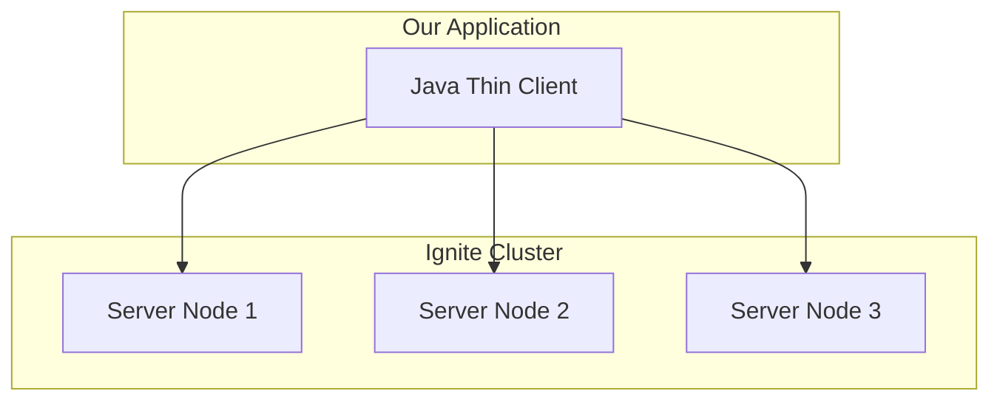
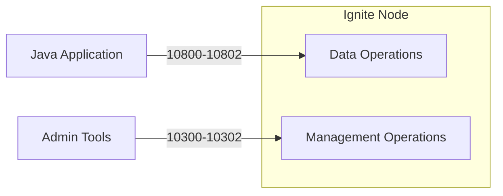

# Project Setup and Configuration

In this module, you'll establish the foundation for your transit monitoring application by setting up the project structure, dependencies, and local Ignite cluster. A proper setup ensures you can focus on the core functionality in subsequent modules without environment-related interruptions.

## Creating the Project Structure

## Development Environment Options

While the tutorial uses Maven and command-line operations, you can adapt the approach to your preferred development environment:

### IntelliJ IDEA Setup

1. Open IntelliJ IDEA
2. Select **File > New > Project**
3. Choose **Java** as the project type
4. Enter the group id as `com.example`, artifact id as `transit-monitor`
5. Click **Finish**
6. Replace the contents of the generated `pom.xml` with our configuration
7. Create the package structure by right-clicking on `src/main/java` and selecting **New > Package** and entering `com.example.transit`
8. Create the Java classes in this package
9. Create the `docker-compose.yml` file in the project root

### Visual Studio Code Setup

1. Create a new folder for your project
2. Open the folder in VS Code
3. Create the `pom.xml` file with our configuration
4. Create a `src/main/java/com/example/transit` directory structure
5. Add the Java files to this directory
6. Create the `docker-compose.yml` file in the project root
7. Use the Java extension to run the application

### Using Other Editors

If you prefer another editor:

1. Create the project structure manually
2. Use the editor's Maven integration or command-line Maven to build
3. Ensure your editor's Java extension can resolve the dependencies in the `pom.xml`

## Directory Structure

By the end of this tutorial, your project structure should look like this:

```shell
transit-monitoring/
├── .env
├── .gitignore
├── docker-compose.yml
├── pom.xml
├── src
│   ├── main
│   │   ├── java
│   │   │   └── com
│   │   │       └── example
│   │   │           └── transit
│   │   │               ├── app
│   │   │               │   └── TransitMonitoringApp.java
│   │   │               ├── service
│   │   │               │   ├── DataIngestionService.java
│   │   │               │   ├── DataVerificationService.java
│   │   │               │   ├── GTFSFeedService.java
│   │   │               │   ├── IgniteConnectionService.java
│   │   │               │   ├── SchemaSetupService.java
│   │   │               │   └── MonitoringService.java
│   │   │               ├── util
│   │   │               │   └── TerminalUtils.java
│   │   │               └── examples
│   │   │                   ├── DataIngestionExample.java
│   │   │                   ├── GTFSConnectionExample.java
│   │   │                   ├── IgniteClusterExample.java
│   │   │                   ├── SchemaSetupExample.java
│   │   │                   └── ServiceMonitorExample.java
│   │   └── resources
```

> [!tip]
> You can either create the project structure manually as you progress through the tutorial, or clone the starter [repository](https://github.com/maglietti/transit-monitor). We'll walk through the manual setup process to understand each component.

### Maven Configuration

Start by creating a Maven `pom.xml` file with the necessary dependencies for your application:

```xml
<?xml version="1.0" encoding="UTF-8"?>
<project xmlns="http://maven.apache.org/POM/4.0.0"
         xmlns:xsi="http://www.w3.org/2001/XMLSchema-instance"
         xsi:schemaLocation="http://maven.apache.org/POM/4.0.0 http://maven.apache.org/xsd/maven-4.0.0.xsd">
    <modelVersion>4.0.0</modelVersion>

    <groupId>com.example</groupId>
    <artifactId>transit-monitor</artifactId>
    <version>1.0</version>

    <properties>
        <maven.compiler.source>11</maven.compiler.source>
        <maven.compiler.target>11</maven.compiler.target>
        <ignite.version>3.0.0</ignite.version>
    </properties>

    <dependencies>
        <!-- Apache Ignite dependencies -->
        <dependency>
            <groupId>org.apache.ignite</groupId>
            <artifactId>ignite-client</artifactId>
            <version>${ignite.version}</version>
        </dependency>

        <!-- GTFS-realtime library -->
        <dependency>
            <groupId>org.mobilitydata</groupId>
            <artifactId>gtfs-realtime-bindings</artifactId>
            <version>0.0.8</version>
        </dependency>

        <!-- Logging -->
        <dependency>
            <groupId>ch.qos.logback</groupId>
            <artifactId>logback-classic</artifactId>
            <version>1.2.11</version>
        </dependency>

        <!-- Configuration -->
        <dependency>
            <groupId>io.github.cdimascio</groupId>
            <artifactId>dotenv-java</artifactId>
            <version>2.3.2</version>
        </dependency>
    </dependencies>

    <build>
        <plugins>
            <plugin>
                <groupId>org.apache.maven.plugins</groupId>
                <artifactId>maven-shade-plugin</artifactId>
                <version>3.2.4</version>
                <executions>
                    <execution>
                        <phase>package</phase>
                        <goals>
                            <goal>shade</goal>
                        </goals>
                        <configuration>
                            <transformers>
                                <transformer implementation="org.apache.maven.plugins.shade.resource.ManifestResourceTransformer">
                                    <mainClass>com.example.transit.TransitMonitoringApp</mainClass>
                                </transformer>
                            </transformers>
                        </configuration>
                    </execution>
                </executions>
            </plugin>
        </plugins>
    </build>
</project>
```

This Maven configuration includes:

- **Apache Ignite client library**: Enables connection to an Ignite cluster
- **MobilityData GTFS-realtime API**: Provides tools for parsing transit data
- **Logback**: Implements structured logging for application events
- **dotenv-java**: Manages configuration variables securely
- **Maven Shade plugin**: Creates an executable JAR with all dependencies

> [!important]
> **Checkpoint**: After creating the `pom.xml` file, run `mvn verify` in your terminal from the project directory. Maven should download all dependencies without errors. If you see "BUILD SUCCESS", your Maven configuration is correct.

## Understanding Ignite's Client-Server Architecture

Before we set up our Ignite cluster, let's briefly explore Ignite's architecture. Apache Ignite 3 follows a client-server model:

- **Server Nodes**: Form the distributed cluster where data is stored and processed
- **Thin Clients**: Lightweight connections that communicate with the cluster

Unlike in Ignite 2.x, Ignite 3 exclusively uses the thin client model. This separation provides several advantages:

1. **Resource Efficiency**: Clients require minimal memory and CPU
2. **Language Flexibility**: Clients can be implemented in various languages
3. **Operational Simplicity**: Server nodes can be deployed and scaled independently

In our application, we'll use Java thin clients to connect to a cluster of Ignite server nodes running in Docker containers.



> [!note]
> Think of Ignite server nodes as database servers that work together to store data. The client is like a database connector in your application code. The thin client approach means your application only needs a lightweight connection to the cluster, not a full Ignite instance running inside your application.

## Setting Up Your Ignite Cluster

To run the application, you need a local Ignite 3 cluster. Docker provides the simplest way to get started without complex installation procedures.

### Creating a Docker Compose File

Create a file named `docker-compose.yml` in your project's root directory:

```yaml
name: ignite3  
  
x-ignite-def: &ignite-def  
  image: apacheignite/ignite:3.0.0  
  environment:  
    JVM_MAX_MEM: "4g"  
    JVM_MIN_MEM: "4g"  
  configs:  
    - source: node_config  
      target: /opt/ignite/etc/ignite-config.conf  
  
services:  
  node1:  
    <<: *ignite-def  
    command: --node-name node1  
    ports:  
      - "10300:10300"  
      - "10800:10800"  
  node2:  
    <<: *ignite-def  
    command: --node-name node2  
    ports:  
      - "10301:10300"  
      - "10801:10800"  
  node3:  
    <<: *ignite-def  
    command: --node-name node3  
    ports:  
      - "10302:10300"  
      - "10802:10800"  
  
configs:  
  node_config:  
    content: |  
      ignite {  
        network {  
          port: 3344  
          nodeFinder.netClusterNodes = ["node1:3344", "node2:3344", "node3:3344"]  
        }  
      }
```

> [!note]
> Docker Compose helps run multiple related containers together. This file defines three Ignite server nodes that will form our cluster. Each node gets 4GB of memory and exposes specific ports for communication. The `configs` section provides shared configuration to all nodes.

This configuration creates a three-node Ignite cluster running in Docker containers. Each node is configured with:

- 4GB of memory allocation
- Exposed HTTP and thin client ports
- A shared configuration for node discovery

### Starting the Ignite Cluster

To launch the cluster:

1. Open a terminal in the directory containing your `docker-compose.yml` file
2. Run: `docker compose up -d`
3. Verify the status with: `docker compose ps`

You should see output similar to:

```shell
NAME                COMMAND                  SERVICE             STATUS              PORTS
ignite3-node1-1     "/opt/ignite/bin/ign…"   node1               running             0.0.0.0:10300->10300/tcp, 0.0.0.0:10800->10800/tcp
ignite3-node2-1     "/opt/ignite/bin/ign…"   node2               running             0.0.0.0:10301->10300/tcp, 0.0.0.0:10801->10800/tcp
ignite3-node3-1     "/opt/ignite/bin/ign…"   node3               running             0.0.0.0:10302->10300/tcp, 0.0.0.0:10802->10800/tcp
```

> [!important]
> **Checkpoint**: All three containers should be in "running" status after executing the Docker Compose command. If you see all three containers with "running" status, your Ignite cluster is properly started.

### Understanding Ignite Ports

In our Docker Compose configuration, we're exposing two ports for each node:

- **10300-10302**: The REST API ports used for administrative operations
- **10800-10802**: The client connection ports used by our Java application

These ports follow Ignite 3's network architecture, which separates client traffic from administrative operations.



### Initializing the Cluster

Before we can use our cluster, we need to initialize it. Ignite 3 requires explicit cluster initialization, which configures the metastorage group responsible for system metadata.

Start the Ignite 3 CLI in Docker:

```bash
docker run --rm -it --network=host -e LANG=C.UTF-8 -e LC_ALL=C.UTF-8 apacheignite/ignite:3.0.0 cli
```

Inside the CLI:

1. Connect to a node: `connect http://localhost:10300`
2. Initialize the cluster: `cluster init --name=ignite3 --metastorage-group=node1,node2,node3`

>[!note]
> The initialization step creates essential system tables and structures in the Ignite cluster. The metastorage group defines which nodes will store this critical system information, with enough redundancy to maintain availability if one node fails.

>[!warning]
> The initialization step is only performed once for a new cluster. If the command returns an error indicating the cluster is already initialized, you can proceed to the next step.

```shell


           #              ___                         __
         ###             /   |   ____   ____ _ _____ / /_   ___
     #  #####           / /| |  / __ \ / __ `// ___// __ \ / _ \
   ###  ######         / ___ | / /_/ // /_/ // /__ / / / // ___/
  #####  #######      /_/  |_|/ .___/ \__,_/ \___//_/ /_/ \___/
  #######  ######            /_/
    ########  ####        ____               _  __           _____
   #  ########  ##       /  _/____ _ ____   (_)/ /_ ___     |__  /
  ####  #######  #       / / / __ `// __ \ / // __// _ \     /_ <
   #####  #####        _/ / / /_/ // / / // // /_ / ___/   ___/ /
     ####  ##         /___/ \__, //_/ /_//_/ \__/ \___/   /____/
       ##                  /____/

                      Apache Ignite CLI version 3.0.0


You appear to have not connected to any node yet. Do you want to connect to the default node http://localhost:10300? [Y/n] 
Connected to http://localhost:10300
The cluster is not initialized. Run cluster init command to initialize it.
[node1]> cluster init --name=ignite3 --metastorage-group=node1,node2,node3
Cluster was initialized successfully
[node1]> 
```

> [!important]
> **Checkpoint**: After running the initialization command, you should see a success message. If you see "Cluster initialized successfully" or a message indicating the cluster is already initialized, you can proceed to the next step.

## Creating the Ignite Connection Manager

Now that our cluster is running, we need a reliable way to connect to it from our Java application. Let's create an `IgniteConnectionService` class that will handle connection management, including initial setup, retry policies, and proper resource cleanup.

Create a new file named `IgniteConnectionService.java` in the `src/main/java/com/example/transit/service` directory.

>[!tip]
>Create a new file in IntelliJ IDEA:
>
>1. Right-click on the `java` folder in your project structure
>2. Select "New" > "Package"
>3. Type the full package path: `com.example.transit.service`
>4. Click OK to create the package (IntelliJ will create all intermediate directories)
>5. Right-click on the newly created `service` package 
>6. Select "New" > "Java Class"
>7. Enter the class name: `IgniteConnectionService`
>8. Click OK
>
>The file will be created with the correct package declaration at the top:
>```java
>package com.example.transit.service;
>
>public class IgniteConnectionService {
>    // Class implementation here
>}
>```

Replace everything in your new file with this code:

```java
package com.example.transit.service;

import org.apache.ignite.client.IgniteClient;
import org.apache.ignite.client.RetryReadPolicy;

/**
 * Singleton class that manages the connection to the Ignite cluster.
 * This class uses the Ignite 3 client API to establish and maintain
 * a connection to the cluster throughout our application's lifecycle.
 */
public class IgniteConnectionService {
    private static IgniteClient igniteClient;

    /**
     * Gets a singleton instance of IgniteClient.
     * The client connects to a local Ignite 3 cluster running on the default port.
     *
     * @return An initialized IgniteClient instance
     * @throws RuntimeException if the connection cannot be established
     */
    public static synchronized IgniteClient getClient() {
        if (igniteClient == null) {
            try {
                // Using the builder pattern introduced in Ignite 3
                igniteClient = IgniteClient.builder()
                        // Configure the addresses of all three Ignite server nodes
                        // This provides redundancy and failover capabilities
                        .addresses(
                                "127.0.0.1:10800",  // Node 1
                                "127.0.0.1:10801",  // Node 2
                                "127.0.0.1:10802"   // Node 3
                        )
                        // Set connection timeout to 10 seconds
                        .connectTimeout(10_000)
                        // RetryReadPolicy allows read operations to be retried automatically on connection issues
                        .retryPolicy(new RetryReadPolicy())
                        // Build the client instance
                        .build();

                System.out.println("Successfully connected to Ignite cluster" + igniteClient.connections());
            } catch (Exception e) {
                System.err.println("Failed to connect to Ignite cluster: " + e.getMessage());
                throw new RuntimeException("Ignite connection failure", e);
            }
        }
        return igniteClient;
    }

    /**
     * Closes the connection to the Ignite cluster.
     * Call this method when shutting down your application to release resources.
     */
    public static void close() {
        if (igniteClient != null) {
            try {
                igniteClient.close();
                igniteClient = null;
                System.out.println("Ignite client connection closed");
            } catch (Exception e) {
                System.err.println("Error closing Ignite client: " + e.getMessage());
            }
        }
    }
}
```

> [!note]
> This class uses the "singleton" pattern, which ensures we only create one connection to our Ignite cluster that's shared throughout the application. The `synchronized` keyword ensures thread safety, and the `RetryReadPolicy` automatically handles temporary connection issues.

This singleton class provides a central point for obtaining and managing the connection to your Ignite cluster. Key features include:

- **Lazy initialization**: The connection is only established when first needed
- **Connection pooling**: The same client instance is reused across the application
- **High availability**: Multiple node addresses ensure the application can connect even if one node is down
- **Automatic retries**: The RetryReadPolicy helps maintain resilience during temporary network issues
- **Proper resource cleanup**: The close method ensures resources are released when the application shuts down

## Testing Your Connection

Let's create an example class `IgniteClusterExample` to verify that your connection to the Ignite cluster works correctly.

>[!tip]
>To create the `IgniteClusterExample.java` file:
>
>1. In IntelliJ IDEA, right-click on the `java` folder in your project structure
>2. Select "New" > "Package"
>3. Type the full package path: `com.example.transit.examples`
>4. Click OK to create the package (IntelliJ will create all intermediate directories)
>5. Right-click on the newly created `examples` package 
>6. Select "New" > "Java Class"
>7. Enter the class name: `IgniteClusterExample`
>8. Click OK

Replace everything in your new file with this code:

```java
package com.example.transit.examples;

import ch.qos.logback.classic.Level;
import ch.qos.logback.classic.Logger;
import com.example.transit.service.IgniteConnectionService;
import org.apache.ignite.client.IgniteClient;
import org.apache.ignite.client.RetryLimitPolicy;
import org.apache.ignite.network.ClusterNode;
import org.slf4j.LoggerFactory;

import java.util.List;
import java.util.stream.Collectors;

/**
 * This class demonstrates how to connect to a cluster and retrieve information.
 */
public class IgniteClusterExample {

    public static void main(String[] args) {
        // Configure logging to be quiet before any other operations
        configureLogging();

        // Connect to Ignite cluster
        IgniteClient client = null;

        try {
            // Get client connection
            System.out.println("--- Connecting to Ignite cluster...");
            client = IgniteConnectionService.getClient();

            // Test the connection by retrieving cluster nodes
            System.out.println("Testing connection by retrieving cluster nodes...");
            testConnection(client);

            System.out.println("Ignite cluster operations completed successfully");

        } catch (Exception e) {
            System.err.println("Error during Ignite operations: " + e.getMessage());
            e.printStackTrace();
        } finally {
            // Always properly disconnect from the cluster
            if (client != null) {
                System.out.println("--- Disconnecting from Ignite cluster...");
                IgniteConnectionService.close();
            }
        }
    }

    /**
     * Configure logging to completely suppress all log messages.
     * This is useful for tests to keep the console output to a minimum.
     */
    private static void configureLogging() {
        // Get the Logback root logger and set it to OFF
        Logger root = (Logger) LoggerFactory.getLogger(Logger.ROOT_LOGGER_NAME);
        root.setLevel(Level.OFF);

        // Specifically set Netty logger to OFF as well
        Logger nettyLogger = (Logger) LoggerFactory.getLogger("io.netty");
        nettyLogger.setLevel(Level.OFF);
    }

    /**
     * Tests the connection to the Ignite cluster and displays useful information
     *
     * @param client The IgniteClient instance
     */
    private static void testConnection(IgniteClient client) {
        System.out.println("\n========== IGNITE CLUSTER OVERVIEW ==========");

        // Get list of active connections (cluster nodes)
        List<ClusterNode> clusterNnodes = client.connections();

        // 1. Cluster Topology Information
        System.out.println("\nCLUSTER TOPOLOGY:");
        try {
            // Get complete cluster topology
            List<ClusterNode> allNodes = client.clusterNodes().stream().collect(Collectors.toList());

            System.out.println("  • Total cluster nodes: " + allNodes.size());

            // Display simple list of nodes
            for (int i = 0; i < allNodes.size(); i++) {
                ClusterNode node = allNodes.get(i);
                System.out.println("    - Node " + (i + 1) + ": " + node.name() +
                        " (ID: " + node.id() + ", Address: " + node.address() + ")");
            }

            // Also show which node(s) the client is currently connected to
            List<ClusterNode> connectedNodes = client.connections();
            System.out.println("  • Currently connected to: " +
                    (connectedNodes.isEmpty() ? "None" : connectedNodes.get(0).name()));
        } catch (Exception e) {
            System.out.println("  • Could not retrieve full cluster topology: " + e.getMessage());

            // Fall back to showing just the connected nodes
            List<ClusterNode> currentNodes = client.connections();
            System.out.println("  • Connected nodes: " + currentNodes.size());
            for (int i = 0; i < currentNodes.size(); i++) {
                ClusterNode node = currentNodes.get(i);
                System.out.println("    - Node " + (i + 1) + ": " + node.name() +
                        " (ID: " + node.id() + ", Address: " + node.address() + ")");
            }
        }

        // 2. Connection Details
        System.out.println("\nCONNECTION DETAILS:");
        System.out.println("  • Connection timeout: " + client.configuration().connectTimeout() + "ms");
        System.out.println("  • Operation timeout: " +
                (client.configuration().operationTimeout() > 0 ?
                        client.configuration().operationTimeout() + "ms" : "No timeout (unlimited)"));
        System.out.println("  • Heartbeat interval: " + client.configuration().heartbeatInterval() + "ms");

        // 3. Available Resources - Tables
        try {
            List<String> tables = client.tables().tables().stream()
                    .map(table -> table.name())
                    .collect(Collectors.toList());

            System.out.println("\nAVAILABLE TABLES:");
            if (tables.isEmpty()) {
                System.out.println("  • No tables found. Your cluster is ready for you to create tables.");
                System.out.println("  • Tip: Use client.tables().createTable(...) to create your first table.");
            } else {
                System.out.println("  • Found " + tables.size() + " table(s):");
                for (String tableName : tables) {
                    System.out.println("    - " + tableName);
                }
                System.out.println("  • Tip: Access a table with client.tables().table(\"" +
                        (tables.isEmpty() ? "table_name" : tables.get(0)) + "\")");
            }
        } catch (Exception e) {
            System.out.println("\nAVAILABLE TABLES:");
            System.out.println("  • Could not retrieve tables: " + e.getMessage());
            System.out.println("  • Tip: You may need additional permissions to view tables");
        }

        // 4. Client Retry Policy
        System.out.println("\nRETRY POLICY:");
        if (client.configuration().retryPolicy() != null) {
            System.out.println("  • Type: " + client.configuration().retryPolicy().getClass().getSimpleName());
            if (client.configuration().retryPolicy() instanceof RetryLimitPolicy) {
                RetryLimitPolicy policy = (RetryLimitPolicy) client.configuration().retryPolicy();
                System.out.println("  • Retry limit: " + policy.retryLimit());
            }
            System.out.println("  • Tip: The retry policy helps maintain connection during network issues");
        } else {
            System.out.println("  • No retry policy configured");
            System.out.println("  • Tip: Consider adding a RetryReadPolicy for better resilience");
        }

        // 5. Security Status
        System.out.println("\nSECURITY STATUS:");
        if (client.configuration().authenticator() != null) {
            System.out.println("  • Authentication: Enabled");
            System.out.println("  • Type: " + client.configuration().authenticator().type());
        } else {
            System.out.println("  • Authentication: Not configured");
        }

        if (client.configuration().ssl() != null && client.configuration().ssl().enabled()) {
            System.out.println("  • SSL/TLS: Enabled");
        } else {
            System.out.println("  • SSL/TLS: Disabled");
            System.out.println("  • Tip: Consider enabling SSL for secure communication");
        }

        System.out.println("\nCONNECTION SUCCESSFUL! You are now ready to use Ignite.");
        System.out.println("========== END OF CLUSTER OVERVIEW ==========\n");
    }
}
```

> [!note]
> This example class demonstrates how to connect to the Ignite cluster and gather basic information about it. The `testConnection` method explores different aspects of the cluster, like how many nodes are running and what configuration is being used.

### Running the Connection Example

To run the example:

1. Compile your project: `mvn compile`
2. Execute the example class: `mvn exec:java -Dexec.mainClass="com.example.transit.examples.IgniteClusterExample"`

If everything is set up correctly, you should see output confirming the connection to your Ignite cluster, along with details about the connected nodes, client configuration, and available resources.

**Expected Output**: You should see a successful connection message and information about the three nodes in your cluster. The output should confirm that you're connected to at least one of the nodes.

> [!important]
> **Checkpoint #4**: After running the connection example, you should see a successful connection message and information about all three nodes in your cluster. If you see "CONNECTION SUCCESSFUL!" near the end of the output, your connection is working properly.

## Next Steps

Congratulations! You've now set up a complete development environment for our transit monitoring application:

- A three-node Ignite cluster running in Docker containers
- A Maven project with all necessary dependencies
- A robust connection management class
- An example application that verifies connectivity

This foundation gives us everything we need to start building our transit monitoring application. In the next module, we'll explore the GTFS data format and design our schema for storing transit data in Ignite.

> [!important]
> **Final Module Checkpoint**: Before proceeding to the next module, ensure:
>
> - Your Ignite cluster is running (all three containers in "running" state)
> - The connection example completes successfully
> - You can compile the project without errors
> - You understand the basic client-server architecture of Ignite 3

> [!tip]
> **Next Steps:** Continue to [Module 3: Understanding GTFS Data and Creating the Transit Schema](03-understanding-gtfs.md) to learn how to model transit data and create the appropriate schema in Ignite.
