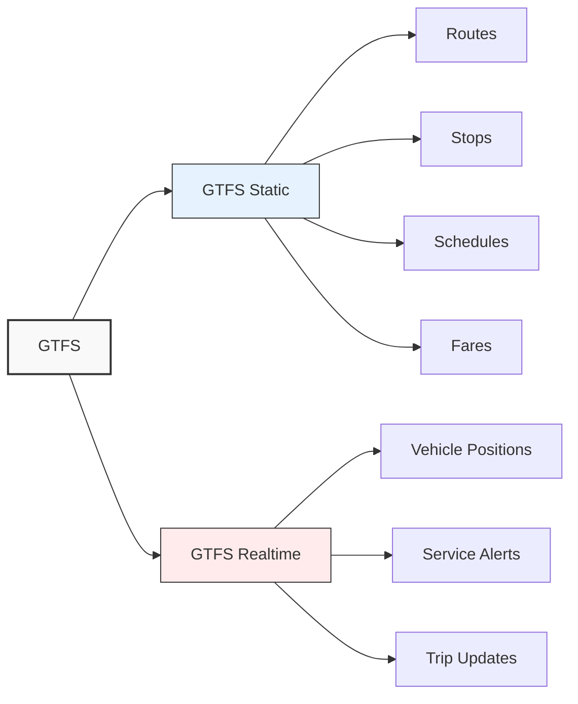
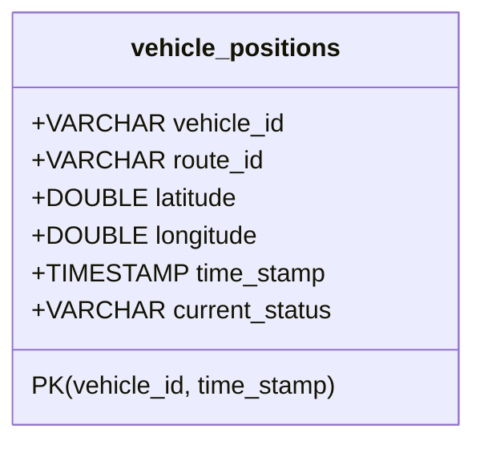
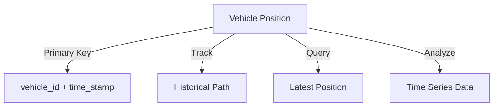
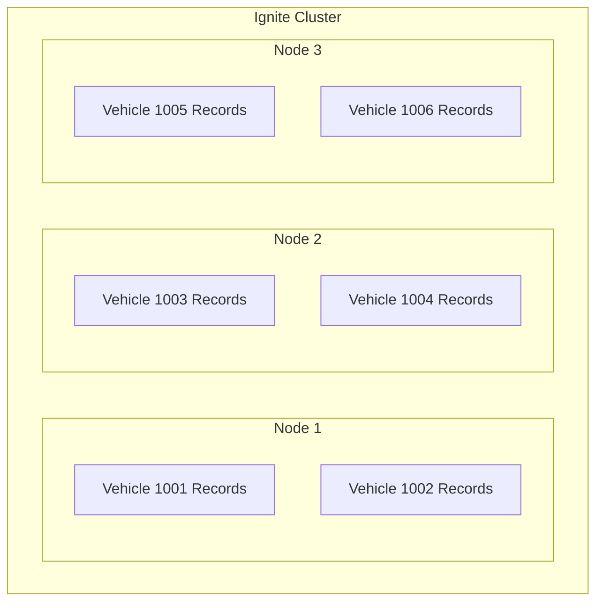

# Understanding GTFS Data and Creating the Transit Schema

In this module, you'll learn about the General Transit Feed Specification (GTFS) data format and how to model this data within Apache Ignite. You'll create a schema that enables efficient storage and querying of transit vehicle positions.

## The GTFS Format: Transit Data in Motion

The [General Transit Feed Specification](https://gtfs.org) (GTFS) has become the universal language of public transportation data. Created through a collaboration between Google and Portland's TriMet transit agency in 2006, it's now the industry standard used by transit agencies worldwide to share transit information in a consistent, machine-readable format.

GTFS comes in two complementary formats:



1. **GTFS Static**: The foundation of transit data, containing:
   - Route definitions (paths that vehicles travel)
   - Stop locations (where vehicles pick up passengers)
   - Schedules (when vehicles are expected at stops)
   - Fares (how much it costs to ride)

2. **GTFS Realtime**: The dynamic extension that provides near real-time updates:
   - Vehicle Positions (where vehicles are right now)
   - Service Alerts (disruptions, detours, etc.)
   - Trip Updates (predictions of arrival/departure times)

For our transit monitoring system, we'll focus on the **[Vehicle Positions](https://gtfs.org/documentation/realtime/reference/#message-vehicleposition)** component of GTFS Realtime. This gives us a continuous stream of data points showing where each transit vehicle is located, what route it's serving, and its current status (in transit, stopped at a location, etc.).

## Analyzing the Data: What's in a Vehicle Position?

Before designing our schema, let's examine what information is available in a GTFS vehicle position record:

| Field | Description | Example |
|-------|-------------|---------|
| Vehicle ID | Unique identifier for the vehicle | "1234" |
| Route ID | Identifier for the route the vehicle is servicing | "42" |
| Trip ID | Identifier for the specific trip being made | "trip_morning_1" |
| Position | Latitude and longitude coordinates | (37.7749, -122.4194) |
| Timestamp | When the position was recorded | 1616724123000 |
| Status | Current status of the vehicle | "IN_TRANSIT_TO", "STOPPED_AT" |
| Stop ID | Identifier of the stop if the vehicle is stopped | "stop_downtown_3" |
| Congestion Level | Level of traffic congestion | "RUNNING_SMOOTHLY" |
| Occupancy Status | How full the vehicle is | "MANY_SEATS_AVAILABLE" |

For our application, we'll focus on the most essential fields: vehicle ID, route ID, position coordinates, timestamp, and status. This gives us the core information needed for monitoring while keeping our schema clean and focused.

## Modeling the Data: From Specification to Java Objects

Now that we understand what data we're working with, let's transform these transit concepts into code. We need a clean, intuitive model that captures the essence of a vehicle's position in the transit network.

```java
package com.example.transit;

import java.sql.Timestamp;
import java.time.Instant;
import java.io.Serializable;
import java.util.Objects;

/**
 * Represents a single vehicle position record from GTFS-realtime data.
 * This class captures the essential information about a transit vehicle's
 * location and status at a specific point in time.
 */
public class VehiclePosition implements Serializable {
    // Good practice to define a serialVersionUID for Serializable classes
    private static final long serialVersionUID = 1L;

    private String vehicleId;    // Unique identifier for the vehicle
    private String routeId;      // The route this vehicle is serving
    private double latitude;     // Geographic latitude coordinate
    private double longitude;    // Geographic longitude coordinate
    private long timestamp;      // When this position was recorded (epoch millis)
    private String currentStatus; // Vehicle status (IN_TRANSIT_TO, STOPPED_AT, etc.)

    /**
     * Default no-arg constructor required for serialization and ORM frameworks
     */
    public VehiclePosition() {
        // Default constructor required for POJO usage with Ignite
    }

    /**
     * Full constructor for creating a VehiclePosition object
     * 
     * @param vehicleId Unique identifier for the vehicle
     * @param routeId The route this vehicle is serving
     * @param latitude Geographic latitude coordinate
     * @param longitude Geographic longitude coordinate
     * @param timestamp When this position was recorded (epoch millis)
     * @param currentStatus Vehicle status (IN_TRANSIT_TO, STOPPED_AT, etc.)
     */
    public VehiclePosition(String vehicleId, String routeId, double latitude,
                           double longitude, long timestamp, String currentStatus) {
        this.vehicleId = vehicleId;
        this.routeId = routeId;
        this.latitude = latitude;
        this.longitude = longitude;
        this.timestamp = timestamp;
        this.currentStatus = currentStatus;
    }

    // Getters and Setters
    public String getVehicleId() { return vehicleId; }
    public void setVehicleId(String vehicleId) { this.vehicleId = vehicleId; }

    public String getRouteId() { return routeId; }
    public void setRouteId(String routeId) { this.routeId = routeId; }

    public double getLatitude() { return latitude; }
    public void setLatitude(double latitude) { this.latitude = latitude; }

    public double getLongitude() { return longitude; }
    public void setLongitude(double longitude) { this.longitude = longitude; }

    public long getTimestamp() { return timestamp; }
    public void setTimestamp(long timestamp) { this.timestamp = timestamp; }

    public String getCurrentStatus() { return currentStatus; }
    public void setCurrentStatus(String currentStatus) { this.currentStatus = currentStatus; }

    /**
     * Convenience method to convert the epoch millisecond timestamp to an Instant
     * 
     * @return The timestamp as a Java Instant
     */
    public Instant getTimestampAsInstant() { return Instant.ofEpochMilli(this.timestamp); }

    /**
     * Equals method for object comparison
     */
    @Override
    public boolean equals(Object o) {
        if (this == o) return true;
        if (o == null || getClass() != o.getClass()) return false;

        VehiclePosition that = (VehiclePosition) o;

        return Double.compare(that.latitude, latitude) == 0 &&
                Double.compare(that.longitude, longitude) == 0 &&
                timestamp == that.timestamp &&
                Objects.equals(vehicleId, that.vehicleId) &&
                Objects.equals(routeId, that.routeId) &&
                Objects.equals(currentStatus, that.currentStatus);
    }

    /**
     * Hash code implementation for collections
     */
    @Override
    public int hashCode() {
        return Objects.hash(vehicleId, routeId, latitude, longitude, timestamp, currentStatus);
    }

    /**
     * String representation of the vehicle position
     */
    @Override
    public String toString() {
        return "Vehicle ID: " + vehicleId +
                ", Route: " + routeId +
                ", Position: (" + latitude + ", " + longitude + ")" +
                ", Status: " + currentStatus +
                ", Time: " + new Timestamp(timestamp);
    }
}
```

This model is our translator between the GTFS protocol buffer format and a straightforward Java object that's easy to work with in our application. Each instance represents a snapshot of a vehicle at a specific moment in time.

## Designing an Ignite Schema: Data Modeling Considerations

Before writing the schema creation code, let's consider the requirements for our transit data storage:

### 1. Time-Series Nature

Vehicle positions represent a time series – sequential data points collected at regular intervals. Our schema must efficiently handle:

- Regular inserts of new position data
- Queries for the most recent position of each vehicle
- Historical queries over specific time ranges

### 2. Query Patterns

Our application will need to support several types of queries:

- Find all vehicles on a specific route
- Find the latest position of a specific vehicle
- Find all vehicles in a geographic area
- Find vehicles that haven't moved for a period of time

### 3. Scaling Considerations

As our transit system grows, the data volume will increase in two dimensions:

- More vehicles sending position updates
- More historical data accumulating over time

With these considerations in mind, let's design our schema.

## Creating the Ignite Schema: Using the Catalog API

Apache Ignite 3 provides a Catalog API for defining tables and their schemas in a type-safe manner. We'll use this API to create our vehicle positions table with the appropriate structure and indexing.

Let's create a `SchemaSetup` class to handle the table creation:

```java
package com.example.transit;

import org.apache.ignite.client.IgniteClient;
import org.apache.ignite.catalog.ColumnType;
import org.apache.ignite.catalog.definitions.ColumnDefinition;
import org.apache.ignite.catalog.definitions.TableDefinition;
import org.apache.ignite.table.Table;

/**
 * Creates and maintains the database schema for the transit monitoring system.
 * This class handles the creation of tables using Ignite's Catalog API.
 */
public class SchemaSetup {
    /**
     * Creates the database schema for storing vehicle position data.
     * This method is idempotent and can be safely run multiple times.
     *
     * @return true if the schema setup was successful
     */
    public boolean createSchema() {
        try {
            // Get the client connection
            IgniteClient client = IgniteConnection.getClient();

            // Check if table already exists
            boolean tableExists = false;
            try {
                // Try to directly get the table
                var table = client.tables().table("vehicle_positions");
                if (table != null) {
                    tableExists = true;
                    System.out.println("Vehicle positions table already exists. Schema setup complete.");
                }
            } catch (Exception e) {
                System.out.println("Table does not exist, will create it: " + e.getMessage());
                // Continue with table creation
            }

            if (!tableExists) {
                // Define and create the table
                TableDefinition tableDefinition = TableDefinition.builder("vehicle_positions")
                        .ifNotExists()
                        .columns(
                                ColumnDefinition.column("vehicle_id", ColumnType.VARCHAR),
                                ColumnDefinition.column("route_id", ColumnType.VARCHAR),
                                ColumnDefinition.column("latitude", ColumnType.DOUBLE),
                                ColumnDefinition.column("longitude", ColumnType.DOUBLE),
                                ColumnDefinition.column("time_stamp", ColumnType.TIMESTAMP),
                                ColumnDefinition.column("current_status", ColumnType.VARCHAR)
                        )
                        // Define a composite primary key on vehicle_id and time_stamp
                        // This enables efficient queries for a vehicle's history
                        .primaryKey("vehicle_id", "time_stamp")
                        .build();

                System.out.println("Creating table using Catalog API: " + tableDefinition);
                Table table = client.catalog().createTable(tableDefinition);
                System.out.println("Vehicle positions table created successfully: " + table.name());
            }

            return true;
        } catch (Exception e) {
            System.err.println("Failed to create schema: " + e.getMessage());
            Throwable cause = e;
            while (cause != null) {
                System.err.println("  Caused by: " + cause.getClass().getName() + ": " + cause.getMessage());
                cause = cause.getCause();
            }
            e.printStackTrace();
            return false;
        }
    }
}
```

This schema creation code:

1. Checks if the table already exists to prevent errors
2. Uses Ignite's Catalog API to define a table with appropriate columns
3. Sets a composite primary key of `vehicle_id` and `time_stamp`
4. Handles errors with detailed reporting
5. Returns a success/failure indicator

### Schema Design Decisions Explained

Let's take a closer look at some key decisions in our schema design:



1. **Composite Primary Key**:
   We defined a primary key consisting of `vehicle_id` and `time_stamp`. This allows us to:
   - Store multiple positions for the same vehicle (at different times)
   - Efficiently query the history of a specific vehicle
   - Enforce uniqueness for each vehicle's position at a given time

2. **Column Types**:
   - `VARCHAR` for string identifiers (vehicle_id, route_id, current_status)
   - `DOUBLE` for precise geographic coordinates
   - `TIMESTAMP` for temporal data, which allows for SQL time functions and comparisons

3. **Table Name**:
   We chose a clear, descriptive name (`vehicle_positions`) that follows SQL naming conventions.

## Testing the Schema

To verify our schema creation works correctly, let's implement a test class that creates the schema and performs basic CRUD (Create, Read, Update, Delete) operations.

Create a file named `SchemaSetupTest.java`:

```java
package com.example.transit;

import org.apache.ignite.client.IgniteClient;
import org.apache.ignite.table.RecordView;
import org.apache.ignite.table.Table;
import org.apache.ignite.table.Tuple;

import java.time.Instant;
import java.time.LocalDateTime;
import java.time.ZoneId;
import java.util.ArrayList;
import java.util.List;

/**
 * Test class to verify database connectivity and schema creation.
 * This class demonstrates how to connect to an Ignite cluster and set up
 * the table for the transit monitoring system.
 */
public class SchemaSetupTest {

    public static void main(String[] args) {
        System.out.println("Starting schema setup test...");

        // Test connection to Ignite cluster
        try {
            // Get the client connection
            IgniteClient client = IgniteConnection.getClient();
            System.out.println("Successfully connected to Ignite cluster");

            // Create schema for transit data
            SchemaSetup schemaSetup = new SchemaSetup();
            boolean success = schemaSetup.createSchema();

            if (success) {
                // Verify the table was created by querying it
                System.out.println("Verifying table creation...");
                try {
                    // Get a reference to the vehicle_positions table
                    Table table = client.tables().table("vehicle_positions");
                    System.out.println("Table: " + table.name());
                    System.out.println("Table creation successful.");

                    // Create a VehiclePosition object for testing
                    long currentTime = System.currentTimeMillis();
                    VehiclePosition testVehicle = new VehiclePosition(
                            "test-vehicle-1",
                            "test-route-100",
                            47.6062,
                            -122.3321,
                            currentTime,
                            "STOPPED"
                    );

                    // Convert timestamp to LocalDateTime expected by Ignite
                    LocalDateTime localDateTime = LocalDateTime.ofInstant(
                            Instant.ofEpochMilli(testVehicle.getTimestamp()),
                            ZoneId.systemDefault()
                    );

                    // Use RecordView with Tuple approach for insert
                    RecordView<Tuple> recordView = table.recordView();

                    // Create a tuple with field names that match database columns
                    Tuple vehicleTuple = Tuple.create()
                            .set("vehicle_id", testVehicle.getVehicleId())
                            .set("route_id", testVehicle.getRouteId())
                            .set("latitude", testVehicle.getLatitude())
                            .set("longitude", testVehicle.getLongitude())
                            .set("time_stamp", localDateTime)  // Use LocalDateTime, not Instant
                            .set("current_status", testVehicle.getCurrentStatus());

                    // Insert test data using the recordView
                    recordView.insert(null, vehicleTuple);
                    System.out.println("Test record inserted successfully: " + testVehicle);

                    // Use SQL approach to query
                    String querySql = "SELECT vehicle_id, route_id, latitude, longitude, " +
                            "time_stamp, current_status FROM vehicle_positions WHERE vehicle_id = ?";

                    var resultSet = client.sql().execute(null, querySql, testVehicle.getVehicleId());

                    List<VehiclePosition> results = new ArrayList<>();
                    resultSet.forEachRemaining(row -> {
                        // Extract timestamp milliseconds from LocalDateTime
                        LocalDateTime resultDateTime = row.value("time_stamp");
                        // Convert LocalDateTime to Instant (requires a ZoneId)
                        Instant instant = resultDateTime.atZone(ZoneId.systemDefault()).toInstant();
                        long timestamp = instant.toEpochMilli();

                        VehiclePosition position = new VehiclePosition(
                                row.stringValue("vehicle_id"),
                                row.stringValue("route_id"),
                                row.doubleValue("latitude"),
                                row.doubleValue("longitude"),
                                timestamp,
                                row.stringValue("current_status")
                        );
                        results.add(position);
                        System.out.println("Found test record: " + position);
                    });

                    System.out.println("Retrieved " + results.size() + " vehicle position records");

                    // Use SQL for delete
                    String deleteSql = "DELETE FROM vehicle_positions WHERE vehicle_id = ?";
                    client.sql().execute(null, deleteSql, testVehicle.getVehicleId());
                    System.out.println("Test record deleted successfully.");

                    // Verify deletion using SQL
                    long count = 0;
                    var verifyDeleteRs = client.sql().execute(null,
                            "SELECT COUNT(*) as cnt FROM vehicle_positions WHERE vehicle_id = ?",
                            testVehicle.getVehicleId());

                    if (verifyDeleteRs.hasNext()) {
                        count = verifyDeleteRs.next().longValue("cnt");
                    }

                    System.out.println("Records remaining after delete: " + count);
                    if (count == 0) {
                        System.out.println("Deletion verification successful.");
                    } else {
                        System.out.println("Warning: Test data deletion may have failed.");
                    }

                } catch (Exception e) {
                    System.err.println("Table verification failed: " + e.getMessage());
                    e.printStackTrace();
                }
            } else {
                System.err.println("Schema setup failed.");
            }

        } catch (Exception e) {
            System.err.println("Test failed: " + e.getMessage());
            e.printStackTrace();
        } finally {
            // Clean up connection
            try {
                IgniteConnection.close();
                System.out.println("Test completed, resources cleaned up.");
            } catch (Exception e) {
                System.err.println("Error during cleanup: " + e.getMessage());
            }
        }
    }
}
```

This test class performs a complete cycle of operations:

1. Connects to the Ignite cluster
2. Creates the schema using our `SchemaSetup` class
3. Inserts a test vehicle position record
4. Queries the record back to verify it was stored correctly
5. Deletes the test record
6. Verifies the deletion was successful
7. Cleans up resources

## The Architecture Behind the Schema

Our schema design follows several important principles that enable effective real-time transit monitoring while leveraging Apache Ignite 3's distributed architecture:

### Historical Tracking with Composite Primary Key

By using a composite primary key of `vehicle_id` and `time_stamp`, we can:

1. **Track complete vehicle histories**: Store multiple positions for each vehicle over time
2. **Efficiently find specific positions**: Quickly locate a vehicle's position at a particular time
3. **Enable time-series analysis**: Analyze movement patterns and service performance over time



### Data Colocation With Ignite 3

One of Apache Ignite 3's key features is data colocation, which places related data on the same cluster node. By using `vehicle_id` as the first part of our composite primary key, we enable efficient colocation of all position records for a single vehicle:



This colocation brings several significant benefits:

1. **Reduced network overhead**: When querying a vehicle's history, all data can be processed on a single node
2. **Faster aggregations**: Calculating metrics like average speed or total distance becomes more efficient
3. **Improved locality**: Data that's frequently accessed together stays together
4. **Better scaling**: As the fleet grows, new vehicles' data distributes evenly across the cluster

For example, when tracking a specific vehicle's path over time, Ignite can execute the query entirely on the node containing that vehicle's data, avoiding costly network transfers between nodes.

## Executing the Schema Test

To run the schema test:

```bash
mvn compile exec:java -Dexec.mainClass="com.example.transit.SchemaSetupTest"
```

When executed successfully, you'll see output confirming the schema creation, record insertion, query, and deletion operations. This validates that your Ignite cluster is correctly configured for storing transit data.

## Next Steps

Congratulations! You've now:

1. Understood the structure of GTFS transit data
2. Created a Java model for vehicle positions
3. Designed an efficient schema using Ignite's Catalog API
4. Implemented and tested basic CRUD operations
5. Learned about the distributed architecture supporting your application

This schema provides the foundation for our transit monitoring system. In the next module, we'll build a client to fetch real-time GTFS data from a transit agency and feed it into our Ignite database.

> **Next Steps:** Continue to [Module 4: Building the GTFS Client](04-gtfs-client.md) to implement the component that will connect to real-time transit data feeds.
