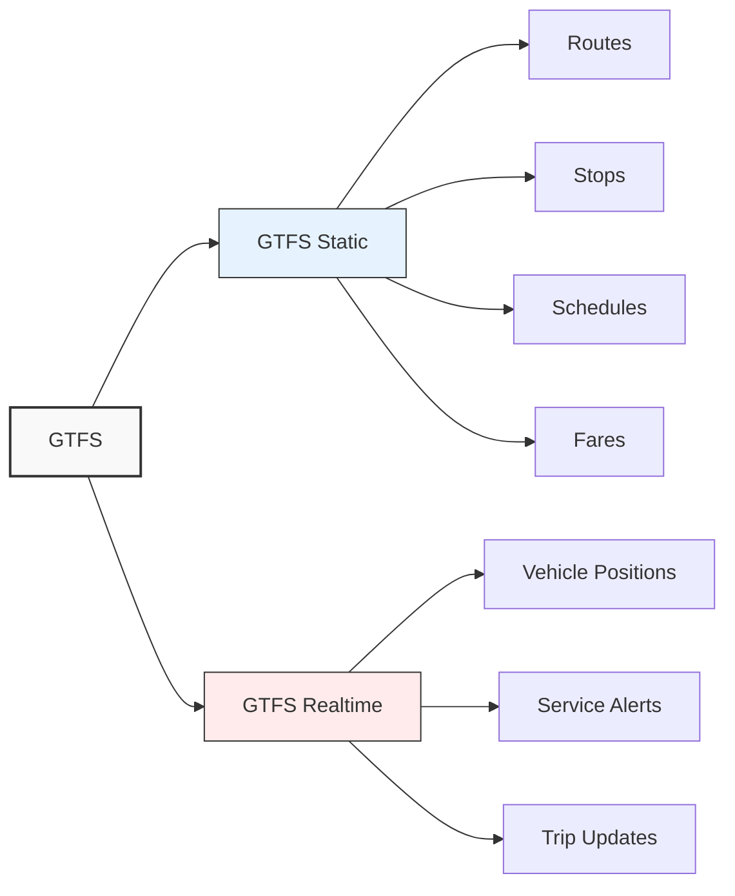
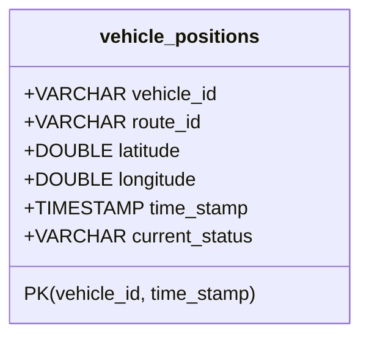

# Understanding GTFS Data and Creating the Transit Schema

In this module, you'll learn about the General Transit Feed Specification (GTFS) data format and how to model the data within Apache Ignite. You'll create a schema that enables efficient storage and querying of transit vehicle positions.

## The GTFS Format: Transit Data in Motion

The [General Transit Feed Specification](https://gtfs.org) (GTFS) has become the universal language of public transportation data. Created through a collaboration between Google and Portland's TriMet transit agency in 2006, it's now the industry standard used by transit agencies worldwide to share transit information in a consistent, machine-readable format.

GTFS comes in two formats:



1. **GTFS Static**: The foundation of transit data, containing:
   - Route definitions (paths that vehicles travel)
   - Stop locations (where vehicles pick up passengers)
   - Schedules (when vehicles are expected at stops)
   - Fares (how much it costs to ride)

2. **GTFS Realtime**: The dynamic extension that provides near real-time updates:
   - Vehicle Positions (where vehicles are right now)
   - Service Alerts (disruptions, detours, etc.)
   - Trip Updates (predictions of arrival/departure times)

For our transit monitoring system, we'll focus on the **[Vehicle Positions](https://gtfs.org/documentation/realtime/reference/#message-vehicleposition)** component of GTFS Realtime. This gives us a continuous stream of data points showing where each transit vehicle is located, what route it's serving, and its current status (in transit, stopped at a location, etc.).

> [!note]
> GTFS-realtime data is typically delivered as Protocol Buffer messages, a binary serialization format developed by Google. While we won't delve into the details of Protocol Buffers in this tutorial, our client library will handle the parsing for us.

## Analyzing the Data: What's in a Vehicle Position?

Before designing our schema, let's examine what information is available in a GTFS vehicle position record:

| Field | Description | Example | Will We Use It? |
|-------|-------------|---------|----------------|
| Vehicle ID | Unique identifier for the vehicle | "1234" | Yes - Primary key |
| Route ID | Identifier for the route the vehicle is servicing | "42" | Yes - For filtering |
| Trip ID | Identifier for the specific trip being made | "trip_morning_1" | No - Not needed for monitoring |
| Position | Latitude and longitude coordinates | (37.7749, -122.4194) | Yes - For mapping |
| Timestamp | When the position was recorded | 1616724123000 | Yes - Primary key component |
| Status | Current status of the vehicle | "IN_TRANSIT_TO", "STOPPED_AT" | Yes - For monitoring |
| Stop ID | Identifier of the stop if the vehicle is stopped | "stop_downtown_3" | No - Not needed for basic monitoring |
| Congestion Level | Level of traffic congestion | "RUNNING_SMOOTHLY" | No - Not in scope |
| Occupancy Status | How full the vehicle is | "MANY_SEATS_AVAILABLE" | No - Not in scope |

For our application, we'll focus on the most essential fields: vehicle ID, route ID, position coordinates, timestamp, and status. This gives us the core information needed for monitoring while keeping our schema clean and focused.

> [!important]
> **Checkpoint**: Before continuing, make sure you understand:
>
> - The difference between GTFS Static and GTFS Realtime
> - What data is available in a vehicle position record
> - Which fields we'll use in our application and why

## Creating the Ignite Schema: Using the Catalog API

Apache Ignite 3 provides a Catalog API for defining tables and their schemas in a type-safe manner. We'll use this API to create our vehicle positions table with the appropriate structure and indexing.

>[!caution]
>It is up to you to create files in the correct folder inside your project in order for the application to function.

Let's create a `SchemaService` class to handle the table creation:

```java
package com.example.transit.service;

import org.apache.ignite.client.IgniteClient;
import org.apache.ignite.catalog.ColumnType;
import org.apache.ignite.catalog.definitions.ColumnDefinition;
import org.apache.ignite.catalog.definitions.TableDefinition;
import org.apache.ignite.table.Table;

/**
 * Service responsible for creating and maintaining the database schema.
 * This class provides methods to set up tables for the transit monitoring system
 * using Apache Ignite 3 Catalog API.
 */
public class SchemaService {
    private static final String VEHICLE_POSITIONS_TABLE = "vehicle_positions";
    private final ConnectService connectionService;

    /**
     * Creates a new schema setup service using the provided connection service.
     *
     * @param connectionService Service that provides Ignite client connections
     */
    public SchemaService(ConnectService connectionService) {
        this.connectionService = connectionService;
    }

    /**
     * Creates the database schema for storing vehicle position data.
     * This method is idempotent and can be safely called multiple times.
     *
     * @return true if the schema setup was successful, false otherwise
     */
    public boolean createSchema() {
        try {
            IgniteClient client = connectionService.getClient();

            if (tableExists(client, VEHICLE_POSITIONS_TABLE)) {
                System.out.println(">>> Vehicle positions table already exists.");
                return true;
            }

            return createVehiclePositionsTable(client);
        } catch (Exception e) {
            logError("Failed to create schema", e);
            return false;
        }
    }

    /**
     * Checks if a table exists in the Ignite catalog.
     *
     * @param client Ignite client
     * @param tableName Name of the table to check
     * @return true if the table exists, false otherwise
     */
    private boolean tableExists(IgniteClient client, String tableName) {
        try {
            return client.tables().table(tableName) != null;
        } catch (Exception e) {
            System.out.println("+++ Table does not exist: " + e.getMessage());
            return false;
        }
    }

    /**
     * Creates the vehicle positions table with appropriate columns and primary key.
     *
     * @param client Ignite client
     * @return true if creation was successful, false otherwise
     */
    private boolean createVehiclePositionsTable(IgniteClient client) {
        try {
            TableDefinition tableDefinition = buildVehiclePositionsTableDefinition();
            System.out.println("--- Creating table: " + tableDefinition);

            Table table = client.catalog().createTable(tableDefinition);
            System.out.println("+++ Table created successfully: " + table.name());
            return true;
        } catch (Exception e) {
            logError("Failed to create vehicle positions table", e);
            return false;
        }
    }

    /**
     * Builds the table definition for vehicle positions.
     *
     * @return TableDefinition for vehicle positions
     */
    private TableDefinition buildVehiclePositionsTableDefinition() {
        return TableDefinition.builder(VEHICLE_POSITIONS_TABLE)
                .ifNotExists()
                .columns(
                        ColumnDefinition.column("vehicle_id", ColumnType.VARCHAR),
                        ColumnDefinition.column("route_id", ColumnType.VARCHAR),
                        ColumnDefinition.column("latitude", ColumnType.DOUBLE),
                        ColumnDefinition.column("longitude", ColumnType.DOUBLE),
                        ColumnDefinition.column("time_stamp", ColumnType.TIMESTAMP),
                        ColumnDefinition.column("current_status", ColumnType.VARCHAR))
                // Define a composite primary key on vehicle_id and time_stamp
                // This enables efficient queries for a vehicle's history
                .primaryKey("vehicle_id", "time_stamp")
                .build();
    }

    /**
     * Logs an error message along with exception details.
     *
     * @param message Error message
     * @param e Exception that occurred
     */
    private void logError(String message, Exception e) {
        System.err.println(message + ": " + e.getMessage());
        Throwable cause = e;
        while (cause != null) {
            System.err.println("  Caused by: " + cause.getClass().getName() + ": " + cause.getMessage());
            cause = cause.getCause();
        }
        e.printStackTrace();
    }
}
```

This schema creation code:

1. Checks if the table already exists to prevent errors
2. Uses Ignite's Catalog API to define a table with appropriate columns
3. Sets a composite primary key of `vehicle_id` and `time_stamp`
4. Handles errors with detailed reporting
5. Returns a success/failure indicator

> [!note]
> The `.ifNotExists()` method ensures the table creation statement won't fail if the table already exists. This makes our schema setup idempotent, meaning it can be run multiple times without causing errors or duplicate tables.

### Schema Design Decisions Explained

Let's take a closer look at some key decisions in our schema design:



1. **Composite Primary Key**:
   We defined a primary key consisting of `vehicle_id` and `time_stamp`. This allows us to:
   - Store multiple positions for the same vehicle (at different times)
   - Efficiently query the history of a specific vehicle
   - Enforce uniqueness for each vehicle's position at a given time

2. **Column Types**:
   - `VARCHAR` for string identifiers (vehicle_id, route_id, current_status)
   - `DOUBLE` for precise geographic coordinates
   - `TIMESTAMP` for temporal data, which allows for SQL time functions and comparisons

3. **Table Name**:
   We chose a clear, descriptive name (`vehicle_positions`) that follows SQL naming conventions.

> [!note]
> We didn't create separate secondary indexes in this schema since our query patterns will primarily use the composite primary key. In a production system, you might add additional indexes for specific query patterns, such as a spatial index for geographic queries or an index on `route_id` for filtering by route.

> [!important]
> **Checkpoint**: Review the schema design and ensure you understand:
>
> - Why we're using a composite primary key
> - The purpose of each column and its data type
> - How the schema supports our query patterns

## Using the Schema

To verify our schema creation works correctly, let's implement an example class that creates the schema and performs basic CRUD (Create, Read, Update, Delete) operations.

Create a file named `SchemaSetupExample.java`:

```java
package com.example.transit.examples;

import com.example.transit.service.ConnectService;
import com.example.transit.service.SchemaService;
import com.example.transit.util.LoggingUtil;
import org.apache.ignite.client.IgniteClient;

import java.time.Instant;
import java.time.LocalDateTime;
import java.time.ZoneId;
import java.util.HashMap;
import java.util.Map;

/**
 * Example demonstrating database connectivity and schema operations.
 *
 * This class shows how to:
 * 1. Connect to an Apache Ignite cluster
 * 2. Create a table for vehicle position data
 * 3. Perform basic CRUD operations to verify functionality
 *
 * Run this example after initializing an Ignite cluster to verify
 * that your application can interact with the database correctly.
 */
public class SchemaSetupExample {

    private static final String VEHICLE_TABLE = "vehicle_positions";

    /**
     * Main method to run the schema setup example.
     *
     * @param args Command line arguments (not used)
     */
    public static void main(String[] args) {
        // Configure logging to suppress unnecessary output
        LoggingUtil.setLogs("OFF");

        System.out.println("=== Table Creation Example ===");
        System.out.println("=== Connect to Ignite cluster");

        try (ConnectService connectionService = new ConnectService()) {
            IgniteClient client = connectionService.getClient();

            // Create schema and verify with test data
            System.out.println("=== Create vehicle positions table");
            SchemaService schemaSetup = new SchemaService(connectionService);

            if (schemaSetup.createSchema()) {
                verifyTableWithTestData(client);
            } else {
                System.err.println("Table setup failed.");
            }
        } catch (Exception e) {
            System.err.println("Table setup failed: " + e.getMessage());
            e.printStackTrace();
        }

        System.out.println("=== Table operations completed");
    }

    /**
     * Performs a sequence of operations to verify table functionality.
     *
     * @param client Ignite client connection
     */
    private static void verifyTableWithTestData(IgniteClient client) {
        System.out.println("=== Table operations");

        try {
            verifyTableExists(client);

            Map<String, Object> testData = createTestData();
            insertTestData(client, testData);

            queryTestData(client, testData);
            deleteAndVerify(client, testData);
        } catch (Exception e) {
            System.err.println("Table operations failed: " + e.getMessage());
            e.printStackTrace();
        }
    }

    /**
     * Verifies that the vehicle positions table exists in the schema.
     *
     * @param client Ignite client connection
     */
    private static void verifyTableExists(IgniteClient client) {
        try {
            var table = client.tables().table(VEHICLE_TABLE);
            if (table != null) {
                System.out.println("+++ Table exists: " + table.name());
            } else {
                System.out.println("Table not found in schema.");
            }
        } catch (Exception e) {
            System.err.println("Error checking if table exists: " + e.getMessage());
        }
    }

    /**
     * Creates a map with test vehicle data.
     *
     * @return Map containing test vehicle position data
     */
    private static Map<String, Object> createTestData() {
        long currentTime = System.currentTimeMillis();
        Map<String, Object> testData = new HashMap<>();
        testData.put("vehicle_id", "test-vehicle-1");
        testData.put("route_id", "test-route-100");
        testData.put("latitude", 47.6062);
        testData.put("longitude", -122.3321);
        testData.put("timestamp", currentTime);
        testData.put("current_status", "STOPPED");

        return testData;
    }

    /**
     * Inserts test vehicle data into the database using SQL.
     *
     * @param client Ignite client connection
     * @param testData Map containing the test data
     */
    private static void insertTestData(IgniteClient client, Map<String, Object> testData) {
        // Convert timestamp to LocalDateTime expected by Ignite
        LocalDateTime localDateTime = LocalDateTime.ofInstant(
                Instant.ofEpochMilli((Long) testData.get("timestamp")),
                ZoneId.systemDefault()
        );

        // SQL parameters are provided in the order they appear in the query
        String insertSql = "INSERT INTO vehicle_positions " +
                "(vehicle_id, route_id, latitude, longitude, time_stamp, current_status) " +
                "VALUES (?, ?, ?, ?, ?, ?)";

        client.sql().execute(null, insertSql,
                testData.get("vehicle_id"),
                testData.get("route_id"),
                testData.get("latitude"),
                testData.get("longitude"),
                localDateTime,
                testData.get("current_status"));

        System.out.println("+++ Test record inserted successfully: " + testData);
    }

    /**
     * Queries the inserted test data and displays results.
     *
     * @param client Ignite client connection
     * @param testData Map containing the original test data
     */
    private static void queryTestData(IgniteClient client, Map<String, Object> testData) {
        String querySql = "SELECT vehicle_id, route_id, latitude, longitude, " +
                "time_stamp, current_status FROM vehicle_positions WHERE vehicle_id = ?";

        try (var resultSet = client.sql().execute(null, querySql, testData.get("vehicle_id"))) {
            int resultCount = 0;

            while (resultSet.hasNext()) {
                var row = resultSet.next();
                resultCount++;

                // Convert timestamp and display the result
                LocalDateTime resultDateTime = row.value("time_stamp");
                Instant instant = resultDateTime.atZone(ZoneId.systemDefault()).toInstant();
                long timestamp = instant.toEpochMilli();

                Map<String, Object> resultData = Map.of(
                        "vehicle_id", row.stringValue("vehicle_id"),
                        "route_id", row.stringValue("route_id"),
                        "latitude", row.doubleValue("latitude"),
                        "longitude", row.doubleValue("longitude"),
                        "timestamp", timestamp,
                        "current_status", row.stringValue("current_status")
                );

                System.out.println("+++ Found test record: " + resultData);
            }

            System.out.println("+++ Retrieved " + resultCount + " vehicle position records");
        }
    }

    /**
     * Deletes test data and verifies it was removed.
     *
     * @param client Ignite client connection
     * @param testData Map containing the test data to delete
     */
    private static void deleteAndVerify(IgniteClient client, Map<String, Object> testData) {
        // Delete the test record using SQL
        String deleteSql = "DELETE FROM vehicle_positions WHERE vehicle_id = ?";
        client.sql().execute(null, deleteSql, testData.get("vehicle_id"));
        System.out.println("+++ Test record deleted successfully.");

        // Verify deletion by counting remaining matching records
        long count = 0;
        String verifySql = "SELECT COUNT(*) as cnt FROM vehicle_positions WHERE vehicle_id = ?";

        try (var verifyResultSet = client.sql().execute(null, verifySql, testData.get("vehicle_id"))) {
            if (verifyResultSet.hasNext()) {
                count = verifyResultSet.next().longValue("cnt");
            }
        }

        System.out.println("+++ Records remaining after delete: " + count);
        if (count == 0) {
            System.out.println("+++ Deletion verification successful.");
        } else {
            System.err.println("Warning: Test data deletion may have failed.");
        }
    }
}
```

This example class performs a complete cycle of operations:

1. Connects to the Ignite cluster
2. Creates the schema using our `SchemaSetupExample` class
3. Inserts a test vehicle position record
4. Queries the record back to verify it was stored correctly
5. Deletes the test record
6. Verifies the deletion was successful
7. Cleans up resources

## Executing the Schema Example

To run the schema example:

```bash
mvn compile exec:java -Dexec.mainClass="com.example.transit.examples.SchemaSetupExample"
```

When executed successfully, you'll see output confirming the schema creation, record insertion, query, and deletion operations. This validates that your Ignite cluster is correctly configured for storing transit data.

```text
=== Table Creation Example ===
=== Connect to Ignite cluster
--- Successfully connected to Ignite cluster: [ClientClusterNode [id=269b35be-01cb-4013-9333-add1ef38e05a, name=node3, address=127.0.0.1:10802, nodeMetadata=null]]
=== Create vehicle positions table
--- Creating table: org.apache.ignite.catalog.definitions.TableDefinition@fce85978
+++ Table created successfully: VEHICLE_POSITIONS
=== Table operations
+++ Table exists: VEHICLE_POSITIONS
+++ Test record inserted successfully: {route_id=test-route-100, latitude=47.6062, current_status=STOPPED, vehicle_id=test-vehicle-1, longitude=-122.3321, timestamp=1742938391111}
+++ Found test record: {vehicle_id=test-vehicle-1, route_id=test-route-100, timestamp=1742938391111, latitude=47.6062, current_status=STOPPED, longitude=-122.3321}
+++ Retrieved 1 vehicle position records
+++ Test record deleted successfully.
+++ Records remaining after delete: 0
+++ Deletion verification successful.
--- Ignite client connection closed
=== Table operations completed
```

> [!important]
> **Checkpoint**: After running the schema example:
>
> - Verify all operations (create, insert, query, delete) completed successfully
> - Check that no exceptions were thrown during the test
> - Ensure the connection was properly closed at the end

## Next Steps

Congratulations! You've now:

1. Understood the structure of GTFS transit data
2. Created a Java model for vehicle positions
3. Designed an efficient schema using Ignite's Catalog API
4. Implemented and tested basic CRUD operations
5. Learned about the distributed architecture supporting your application

This schema provides the foundation for our transit monitoring system. In the next module, we'll build a client to fetch real-time GTFS data from a transit agency and feed it into our Ignite database.

> [!important]
> **Final Module Checkpoint**: Before proceeding to the next module, ensure:
>
> - You understand the schema design and its relationship to the data model
> - The schema creation test runs successfully
> - You can explain how the composite primary key helps with data organization and query performance
> - You understand how Ignite's data colocation feature improves query performance

> [!tip]
> **Next Steps:** Continue to [Module 4: Building the GTFS Client](04-gtfs-client.md) to implement the component that will connect to real-time transit data feeds.
