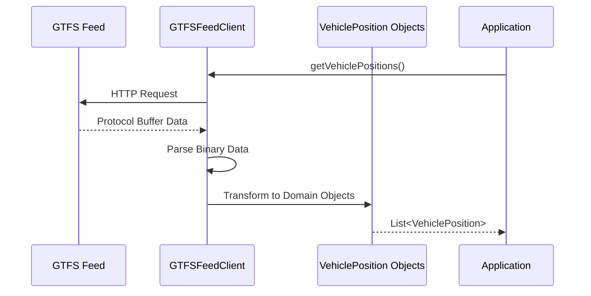

# Building and Testing the GTFS Client

In this module, you'll implement a client that communicates with GTFS-realtime feeds to fetch transit vehicle positions. This client serves as the data acquisition layer of your application, providing a clean interface between external transit data and your Ignite database.

## Understanding the Client's Role

Before we dive into code, let's clarify what we're trying to accomplish:

1. **External Data Acquisition**: Connect to a GTFS-realtime feed provided by a transit agency
2. **Protocol Buffer Processing**: Parse the complex binary format used by GTFS-realtime
3. **Data Transformation**: Convert external data structures into our domain model
4. **Error Handling**: Deal robustly with network issues, data format changes, and other potential problems



By isolating the complexities of GTFS-realtime protocol buffer parsing, we make the rest of our application more maintainable and focused on business logic.

## Implementing the GTFS Client

Let's create a client that handles the connection to a GTFS-realtime feed and transforms the data into our domain model. This class encapsulates all the complexities of working with the protocol buffer format and external API endpoints.

Create `GTFSFeedClient.java`:

```java
package com.example.transit;

import com.google.transit.realtime.GtfsRealtime.FeedEntity;
import com.google.transit.realtime.GtfsRealtime.FeedMessage;
import com.google.transit.realtime.GtfsRealtime.Position;

import java.io.IOException;
import java.net.URL;
import java.util.ArrayList;
import java.util.List;

/**
 * Client for retrieving GTFS-realtime feed data.
 * This class handles the connection to the transit agency's GTFS feed,
 * parses the protobuf-formatted data, and converts it to our domain model.
 */
public class GTFSFeedClient {
    private final String feedUrl;
    
    /**
     * Creates a new GTFS feed client.
     * 
     * @param feedUrl The URL of the GTFS-realtime vehicle positions feed
     */
    public GTFSFeedClient(String feedUrl) {
        this.feedUrl = feedUrl;
    }

    /**
     * Retrieves vehicle positions from the GTFS feed.
     * This method:
     * 1. Connects to the feed URL
     * 2. Parses the protobuf data
     * 3. Transforms it into our VehiclePosition domain objects
     *
     * @return List of vehicle positions
     * @throws IOException if there's an error fetching or parsing the feed
     */
    public List<VehiclePosition> getVehiclePositions() throws IOException {
        List<VehiclePosition> positions = new ArrayList<>();

        try {
            // Parse feed directly from URL
            URL url = new URL(feedUrl);
            FeedMessage feed = FeedMessage.parseFrom(url.openStream());
            
            // Log feed metadata
            System.out.println("GTFS Feed Version: " + feed.getHeader().getGtfsRealtimeVersion());
            System.out.println("Feed Timestamp: " + feed.getHeader().getTimestamp());
            System.out.println("Total entities: " + feed.getEntityCount());

            // Process each entity in the feed
            for (FeedEntity entity : feed.getEntityList()) {
                // Only process entities that contain vehicle position data
                if (entity.hasVehicle()) {
                    com.google.transit.realtime.GtfsRealtime.VehiclePosition vehicle = entity.getVehicle();

                    // Ensure we have the required fields before processing
                    if (vehicle.hasPosition() && vehicle.hasVehicle() && vehicle.hasTrip()) {
                        Position position = vehicle.getPosition();
                        String vehicleId = vehicle.getVehicle().getId();
                        String routeId = vehicle.getTrip().getRouteId();

                        // Map the GTFS status to our string representation
                        String status = "UNKNOWN";
                        if (vehicle.hasCurrentStatus()) {
                            switch (vehicle.getCurrentStatus()) {
                                case IN_TRANSIT_TO:
                                    status = "IN_TRANSIT_TO";
                                    break;
                                case STOPPED_AT:
                                    status = "STOPPED_AT";
                                    break;
                                case INCOMING_AT:
                                    status = "INCOMING_AT";
                                    break;
                                default:
                                    status = "UNKNOWN";
                                    break;
                            }
                        }

                        // Create our vehicle position object
                        positions.add(new VehiclePosition(
                                vehicleId,
                                routeId,
                                position.getLatitude(),
                                position.getLongitude(),
                                // Convert seconds to milliseconds if present, otherwise use current time
                                vehicle.hasTimestamp() ? vehicle.getTimestamp() * 1000 : System.currentTimeMillis(),
                                status
                        ));
                    }
                }
            }

            System.out.println("Fetched " + positions.size() + " vehicle positions from feed");

        } catch (IOException e) {
            System.err.println("Error fetching GTFS feed: " + e.getMessage());
            throw e; // Rethrow to allow caller to handle the exception
        } catch (Exception e) {
            System.err.println("Error parsing GTFS feed: " + e.getMessage());
            throw new IOException("Failed to process GTFS feed", e);
        }

        return positions;
    }
}
```

## GTFS-realtime Feed API Token

To access real transit data, we'll need an API token from a transit data provider. For this tutorial, we'll use the San Francisco Bay Area's 511.org API, which provides GTFS-realtime data for multiple transit agencies.

Follow these steps to obtain an API token:

1. Visit <https://511.org/open-data/token>
2. Complete the registration form with your details
3. Submit the form
4. Save the API token that's emailed to you

## Configuring Environment Variables

To securely manage API tokens and other configuration without hardcoding them in our source code, we'll use environment variables loaded from a `.env` file.

Create a file named `.env` in the root of your project:

```conf
# 511.org API token - get yours at https://511.org/open-data/token
API_TOKEN=your_token_here

# GTFS Feed URL
GTFS_BASE_URL=https://api.511.org/transit/vehiclepositions

# GTFS Agency - default is San Francisco Muni
GTFS_AGENCY=SF
```

Replace `your_token_here` with your actual API token from 511.org and save the `.env` file in the root of your project.

> **Important:** Never commit your `.env` file to version control. Add it to your `.gitignore` file to prevent accidentally exposing your API credentials.

## Create a Test Application

Let's validate our GTFS client with a test application before integrating with Ignite.

Create `GTFSConnectionTest.java`:

```java
package com.example.transit;

import io.github.cdimascio.dotenv.Dotenv;

import java.io.IOException;
import java.util.List;
import java.util.Map;
import java.util.stream.Collectors;

/**
 * Test class to verify the GTFS connection and data parsing.
 * This standalone application demonstrates fetching and analyzing
 * real-time vehicle positions from a transit agency.
 */
public class GTFSConnectionTest {

    public static void main(String[] args) {
        System.out.println("=== GTFS Connection Test ===");
        
        // Load environment variables from .env file
        Dotenv dotenv = Dotenv.configure().ignoreIfMissing().load();

        // Retrieve configuration values
        String apiToken = dotenv.get("API_TOKEN");
        String baseUrl = dotenv.get("GTFS_BASE_URL");
        String agency = dotenv.get("GTFS_AGENCY");

        // Validate configuration
        if (apiToken == null || baseUrl == null || agency == null) {
            System.err.println("Missing configuration. Please check your .env file.");
            System.err.println("Required variables: API_TOKEN, GTFS_BASE_URL, GTFS_AGENCY");
            return;
        }

        // Construct the full feed URL
        String feedUrl = String.format("%s?api_key=%s&agency=%s", baseUrl, apiToken, agency);

        System.out.println("Using GTFS feed URL: " + feedUrl.replaceAll(apiToken, "[API_TOKEN]")); // Hide token in logs

        // Create the feed client
        GTFSFeedClient feedClient = new GTFSFeedClient(feedUrl);

        try {
            // Fetch vehicle positions
            System.out.println("Fetching vehicle positions...");
            List<VehiclePosition> positions = feedClient.getVehiclePositions();

            if (positions.isEmpty()) {
                System.out.println("Warning: No vehicle positions found in the feed.");
                System.out.println("This could indicate an issue with the feed URL, API token, or the agency may not have active vehicles at this time.");
                return;
            }

            System.out.println("Success! Retrieved " + positions.size() + " vehicle positions.");

            // Print the first 5 positions as a sample
            System.out.println("\nSample data (first 5 vehicles):");
            positions.stream()
                    .limit(5)
                    .forEach(System.out::println);

            // Calculate and display statistics
            analyzeVehicleData(positions);

        } catch (IOException e) {
            System.err.println("Error testing GTFS feed: " + e.getMessage());
            System.err.println("Check your internet connection and API token.");
            e.printStackTrace();
            
            // Provide fallback options
            System.out.println("\nTroubleshooting suggestions:");
            System.out.println("1. Verify your API token is correct in the .env file");
            System.out.println("2. Check if the agency code is correct (e.g., 'SF' for San Francisco Muni)");
            System.out.println("3. Try accessing the feed URL in a browser (with your API token)");
        }
    }
    
    /**
     * Analyzes the vehicle position data and displays useful statistics.
     * 
     * @param positions List of vehicle positions to analyze
     */
    private static void analyzeVehicleData(List<VehiclePosition> positions) {
        // Count unique routes and vehicles
        long uniqueRoutes = positions.stream()
                .map(VehiclePosition::getRouteId)
                .distinct()
                .count();

        long uniqueVehicles = positions.stream()
                .map(VehiclePosition::getVehicleId)
                .distinct()
                .count();
                
        // Count vehicles by status
        Map<String, Long> statusCounts = positions.stream()
                .collect(Collectors.groupingBy(
                        VehiclePosition::getCurrentStatus,
                        Collectors.counting()
                ));
                
        // Find top 5 routes by vehicle count
        Map<String, Long> routeCounts = positions.stream()
                .collect(Collectors.groupingBy(
                        VehiclePosition::getRouteId,
                        Collectors.counting()
                ));
                
        List<Map.Entry<String, Long>> topRoutes = routeCounts.entrySet().stream()
                .sorted(Map.Entry.<String, Long>comparingByValue().reversed())
                .limit(5)
                .collect(Collectors.toList());

        // Display statistics
        System.out.println("\n=== Transit System Statistics ===");
        System.out.println("• Unique routes: " + uniqueRoutes);
        System.out.println("• Unique vehicles: " + uniqueVehicles);
        
        System.out.println("\nVehicle status distribution:");
        statusCounts.forEach((status, count) -> 
            System.out.println("• " + status + ": " + count + " vehicles (" + 
                String.format("%.1f", (count * 100.0 / positions.size())) + "%)"));
        
        System.out.println("\nTop 5 routes by vehicle count:");
        for (int i = 0; i < topRoutes.size(); i++) {
            Map.Entry<String, Long> route = topRoutes.get(i);
            System.out.println("• Route " + route.getKey() + ": " + 
                route.getValue() + " vehicles");
        }
        
        // Calculate geographic bounds
        double minLat = positions.stream().mapToDouble(VehiclePosition::getLatitude).min().orElse(0);
        double maxLat = positions.stream().mapToDouble(VehiclePosition::getLatitude).max().orElse(0);
        double minLon = positions.stream().mapToDouble(VehiclePosition::getLongitude).min().orElse(0);
        double maxLon = positions.stream().mapToDouble(VehiclePosition::getLongitude).max().orElse(0);
        
        System.out.println("\nGeographic coverage:");
        System.out.println("• Latitude range: " + minLat + " to " + maxLat);
        System.out.println("• Longitude range: " + minLon + " to " + maxLon);
    }
}
```

## Run the Test

Execute the test to validate the GTFS client:

```bash
mvn compile exec:java -Dexec.mainClass="com.example.transit.GTFSConnectionTest"
```

Successful execution will produce output similar to:

``` text
Using GTFS feed URL: https://api.511.org/transit/vehiclepositions?api_key=[API_TOKEN]&agency=SF
Fetching vehicle positions...
GTFS Feed Version: 2.0
Feed Timestamp: 1647532156
Total entities: 540
Fetched 540 vehicle positions from feed
Success! Retrieved 540 vehicle positions.

Sample data (first 5 vehicles):
Vehicle ID: 1050, Route: F, Position: (37.7687873840332, -122.42732238769531), Status: STOPPED_AT, Time: 2023-03-18 10:53:23.0
Vehicle ID: 1051, Route: F, Position: (37.782012939453125, -122.41065979003906), Status: STOPPED_AT, Time: 2023-03-18 10:53:23.0
Vehicle ID: 1052, Route: F, Position: (37.72022247314453, -122.44660949707031), Status: IN_TRANSIT_TO, Time: 2023-03-18 10:53:23.0
Vehicle ID: 1058, Route: F, Position: (37.80823516845703, -122.416015625), Status: IN_TRANSIT_TO, Time: 2023-03-18 10:53:23.0
Vehicle ID: 1059, Route: F, Position: (37.792911529541016, -122.3965835571289), Status: STOPPED_AT, Time: 2023-03-18 10:53:23.0

=== Transit System Statistics ===
• Unique routes: 58
• Unique vehicles: 540

Vehicle status distribution:
• IN_TRANSIT_TO: 342 vehicles (63.3%)
• STOPPED_AT: 198 vehicles (36.7%)

Top 5 routes by vehicle count:
• Route 14: 32 vehicles
• Route 5: 30 vehicles
• Route 38: 28 vehicles
• Route 1: 26 vehicles
• Route 8: 24 vehicles

Geographic coverage:
• Latitude range: 37.7090301513672 to 37.8102340698242
• Longitude range: -122.5108642578125 to -122.3889923095703
```

## Troubleshooting

If you encounter issues:

- Verify your API token is correctly configured in the `.env` file
- Ensure the feed URL is properly constructed
- Check network connectivity to the GTFS endpoint
- Verify the protobuf dependencies are correctly installed

## Next Steps

In this module, we've built and tested a robust GTFS client that forms the data acquisition layer of our transit monitoring system. This client handles the complexities of connecting to external data sources, parsing protocol buffer formats, and transforming the data into our domain model.

In the next module, we'll implement a data ingestion service that uses this client to regularly fetch transit data and store it in our Ignite database, bringing our monitoring system to life.

> **Next Steps:** Continue to [Module 5: Building the Data Ingestion Service](05-data-ingestion.md) to implement the component that regularly updates our database with fresh transit data.
