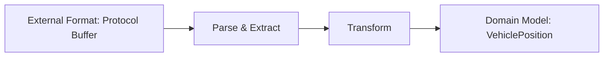

# Building and Testing the GTFS Client

In this module, you'll implement a client that communicates with GTFS-realtime feeds to fetch transit vehicle positions. This client serves as the data acquisition layer of your application, providing a clean interface between external transit data and your Ignite database.

## Understanding the Client's Role

Before we dive into code, let's clarify what we're trying to accomplish:

1. **External Data Acquisition**: Connect to a GTFS-realtime feed provided by a transit agency
2. **Protocol Buffer Processing**: Parse the complex binary format used by GTFS-realtime
3. **Data Transformation**: Convert external data structures into our domain model
4. **Error Handling**: Deal robustly with network issues, data format changes, and other potential problems


By isolating the complexities of GTFS-realtime protocol buffer parsing, we make the rest of our application more maintainable and focused on business logic.

> [!note]
> Protocol Buffers (protobuf) is a binary serialization format developed by Google. It's more compact and faster to parse than JSON or XML, making it ideal for real-time data feeds. The GTFS-realtime specification uses Protocol Buffers to encode transit data efficiently. Our client will use a pre-built library to handle the protobuf parsing.

> [!important]
> **Checkpoint**: Before proceeding, ensure you understand:
>
> - The role of the GTFS client in our application architecture
> - The data flow from the external feed to our application
> - Why we need to transform the data from Protocol Buffers to our domain model

## Implementing the GTFS Client

Let's create a client that handles the connection to a GTFS-realtime feed and transforms the data into our domain model. This class encapsulates all the complexities of working with the protocol buffer format and external API endpoints.

Create `GTFSFeedService.java`:

```java
package com.example.transit.service;

import com.google.transit.realtime.GtfsRealtime.FeedEntity;
import com.google.transit.realtime.GtfsRealtime.FeedMessage;
import com.google.transit.realtime.GtfsRealtime.Position;

import java.io.IOException;
import java.net.URL;
import java.time.Instant;
import java.time.LocalDateTime;
import java.time.ZoneId;
import java.util.ArrayList;
import java.util.HashMap;
import java.util.List;
import java.util.Map;

/**
 * Service for retrieving GTFS-realtime feed data.
 * This class handles the connection to the transit agency's GTFS feed,
 * parses the protobuf-formatted data, and converts it to maps for storage.
 */
public class GTFSFeedService {
    private final String feedUrl;

    /**
     * Creates a new GTFS feed service.
     *
     * @param feedUrl The URL of the GTFS-realtime vehicle positions feed
     */
    public GTFSFeedService(String feedUrl) {
        this.feedUrl = feedUrl;
    }

    /**
     * Retrieves vehicle positions from the GTFS feed.
     * This method:
     * 1. Connects to the feed URL
     * 2. Parses the protobuf data
     * 3. Transforms it into maps containing vehicle position data
     *
     * @return List of maps containing vehicle positions
     * @throws IOException if there's an error fetching or parsing the feed
     */
    public List<Map<String, Object>> getVehiclePositions() throws IOException {
        List<Map<String, Object>> positions = new ArrayList<>();

        try {
            // Parse feed directly from URL
            URL url = new URL(feedUrl);
            FeedMessage feed = FeedMessage.parseFrom(url.openStream());

            // Log feed metadata
            System.out.println("--- GTFS Feed Version: " + feed.getHeader().getGtfsRealtimeVersion());
            System.out.println("--- Feed Timestamp: " + feed.getHeader().getTimestamp());
            System.out.println("--- Total entities: " + feed.getEntityCount());

            // Process each entity in the feed
            for (FeedEntity entity : feed.getEntityList()) {
                // Only process entities that contain vehicle position data
                if (entity.hasVehicle()) {
                    com.google.transit.realtime.GtfsRealtime.VehiclePosition vehicle = entity.getVehicle();

                    // Ensure we have the required fields before processing
                    if (vehicle.hasPosition() && vehicle.hasVehicle() && vehicle.hasTrip()) {
                        Position position = vehicle.getPosition();
                        String vehicleId = vehicle.getVehicle().getId();
                        String routeId = vehicle.getTrip().getRouteId();

                        // Map the GTFS status to our string representation
                        String status = mapVehicleStatus(vehicle);

                        // Get timestamp (convert seconds to milliseconds if present, otherwise use current time)
                        long timestamp = vehicle.hasTimestamp() ? vehicle.getTimestamp() * 1000 : System.currentTimeMillis();

                        // LocalDateTime for Ignite storage
                        LocalDateTime localDateTime = LocalDateTime.ofInstant(
                                Instant.ofEpochMilli(timestamp),
                                ZoneId.systemDefault()
                        );

                        // Create a map for the vehicle position
                        Map<String, Object> vehiclePosition = new HashMap<>();
                        vehiclePosition.put("vehicle_id", vehicleId);
                        vehiclePosition.put("route_id", routeId);
                        vehiclePosition.put("latitude", position.getLatitude());
                        vehiclePosition.put("longitude", position.getLongitude());
                        vehiclePosition.put("time_stamp", localDateTime);
                        vehiclePosition.put("current_status", status);

                        positions.add(vehiclePosition);
                    }
                }
            }

            System.out.println("+++ Fetched " + positions.size() + " vehicle positions from feed");

        } catch (IOException e) {
            System.err.println("Error fetching GTFS feed: " + e.getMessage());
            throw e; // Rethrow to allow caller to handle the exception
        } catch (Exception e) {
            System.err.println("Error parsing GTFS feed: " + e.getMessage());
            throw new IOException("Failed to process GTFS feed", e);
        }

        return positions;
    }

    /**
     * Maps the GTFS vehicle status enum to a string representation.
     *
     * @param vehicle The GTFS vehicle position object
     * @return String representation of the vehicle status
     */
    private String mapVehicleStatus(com.google.transit.realtime.GtfsRealtime.VehiclePosition vehicle) {
        if (!vehicle.hasCurrentStatus()) {
            return "UNKNOWN";
        }

        switch (vehicle.getCurrentStatus()) {
            case IN_TRANSIT_TO:
                return "IN_TRANSIT_TO";
            case STOPPED_AT:
                return "STOPPED_AT";
            case INCOMING_AT:
                return "INCOMING_AT";
            default:
                return "UNKNOWN";
        }
    }
}
```

> [!note]
> The `FeedMessage`, `FeedEntity`, and other GTFS-realtime classes come from the `gtfs-realtime-bindings` library we included in our Maven dependencies. These classes are generated from the GTFS-realtime protocol buffer definition and provide a Java API for accessing the protobuf data.
>
> **Key Sections Explained**:
>
> 1. **Initialization**: We store the feed URL for later use
> 2. **HTTP Connection**: We open a connection to the feed URL using Java's `URL` class
> 3. **Protobuf Parsing**: We parse the binary data stream using the `parseFrom` method
> 4. **Data Extraction**: We extract relevant fields from each vehicle entity
> 5. **Status Mapping**: We convert the GTFS enum status to our string representation
> 6. **Domain Transformation**: We create our `VehiclePosition` objects with the extracted data
> 7. **Error Handling**: We catch and properly handle both network and parsing errors

## GTFS-realtime Feed API Token

To access real transit data, we'll need an API token from a transit data provider. For this tutorial, we'll use the San Francisco Bay Area's 511.org API, which provides GTFS-realtime data for multiple transit agencies.

Follow these steps to obtain an API token:

1. Visit <https://511.org/open-data/token>
2. Complete the registration form with your details
3. Submit the form
4. Save the API token that's emailed to you

> [!note]
> The process of obtaining an API token is similar for most transit data providers. If you want to use data from a different agency, check their developer portal for instructions on getting access.

## Configuring Environment Variables

To securely manage API tokens and other configuration without hardcoding them in our source code, we'll use environment variables loaded from a `.env` file.

Create a file named `.env` in the root of your project:

```conf
# 511.org API token - get yours at https://511.org/open-data/token
API_TOKEN=your_token_here

# GTFS Feed URL
GTFS_BASE_URL=https://api.511.org/transit/vehiclepositions

# GTFS Agency - default is San Francisco Muni
GTFS_AGENCY=SF
```

Replace `your_token_here` with your actual API token from 511.org and save the `.env` file in the root of your project.

> [!caution]
> Never commit your `.env` file to version control. Add it to your `.gitignore` file to prevent accidentally exposing your API credentials.

> [!note]
> The dotenv-java library we included in our Maven dependencies allows us to load these environment variables from the `.env` file at runtime. This is a common pattern for managing configuration in applications, especially for sensitive information like API tokens.

> [!important]
> **Checkpoint**: Before proceeding, make sure you have:
>
> - Created the `GTFSFeedClient.java` file with the provided code
> - Obtained an API token from 511.org (or another transit data provider)
> - Created a `.env` file with your configuration
> - Added `.env` to your `.gitignore` file (if using version control)

## Create a Test Application

Let's validate our GTFS client with a test application before integrating with Ignite.

Create `GTFSFeedExample.java`:

```java
package com.example.transit.examples;

import com.example.transit.service.*;
import com.example.transit.util.LoggingUtil;
import org.apache.ignite.client.IgniteClient;

import java.io.IOException;
import java.util.List;
import java.util.Map;

/**
 * Example application that demonstrates fetching and analyzing
 * real-time vehicle positions from a transit agency and storing
 * them in an Apache Ignite database.
 */
public class GTFSFeedExample {

    private static final String VEHICLE_TABLE = "vehicle_positions";

    public static void main(String[] args) {
        // Configure logging to suppress unnecessary output
        LoggingUtil.setLogs("OFF");

        System.out.println("=== GTFS Feed Example ===");

        // Load configuration
        ConfigurationService config = ConfigurationService.getInstance();
        if (!config.validateConfiguration()) {
            return;
        }

        System.out.println("+++ Using GTFS feed URL: " + config.getRedactedFeedUrl());

        // Initialize Ignite connection service
        try (IgniteConnectionService connectionService = new IgniteConnectionService()) {
            IgniteClient client = connectionService.getClient();
            ReportingService reportingService = new ReportingService(client);

            // Set up the schema for storing vehicle positions
            SchemaSetupService schemaService = new SchemaSetupService(connectionService);
            if (!schemaService.createSchema()) {
                System.err.println("Failed to set up database schema. Exiting.");
                return;
            }

            // Create the feed service
            GTFSFeedService feedService = new GTFSFeedService(config.getFeedUrl());

            try {
                // Fetch vehicle positions
                System.out.println("=== Fetching vehicle positions...");
                List<Map<String, Object>> positions = feedService.getVehiclePositions();

                if (positions.isEmpty()) {
                    System.out.println("Warning: No vehicle positions found in the feed.");
                    System.out.println("This could indicate an issue with the feed URL, API token, or the agency may not have active vehicles at this time.");
                    return;
                }

                System.out.println("=== Success! Retrieved " + positions.size() + " vehicle positions.");

                // Print the first 5 positions as a sample
                System.out.println("\nSample data (first 5 vehicles):");
                positions.stream()
                        .limit(5)
                        .forEach(pos -> System.out.println(reportingService.formatVehicleData(pos)));

                // Calculate and display statistics
                reportingService.analyzeVehicleData(positions);

                // Store vehicle positions in Ignite
                storeVehiclePositions(client, positions);

            } catch (IOException e) {
                System.err.println("Error testing GTFS feed: " + e.getMessage());
                System.err.println("Check your internet connection and API token.");
                e.printStackTrace();

                // Provide fallback options
                System.out.println("\nTroubleshooting suggestions:");
                System.out.println("1. Verify your API token is correct in the .env file");
                System.out.println("2. Check if the agency code is correct (e.g., 'SF' for San Francisco Muni)");
                System.out.println("3. Try accessing the feed URL in a browser (with your API token)");
            }
        } catch (Exception e) {
            System.err.println("Error initializing Ignite connection: " + e.getMessage());
            e.printStackTrace();
        }

        System.out.println("=== GTFS Feed Example Completed");
    }

    /**
     * Store vehicle positions in Ignite database.
     *
     * @param client Ignite client connection
     * @param positions List of vehicle position maps to store
     */
    private static void storeVehiclePositions(IgniteClient client, List<Map<String, Object>> positions) {
        System.out.println("\n=== Storing " + positions.size() + " vehicle positions in Ignite...");

        // Prepare SQL statement
        String insertSql = "INSERT INTO " + VEHICLE_TABLE +
                " (vehicle_id, route_id, latitude, longitude, time_stamp, current_status) " +
                "VALUES (?, ?, ?, ?, ?, ?)";

        int successCount = 0;

        // Insert each position
        for (Map<String, Object> position : positions) {
            try {
                client.sql().execute(null, insertSql,
                        position.get("vehicle_id"),
                        position.get("route_id"),
                        position.get("latitude"),
                        position.get("longitude"),
                        position.get("time_stamp"),
                        position.get("current_status"));

                successCount++;
            } catch (Exception e) {
                System.err.println("Error inserting vehicle position: " + e.getMessage());
                // Continue with the next position
            }
        }

        System.out.println("+++ Successfully stored " + successCount + " vehicle positions in Ignite.");
    }
}
```

> [!note]
> This test application demonstrates several Java 8 features like streams, lambda expressions, and method references. The `analyzeVehicleData` method shows how to use streams to calculate statistics on collections of data.
>
> **The test application works as follows**:
>
> 1. **Load Configuration**: Read API credentials from the `.env` file
> 2. **Create Client**: Initialize the GTFS client with the feed URL
> 3. **Fetch Data**: Request vehicle positions from the transit feed
> 4. **Sample Data**: Display the first few vehicle positions
> 5. **Analyze Data**: Calculate and display statistics about the transit system
> 6. **Handle Errors**: Provide helpful troubleshooting suggestions if there's an issue

## Run the Test

Execute the test to validate the GTFS client:

```bash
mvn compile exec:java -Dexec.mainClass="com.example.transit.GTFSConnectionTest"
```

Successful execution will produce output similar to:

``` text
Using GTFS feed URL: https://api.511.org/transit/vehiclepositions?api_key=[API_TOKEN]&agency=SF
Fetching vehicle positions...
GTFS Feed Version: 2.0
Feed Timestamp: 1647532156
Total entities: 540
Fetched 540 vehicle positions from feed
Success! Retrieved 540 vehicle positions.

Sample data (first 5 vehicles):
Vehicle ID: 1050, Route: F, Position: (37.7687873840332, -122.42732238769531), Status: STOPPED_AT, Time: 2023-03-18 10:53:23.0
Vehicle ID: 1051, Route: F, Position: (37.782012939453125, -122.41065979003906), Status: STOPPED_AT, Time: 2023-03-18 10:53:23.0
Vehicle ID: 1052, Route: F, Position: (37.72022247314453, -122.44660949707031), Status: IN_TRANSIT_TO, Time: 2023-03-18 10:53:23.0
Vehicle ID: 1058, Route: F, Position: (37.80823516845703, -122.416015625), Status: IN_TRANSIT_TO, Time: 2023-03-18 10:53:23.0
Vehicle ID: 1059, Route: F, Position: (37.792911529541016, -122.3965835571289), Status: STOPPED_AT, Time: 2023-03-18 10:53:23.0

=== Transit System Statistics ===
• Unique routes: 58
• Unique vehicles: 540

Vehicle status distribution:
• IN_TRANSIT_TO: 342 vehicles (63.3%)
• STOPPED_AT: 198 vehicles (36.7%)

Top 5 routes by vehicle count:
• Route 14: 32 vehicles
• Route 5: 30 vehicles
• Route 38: 28 vehicles
• Route 1: 26 vehicles
• Route 8: 24 vehicles

Geographic coverage:
• Latitude range: 37.7090301513672 to 37.8102340698242
• Longitude range: -122.5108642578125 to -122.3889923095703
```

> [!note]
> Your actual output will vary depending on the current state of the transit system. The number of vehicles, their statuses, and their locations will change as vehicles move through the system.

> [!important]
> **Checkpoint #3**: After running the test application, verify that:
>
> - The application successfully connects to the GTFS feed
> - Vehicle positions are properly parsed and transformed
> - You can see statistics about the transit system
> - There are no errors or exceptions

## Understanding the GTFS Client Architecture

Let's examine the key architectural decisions in our GTFS client implementation:

### Separation of Concerns

Our client follows the Single Responsibility Principle by focusing solely on:

1. Connecting to the GTFS feed
2. Parsing the protocol buffer data
3. Transforming it to our domain model

This separation isolates the complexities of the external API and data format from the rest of our application.

### Data Transformation Pattern

The client implements a data transformation pattern:



This approach allows our application to work with a consistent domain model regardless of changes in the external data format.

### Error Handling Strategy

The client uses a two-tier error handling approach:

1. **Detailed logging**: Provides context about what went wrong
2. **Exception propagation**: Allows the calling code to decide how to handle failures

This gives flexibility while ensuring errors aren't silently ignored.

## Next Steps

In this module, we've built and tested a robust GTFS client that forms the data acquisition layer of our transit monitoring system. This client handles the complexities of connecting to external data sources, parsing protocol buffer formats, and transforming the data into our domain model.

In the next module, we'll implement a data ingestion service that uses this client to regularly fetch transit data and store it in our Ignite database, bringing our monitoring system to life.

> [!important]
> **Final Module Checkpoint**: Before proceeding to the next module, ensure:
>
> - The GTFS client connects to the feed and fetches data successfully
> - You understand the transformation from protocol buffer format to our domain model
> - You're familiar with the common issues that might arise when working with external APIs
> - You've updated your `.env` file with the correct API credentials
> - The test application runs without errors

> [!tip]
> **Next Steps:** Continue to [Module 5: Building the Data Ingestion Service](05-data-ingestion.md) to implement the component that regularly updates our database with fresh transit data.
