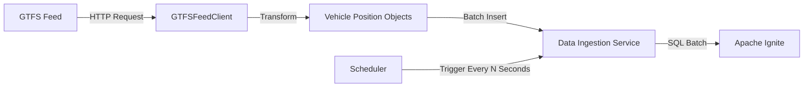

# Building the Data Ingestion Service

In this module, you'll implement a robust data ingestion service that forms the backbone of your transit monitoring application. This service will continuously fetch vehicle position data from GTFS feeds and store it in Apache Ignite, creating the real-time data foundation needed for monitoring and analysis.

## Understanding Data Ingestion Requirements

Real-time transit monitoring demands a reliable data pipeline with specific characteristics:

1. **Periodic data collection**: Regularly fetching the latest data to maintain freshness
2. **Efficient data storage**: Minimizing database overhead during insertion
3. **Fault tolerance**: Handling errors without service disruption
4. **Resource management**: Properly managing connections and threads
5. **Configurable behavior**: Adjusting parameters like frequency based on requirements



## Implementing the DataIngestionService

Let's create a `DataIngestionService.java` file that implements this pipeline:

```java
package com.example.transit;

import org.apache.ignite.client.IgniteClient;

import java.time.LocalDateTime;
import java.time.ZoneId;
import java.util.List;
import java.util.concurrent.Executors;
import java.util.concurrent.ScheduledExecutorService;
import java.util.concurrent.ScheduledFuture;
import java.util.concurrent.TimeUnit;
import java.util.concurrent.atomic.AtomicLong;

/**
 * Service responsible for periodically fetching transit data and storing it in Ignite.
 * Implements a resilient data ingestion pipeline with configurable scheduling.
 *
 * This service uses a scheduled executor to periodically fetch data from the GTFS
 * feed and store it in the Ignite database using batch processing for efficiency.
 */
public class DataIngestionService {
    private final GTFSFeedClient feedClient;
    private final IgniteClient igniteClient;
    private final ScheduledExecutorService scheduler;
    private ScheduledFuture<?> scheduledTask;
    private int batchSize = 100; // Default batch size

    // Statistics tracking
    private final AtomicLong totalFetched = new AtomicLong(0);
    private final AtomicLong totalStored = new AtomicLong(0);
    private final AtomicLong lastFetchCount = new AtomicLong(0);
    private final AtomicLong lastFetchTime = new AtomicLong(0);
    private long startTime;

    /**
     * Constructs a new data ingestion service.
     *
     * @param feedUrl The URL of the GTFS realtime feed
     */
    public DataIngestionService(String feedUrl) {
        this.feedClient = new GTFSFeedClient(feedUrl);
        this.igniteClient = IgniteConnection.getClient();
        this.scheduler = Executors.newSingleThreadScheduledExecutor(r -> {
            Thread t = new Thread(r, "data-ingestion-thread");
            t.setDaemon(true);
            // Make the thread respond better to interrupts
            t.setUncaughtExceptionHandler((thread, ex) -> {
                System.err.println("Uncaught exception in " + thread.getName() + ": " + ex.getMessage());
                ex.printStackTrace();
            });
            return t;
        });
    }

    /**
     * Sets the batch size for database operations.
     * Larger batch sizes can improve performance but consume more memory.
     *
     * @param batchSize Number of records to process in each batch
     * @return This DataIngestionService instance for method chaining
     */
    public DataIngestionService withBatchSize(int batchSize) {
        if (batchSize < 1) {
            throw new IllegalArgumentException("Batch size must be at least 1");
        }
        this.batchSize = batchSize;
        return this;
    }

    /**
     * Starts the data ingestion service with the specified interval.
     *
     * @param intervalSeconds The interval between data fetches in seconds
     */
    public void start(int intervalSeconds) {
        if (scheduledTask != null) {
            System.out.println("Ingestion service is already running. Stop it first before restarting.");
            return;
        }

        this.startTime = System.currentTimeMillis();

        // Reset statistics
        totalFetched.set(0);
        totalStored.set(0);
        lastFetchCount.set(0);
        lastFetchTime.set(0);

        // Schedule the task with initial delay of 0 (start immediately)
        scheduledTask = scheduler.scheduleAtFixedRate(
                this::fetchAndStoreData,
                0,
                intervalSeconds,
                TimeUnit.SECONDS
        );

        System.out.println("Data ingestion service started with "
                + intervalSeconds + " second interval");
    }

    /**
     * Stops the data ingestion service and cleans up resources.
     */
    public void stop() {
        if (scheduledTask != null) {
            scheduledTask.cancel(false); // Don't interrupt if running
            scheduledTask = null;
            
            // Properly shut down the executor service
            try {
                // Attempt to shut down gracefully
                scheduler.shutdown();
                if (!scheduler.awaitTermination(5, TimeUnit.SECONDS)) {
                    // Force shutdown if graceful shutdown fails
                    scheduler.shutdownNow();
                }
                System.out.println("Data ingestion service stopped");
            } catch (InterruptedException e) {
                // If we're interrupted during shutdown, force immediate shutdown
                scheduler.shutdownNow();
                Thread.currentThread().interrupt(); // Preserve interrupt status
                System.out.println("Data ingestion service shutdown interrupted");
            }
            
            printStatistics();
        } else {
            System.out.println("Ingestion service is not running");
        }
    }

    /**
     * Fetches data from the GTFS feed and stores it in Ignite.
     * This method is called periodically by the scheduler.
     */
    private void fetchAndStoreData() {
        long fetchStartTime = System.currentTimeMillis();
        try {
            // Step 1: Fetch the latest vehicle positions
            List<VehiclePosition> positions = feedClient.getVehiclePositions();
            lastFetchCount.set(positions.size());
            totalFetched.addAndGet(positions.size());

            if (!positions.isEmpty()) {
                // Step 2: Store the positions in the database
                int recordsStored = storeVehiclePositions(positions);
                totalStored.addAndGet(recordsStored);

                System.out.println("Fetched " + positions.size() +
                        " and stored " + recordsStored +
                        " vehicle positions");
            } else {
                System.out.println("No vehicle positions fetched from feed");
            }

        } catch (Exception e) {
            System.err.println("Error in data ingestion: " + e.getMessage());
            e.printStackTrace();
        } finally {
            lastFetchTime.set(System.currentTimeMillis() - fetchStartTime);
        }
    }

    /**
     * Stores vehicle positions in Ignite using efficient batch processing.
     * Each batch is processed in a single transaction for atomicity.
     *
     * @param positions List of vehicle positions to store
     * @return Number of records successfully stored
     */
    private int storeVehiclePositions(List<VehiclePosition> positions) {
        if (positions.isEmpty()) {
            return 0;
        }

        int recordsProcessed = 0;

        try {
            // Process records in batches
            for (int i = 0; i < positions.size(); i += batchSize) {
                // Determine the end index for current batch
                int endIndex = Math.min(i + batchSize, positions.size());
                List<VehiclePosition> batch = positions.subList(i, endIndex);

                // Create a transaction for each batch
                var tx = igniteClient.transactions().begin();

                try {
                    // Insert all records in the current batch
                    for (VehiclePosition position : batch) {
                        // Convert epoch milliseconds to LocalDateTime for Ignite
                        LocalDateTime timestamp = LocalDateTime.ofInstant(
                                position.getTimestampAsInstant(),
                                ZoneId.systemDefault()
                        );

                        // Use SQL API to execute insert within transaction
                        igniteClient.sql().execute(tx,
                                "INSERT INTO vehicle_positions " +
                                        "(vehicle_id, route_id, latitude, longitude, time_stamp, current_status) " +
                                        "VALUES (?, ?, ?, ?, ?, ?)",
                                position.getVehicleId(),
                                position.getRouteId(),
                                position.getLatitude(),
                                position.getLongitude(),
                                timestamp,
                                position.getCurrentStatus()
                        );
                    }

                    // Commit the transaction for this batch
                    tx.commit();
                    recordsProcessed += batch.size();

                } catch (Exception e) {
                    // If there was an error, try to roll back the transaction
                    try {
                        tx.rollback();
                    } catch (Exception rollbackEx) {
                        System.err.println("Error rolling back transaction: " + rollbackEx.getMessage());
                    }
                    throw e; // Re-throw to be caught by outer catch
                }
            }

            return recordsProcessed;
        } catch (Exception e) {
            System.err.println("Error storing vehicle positions: " + e.getMessage());
            e.printStackTrace();
            return recordsProcessed;
        }
    }

    /**
     * Returns a snapshot of current ingestion statistics.
     *
     * @return Map containing statistic values
     */
    public IngestStats getStatistics() {
        long runningTimeMs = System.currentTimeMillis() - startTime;

        return new IngestStats(
                totalFetched.get(),
                totalStored.get(),
                lastFetchCount.get(),
                lastFetchTime.get(),
                runningTimeMs,
                scheduledTask != null
        );
    }

    /**
     * Prints current statistics to the console.
     */
    public void printStatistics() {
        IngestStats stats = getStatistics();

        System.out.println("\n=== Data Ingestion Statistics ===");
        System.out.println("• Status: " + (stats.isRunning() ? "Running" : "Stopped"));
        System.out.println("• Running time: " + formatDuration(stats.getRunningTimeMs()));
        System.out.println("• Total records fetched: " + stats.getTotalFetched());
        System.out.println("• Total records stored: " + stats.getTotalStored());
        System.out.println("• Last fetch count: " + stats.getLastFetchCount());
        System.out.println("• Last fetch time: " + stats.getLastFetchTimeMs() + "ms");

        // Calculate rates if we have data
        if (stats.getRunningTimeMs() > 0 && stats.getTotalFetched() > 0) {
            double recordsPerSecond = stats.getTotalFetched() * 1000.0 / stats.getRunningTimeMs();
            System.out.println("• Ingestion rate: " + String.format("%.2f", recordsPerSecond) + " records/second");
        }
        System.out.println("==============================\n");
    }

    /**
     * Formats milliseconds into a human-readable duration string.
     */
    private String formatDuration(long milliseconds) {
        long seconds = milliseconds / 1000;
        long minutes = seconds / 60;
        long hours = minutes / 60;
        seconds %= 60;
        minutes %= 60;

        return String.format("%02d:%02d:%02d", hours, minutes, seconds);
    }

    /**
     * Immutable class representing ingestion statistics at a point in time.
     */
    public static class IngestStats {
        private final long totalFetched;
        private final long totalStored;
        private final long lastFetchCount;
        private final long lastFetchTimeMs;
        private final long runningTimeMs;
        private final boolean running;

        public IngestStats(long totalFetched, long totalStored, long lastFetchCount,
                           long lastFetchTimeMs, long runningTimeMs, boolean running) {
            this.totalFetched = totalFetched;
            this.totalStored = totalStored;
            this.lastFetchCount = lastFetchCount;
            this.lastFetchTimeMs = lastFetchTimeMs;
            this.runningTimeMs = runningTimeMs;
            this.running = running;
        }

        // Getters
        public long getTotalFetched() { return totalFetched; }
        public long getTotalStored() { return totalStored; }
        public long getLastFetchCount() { return lastFetchCount; }
        public long getLastFetchTimeMs() { return lastFetchTimeMs; }
        public long getRunningTimeMs() { return runningTimeMs; }
        public boolean isRunning() { return running; }
    }
}
```

## Data Verification Utility

To ensure our data ingestion pipeline is working correctly, let's also create a verification utility that can check and analyze the data stored in Ignite.

Create a `DataVerifier.java` file:

```java
package com.example.transit;

import org.apache.ignite.client.IgniteClient;

import java.time.LocalDateTime;
import java.time.format.DateTimeFormatter;

/**
 * Utility class for verifying and examining data in the Ignite database.
 */
public class DataVerifier {

    private static final DateTimeFormatter DATETIME_FORMATTER = DateTimeFormatter.ofPattern("yyyy-MM-dd HH:mm:ss");

    /**
     * Verifies the existence and integrity of vehicle position data in Ignite.
     */
    public static void verifyData() {
        System.out.println("Verifying data in vehicle_positions table...");

        try {
            IgniteClient client = IgniteConnection.getClient();

            // Check table existence and count records
            System.out.println("Checking table records...");
            // The SQL error shows that "COUNT(*) as count" is failing - let's try a simpler approach
            String countSql = "SELECT COUNT(*) FROM vehicle_positions";
            var countResult = client.sql().execute(null, countSql);

            long recordCount = 0;
            if (countResult.hasNext()) {
                // Don't use named column access since "as count" is failing
                recordCount = countResult.next().longValue(0);
                System.out.println("Table exists");
                System.out.println("Table contains " + recordCount + " records");
            } else {
                System.out.println("Table appears to exist but COUNT query returned no results");
            }

            if (recordCount == 0) {
                System.out.println("Table is empty. Let's start the ingestion service to load some data.");
                return;
            }

            // Sample recent records
            System.out.println("\nSample records (most recent):");
            String sampleSql = "SELECT * FROM vehicle_positions ORDER BY time_stamp DESC LIMIT 3";
            var sampleResult = client.sql().execute(null, sampleSql);

            while (sampleResult.hasNext()) {
                var record = sampleResult.next();
                LocalDateTime timestamp = record.value("time_stamp");

                System.out.println("Vehicle: " + record.stringValue("vehicle_id") +
                        ", Route: " + record.stringValue("route_id") +
                        ", Status: " + record.stringValue("current_status") +
                        ", Time: " + timestamp.format(DATETIME_FORMATTER));
            }

            // Get route statistics
            System.out.println("\nTop routes by number of records:");
            String routeStatsSql = "SELECT route_id, COUNT(*) as total " +
                    "FROM vehicle_positions " +
                    "GROUP BY route_id " +
                    "ORDER BY total DESC " +
                    "LIMIT 5";

            var routeResult = client.sql().execute(null, routeStatsSql);

            while (routeResult.hasNext()) {
                var record = routeResult.next();
                System.out.println("Route " + record.stringValue("route_id") +
                        ": " + record.longValue("total") + " records");
            }

            System.out.println("\nVerification complete - data exists in Ignite");

        } catch (Exception e) {
            System.err.println("Error verifying data: " + e.getMessage());
            e.printStackTrace();
        }
    }
}
```

This verifier provides insights into the data we've ingested, including:

- Total record count
- Data age range
- Sample records
- Route distribution
- Status distribution

## Testing Your Implementation

Let's create a simple test to verify our data ingestion service. Create a new file `DataIngestionTest.java`:

```java
package com.example.transit;

import io.github.cdimascio.dotenv.Dotenv;
import java.io.ByteArrayOutputStream;
import java.io.PrintStream;

/**
 * Test class for the data ingestion service.
 */
public class DataIngestionTest {

    public static void main(String[] args) {
        System.out.println("=== Data Ingestion Service Test ===");

        // Load environment variables from .env file
        Dotenv dotenv = Dotenv.configure().ignoreIfMissing().load();

        // Retrieve configuration values
        String apiToken = dotenv.get("API_TOKEN");
        String baseUrl = dotenv.get("GTFS_BASE_URL");
        String agency = dotenv.get("GTFS_AGENCY");

        // Validate configuration
        if (apiToken == null || baseUrl == null || agency == null) {
            System.err.println("Missing configuration. Please check your .env file.");
            System.err.println("Required variables: API_TOKEN, GTFS_BASE_URL, GTFS_AGENCY");
            return;
        }

        // Construct the full feed URL
        String feedUrl = String.format("%s?api_key=%s&agency=%s", baseUrl, apiToken, agency);

        // Create a reference to hold the ingestion service
        final DataIngestionService[] serviceRef = new DataIngestionService[1];

        // Register shutdown hook with the reference array
        Runtime.getRuntime().addShutdownHook(new Thread(() -> {
            System.out.println("Shutdown hook triggered, cleaning up resources...");
            if (serviceRef[0] != null) {
                serviceRef[0].stop();
            }
            IgniteConnection.close();
        }));

        try {
            // Create and start the schema
            System.out.println("\n--- Setting up database schema ---");
            SchemaSetup schemaSetup = new SchemaSetup();
            boolean schemaCreated = schemaSetup.createSchema();

            if (!schemaCreated) {
                System.err.println("Failed to create schema. Aborting test.");
                return;
            }

            // Verify initial state (should be empty or contain previous test data)
            System.out.println("\n--- Initial data state ---");
            DataVerifier.verifyData();

            // Create and start the data ingestion service
            System.out.println("\n--- Starting data ingestion service ---");
            DataIngestionService ingestService = new DataIngestionService(feedUrl)
                    .withBatchSize(100); // Configure batch size

            // Store the service in our reference array for the shutdown hook
            serviceRef[0] = ingestService;

            ingestService.start(30); // Fetch every 30 seconds

            // Wait for some data to be ingested
            System.out.println("\nWaiting for data ingestion (45 seconds)...");
            System.out.println(); // Add a blank line for separation

            // Create a volatile boolean for thread signaling
            final boolean[] keepSpinning = {true};

            // Spinning characters and counter
            String[] spinnerChars = new String[]{"⠋","⠙","⠹","⠸","⠼","⠴","⠦","⠧","⠇","⠏"};
            int[] seconds = {0}; // Using array to make it accessible inside the interceptor
            int[] spinPosition = {0}; // Track spinner position separately

            // Original System.out to be restored later
            PrintStream originalOut = System.out;

            // Thread-safe mechanism to manage spinner updates
            Object lock = new Object();

            // Create our interceptor to manage output and the spinner
            PrintStream interceptor = new PrintStream(new ByteArrayOutputStream()) {
                @Override
                public void println(String x) {
                    synchronized (lock) {
                        // Clear the spinner line first
                        originalOut.print("\r\033[K");
                        // Print the actual output
                        originalOut.println(x);
                        // If spinner is still active, redraw it
                        if (keepSpinning[0]) {
                            String spinChar = spinnerChars[spinPosition[0] % spinnerChars.length];
                            originalOut.print(spinChar + " " + (seconds[0] + 1) + "s elapsed");
                            originalOut.flush();
                        }
                    }
                }

                @Override
                public void print(String s) {
                    // We need this override for consistent behavior
                    // but nothing special is needed - just accumulate
                    super.print(s);
                }
            };

            // Set our interceptor as the system out
            System.setOut(interceptor);

            // Define spinner update interval for 1 full revolution per second
            int spinnerUpdatesPerSecond = 10; // 10 characters = 1 revolution
            long spinnerUpdateDelay = 1000 / spinnerUpdatesPerSecond; // milliseconds
            long nextSecondTime = System.currentTimeMillis() + 1000; // when to increment the seconds counter

            // Run the spinner in the main thread using a timer
            while (seconds[0] < 45 && keepSpinning[0]) {
                synchronized (lock) {
                    String spinChar = spinnerChars[spinPosition[0] % spinnerChars.length];
                    originalOut.print("\r" + spinChar + " " + (seconds[0] + 1) + "s elapsed");
                    originalOut.flush();
                }

                try {
                    Thread.sleep(spinnerUpdateDelay);

                    // Increment spinner position
                    spinPosition[0]++;

                    // Check if a second has passed
                    long currentTime = System.currentTimeMillis();
                    if (currentTime >= nextSecondTime) {
                        seconds[0]++;
                        nextSecondTime = currentTime + 1000;
                    }
                } catch (InterruptedException e) {
                    keepSpinning[0] = false;
                    break;
                }
            }

            // Clean up the spinner line
            originalOut.print("\r\033[K");
            originalOut.println("Data ingestion wait complete!");

            // Restore original System.out
            System.setOut(originalOut);

            // Print ingestion statistics
            ingestService.printStatistics();

            // Verify data after ingestion
            System.out.println("\n--- Data state after ingestion ---");
            DataVerifier.verifyData();

            // Stop the ingestion service
            System.out.println("\n--- Stopping data ingestion service ---");
            ingestService.stop();

            // Give threads time to clean up
            System.out.println("Waiting for all threads to terminate...");
            Thread.sleep(1000);

            System.out.println("\nTest completed successfully!");

        } catch (Exception e) {
            System.err.println("Error during test: " + e.getMessage());
            e.printStackTrace();
        } finally {
            // Make sure ingestion service is stopped if it exists
            if (serviceRef[0] != null) {
                serviceRef[0].stop();
            }

            // Clean up connection
            IgniteConnection.close();
        }
    }
}
```

Execute the test to validate the GTFS client:

```bash
mvn compile exec:java -Dexec.mainClass="com.example.transit.DataIngestionTest"
```

> Note: The test runs for 45 seconds without updating the screen most of the time.
>       Wait until you see that the test completed or failed before taking action.

When you run this test, you should observe:

1. The schema being created (or verified if it already exists)
2. The initial data state (empty or containing previous test data)
3. The ingestion service starting and fetching data
4. Statistics about the ingestion process
5. Verification of the newly ingested data
6. The service shutting down cleanly

## Understanding Ignite's Transactional Processing

One of the key performance and reliability features in our ingestion service is the use of Ignite's transactional capabilities. Let's explore this approach in more detail.

### What is Transactional Processing?

Transactional processing ensures that a group of operations is treated as a single atomic unit - either all operations succeed or none do. In our ingestion service, we process vehicle positions in batches, with each batch wrapped in a transaction:

```java
// Create a transaction for each batch
var tx = igniteClient.transactions().begin();

try {
    // Insert all records in the current batch
    for (VehiclePosition position : batch) {
        // SQL operations...
    }

    // Commit the transaction for this batch
    tx.commit();
} catch (Exception e) {
    // Roll back on error
    tx.rollback();
    throw e;
}
```

### Benefits in Ignite

In Apache Ignite, transactional processing provides several specific advantages:

1. **Data Consistency**: If a failure occurs during processing, partial updates are avoided
2. **Atomicity**: All operations within a transaction either succeed or fail together
3. **Isolation**: Changes are not visible to other transactions until committed
4. **Performance**: Transactions can be optimized for bulk operations
5. **Error Recovery**: The ability to rollback keeps the database in a consistent state

### Batch Size Considerations

When using transactions with batches, several factors influence the optimal batch size:

- **Transaction Overhead**: Each transaction has start/commit overhead
- **Memory Usage**: Larger transactions consume more memory on both client and server
- **Lock Contention**: Very large transactions may increase lock contention
- **Rollback Cost**: If a transaction fails, all work in the batch must be redone
- **Visibility Delay**: Data is only visible after the transaction commits

For our transit application, a batch size of 50-200 records typically provides a good balance of performance, resource utilization, and atomicity guarantees.

### Transaction vs. Non-Transactional Batches

It's important to understand the distinction between:

1. **Transactional Batches**: Multiple operations wrapped in a single transaction (our approach)
2. **Non-Transactional Batches**: Multiple operations sent in a single network request without transaction guarantees

While non-transactional batches may offer slightly higher throughput, they lack the consistency guarantees that are crucial for reliable data processing pipelines.

By using transactions with appropriately sized batches, our ingestion service efficiently balances performance with data integrity requirements.

## Next Steps

Congratulations! You've now implemented a robust data ingestion service that:

1. Periodically fetches vehicle position data from a GTFS-realtime feed
2. Efficiently stores this data in Apache Ignite using batch processing
3. Handles errors gracefully to ensure continuous operation
4. Provides statistics to monitor the ingestion process
5. Manages resources properly through a clean lifecycle

This service forms the backbone of our transit monitoring system, ensuring our database is constantly updated with the latest vehicle positions.

In the next module, we'll build on this foundation by implementing SQL queries to analyze the transit data and extract valuable insights about vehicle locations, route performance, and potential service disruptions.

> **Next Steps:** Continue to [Module 6: Exploring Transit Data with SQL Queries](06-implementing-queries.md) to learn how to extract insights from your ingested data.
