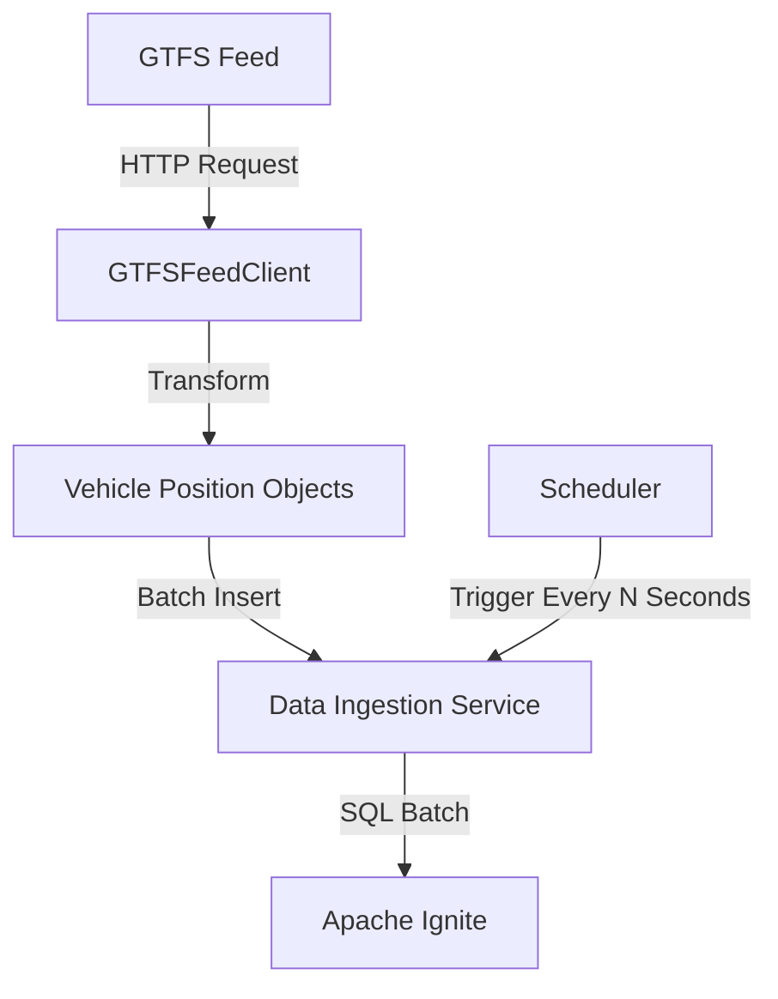

# Building the Data Ingestion Service

In this module, you'll implement a data ingestion service that forms the backbone of your transit monitoring application. This service will continuously fetch vehicle position data from GTFS feeds and store it in Apache Ignite, creating the real-time data foundation needed for monitoring and analysis.

## Understanding Data Ingestion Requirements

Real-time transit monitoring demands a reliable data pipeline with specific characteristics:

1. **Periodic data collection**: Regularly fetching the latest data to maintain freshness
2. **Efficient data storage**: Minimizing database overhead during insertion
3. **Fault tolerance**: Handling errors without service disruption
4. **Resource management**: Properly managing connections and threads
5. **Configurable behavior**: Adjusting parameters like frequency based on requirements



> [!note]
> Data ingestion is the process of fetching, transforming, loading, and processing data from various sources for immediate use or storage in a database. In our case, we're ingesting real-time transit data from a GTFS feed and storing it in Apache Ignite.

## Implementing the DataIngestionService

Let's create a `IngestService.java` file that implements this pipeline:

```java
package com.example.transit.service;

import org.apache.ignite.client.IgniteClient;

import java.util.List;
import java.util.Map;
import java.util.concurrent.Executors;
import java.util.concurrent.ScheduledExecutorService;
import java.util.concurrent.ScheduledFuture;
import java.util.concurrent.TimeUnit;
import java.util.concurrent.atomic.AtomicLong;

/**
 * Service responsible for periodically fetching transit data and storing it in Ignite.
 *
 * This service uses a scheduled executor to periodically fetch data from the
 * GTFS feed and store it in the Ignite database.
 */
public class IngestService {
    private final GtfsService feedService;
    private final ConnectService connectionService;
    private final ScheduledExecutorService scheduler;
    private ScheduledFuture<?> scheduledTask;
    private int batchSize = 100; // Default batch size

    // Statistics tracking
    private final AtomicLong totalFetched = new AtomicLong(0);
    private final AtomicLong totalStored = new AtomicLong(0);
    private final AtomicLong lastFetchCount = new AtomicLong(0);
    private final AtomicLong lastFetchTime = new AtomicLong(0);
    private long startTime;

    /**
     * Constructs a new data ingestion service.
     *
     * @param feedService       The service for retrieving GTFS feed data
     * @param connectionService The service providing Ignite client connections
     */
    public IngestService(GtfsService feedService, ConnectService connectionService) {
        this.feedService = feedService;
        this.connectionService = connectionService;
        this.scheduler = Executors.newSingleThreadScheduledExecutor(r -> {
            Thread t = new Thread(r, "data-ingestion-thread");
            t.setDaemon(true);
            // Make the thread respond better to interrupts
            t.setUncaughtExceptionHandler((thread, ex) -> {
                System.err.println("Uncaught exception in " + thread.getName() + ": " + ex.getMessage());
                ex.printStackTrace();
            });
            return t;
        });
    }

    /**
     * Sets the batch size for database operations.
     * Larger batch sizes can improve performance but consume more memory.
     *
     * @param batchSize Number of records to process in each batch
     * @return This DataIngestionService instance for method chaining
     */
    public IngestService withBatchSize(int batchSize) {
        if (batchSize < 1) {
            throw new IllegalArgumentException("Batch size must be at least 1");
        }
        this.batchSize = batchSize;
        return this;
    }

    /**
     * Starts the data ingestion service with the specified interval.
     *
     * @param intervalSeconds The interval between data fetches in seconds
     */
    public void start(int intervalSeconds) {
        if (scheduledTask != null) {
            System.out.println("Ingestion service is already running. Stop it first before restarting.");
            return;
        }

        this.startTime = System.currentTimeMillis();

        // Reset statistics
        totalFetched.set(0);
        totalStored.set(0);
        lastFetchCount.set(0);
        lastFetchTime.set(0);

        // Schedule the task with initial delay of 0 (start immediately)
        scheduledTask = scheduler.scheduleAtFixedRate(
                this::fetchAndStoreData,
                0,
                intervalSeconds,
                TimeUnit.SECONDS);

        System.out.println("+++ Data ingestion service started with "
                + intervalSeconds + " second interval");
    }

    /**
     * Stops the data ingestion service and cleans up resources.
     */
    public void stop() {
        if (scheduledTask != null) {
            scheduledTask.cancel(false); // Don't interrupt if running
            scheduledTask = null;

            // Properly shut down the executor service
            try {
                // Attempt to shut down gracefully
                scheduler.shutdown();
                if (!scheduler.awaitTermination(5, TimeUnit.SECONDS)) {
                    // Force shutdown if graceful shutdown fails
                    scheduler.shutdownNow();
                }
                System.out.println("=== Data ingestion service stopped");
            } catch (InterruptedException e) {
                // If we're interrupted during shutdown, force immediate shutdown
                scheduler.shutdownNow();
                Thread.currentThread().interrupt(); // Preserve interrupt status
                System.err.println("Data ingestion service shutdown interrupted");
            }

        } else {
            System.err.println("Ingestion service is not running");
        }
    }

    /**
     * Fetches data from the GTFS feed and stores it in Ignite.
     * This method is called periodically by the scheduler.
     */
    private void fetchAndStoreData() {
        long fetchStartTime = System.currentTimeMillis();
        try {
            // Fetch the latest vehicle positions
            List<Map<String, Object>> positions = feedService.getVehiclePositions();
            lastFetchCount.set(positions.size());
            totalFetched.addAndGet(positions.size());

            if (!positions.isEmpty()) {
                // Store the positions in the database
                int recordsStored = storeVehiclePositions(positions);
                totalStored.addAndGet(recordsStored);

                System.out.println("--- Fetched " + positions.size() +
                        " and stored " + recordsStored +
                        " vehicle positions");
            } else {
                System.out.println("No vehicle positions fetched from feed");
            }

        } catch (Exception e) {
            System.err.println("Error in data ingestion: " + e.getMessage());
            e.printStackTrace();
        } finally {
            lastFetchTime.set(System.currentTimeMillis() - fetchStartTime);
        }
    }

    /**
     * Stores vehicle positions in Ignite using efficient batch processing.
     * Each batch is processed in a single transaction using the runInTransaction
     * method
     * for automatic transaction lifecycle management.
     *
     * @param positions List of vehicle positions to store
     * @return Number of records successfully stored
     */
    private int storeVehiclePositions(List<Map<String, Object>> positions) {
        if (positions.isEmpty()) {
            return 0;
        }

        int recordsProcessed = 0;
        IgniteClient client = connectionService.getClient();

        try {
            // Process records in batches
            for (int i = 0; i < positions.size(); i += batchSize) {
                // Prepare SQL statement
                String insertSql = "INSERT INTO vehicle_positions " +
                        " (vehicle_id, route_id, latitude, longitude, time_stamp, current_status) " +
                        "VALUES (?, ?, ?, ?, ?, ?)";

                // Determine the end index for current batch
                int endIndex = Math.min(i + batchSize, positions.size());
                List<Map<String, Object>> batch = positions.subList(i, endIndex);


                // Use runInTransaction to automatically handle transaction lifecycle
                client.transactions().runInTransaction(tx -> {
                    // Insert all records in the current batch
                    for (Map<String, Object> position : batch) {
                        // Use SQL API to execute insert batch within transaction
                        client.sql().execute(tx,
                                insertSql,
                                position.get("vehicle_id"),
                                position.get("route_id"),
                                position.get("latitude"),
                                position.get("longitude"),
                                position.get("time_stamp"),
                                position.get("current_status"));
                    }
                    // No need for explicit commit - handled by runInTransaction
                    return null; // Return value not used in this case
                });

                recordsProcessed += batch.size();
            }

            return recordsProcessed;
        } catch (Exception e) {
            System.err.println("Error storing vehicle positions: " + e.getMessage());
            e.printStackTrace();
            return recordsProcessed;
        }
    }

    /**
     * Returns a snapshot of current ingestion statistics.
     *
     * @return IngestStats object containing statistic values
     */
    public IngestStats getStatistics() {
        long runningTimeMs = System.currentTimeMillis() - startTime;

        return new IngestStats(
                totalFetched.get(),
                totalStored.get(),
                lastFetchCount.get(),
                lastFetchTime.get(),
                runningTimeMs,
                scheduledTask != null);
    }

    /**
     * Prints current statistics to the console.
     */
    public void printStatistics() {
        IngestStats stats = getStatistics();

        System.out.println("\n=== Ingestion Statistics ===");
        System.out.println("• Status: " + (stats.isRunning() ? "Running" : "Stopped"));
        System.out.println("• Running time: " + formatDuration(stats.getRunningTimeMs()));
        System.out.println("• Total records fetched: " + stats.getTotalFetched());
        System.out.println("• Total records stored: " + stats.getTotalStored());
        System.out.println("• Last fetch count: " + stats.getLastFetchCount());
        System.out.println("• Last fetch time: " + stats.getLastFetchTimeMs() + "ms");
        System.out.println("============================\n");
    }

    /**
     * Formats milliseconds into a human-readable duration string.
     */
    private String formatDuration(long milliseconds) {
        long seconds = milliseconds / 1000;
        long minutes = seconds / 60;
        long hours = minutes / 60;
        seconds %= 60;
        minutes %= 60;

        return String.format("%02d:%02d:%02d", hours, minutes, seconds);
    }

    /**
     * Immutable class representing ingestion statistics at a point in time.
     */
    public static class IngestStats {
        private final long totalFetched;
        private final long totalStored;
        private final long lastFetchCount;
        private final long lastFetchTimeMs;
        private final long runningTimeMs;
        private final boolean running;

        public IngestStats(long totalFetched, long totalStored, long lastFetchCount,
                long lastFetchTimeMs, long runningTimeMs, boolean running) {
            this.totalFetched = totalFetched;
            this.totalStored = totalStored;
            this.lastFetchCount = lastFetchCount;
            this.lastFetchTimeMs = lastFetchTimeMs;
            this.runningTimeMs = runningTimeMs;
            this.running = running;
        }

        // Getters
        public long getTotalFetched() {
            return totalFetched;
        }
        public long getTotalStored() {
            return totalStored;
        }
        public long getLastFetchCount() {
            return lastFetchCount;
        }
        public long getLastFetchTimeMs() {
            return lastFetchTimeMs;
        }
        public long getRunningTimeMs() {
            return runningTimeMs;
        }
        public boolean isRunning() {
            return running;
        }
    }
}
```

> [!tip]
> The `ScheduledExecutorService` is a Java concurrency utility that lets us execute tasks periodically. We're using it to repeatedly fetch and store data at fixed intervals, which is essential for real-time monitoring. The thread is marked as a daemon thread, meaning it won't prevent the JVM from shutting down when the main thread exits.

> [!important]
> **Checkpoint**: Review the key components of the ingestion service and make sure you understand:
>
> - How scheduled execution works
> - Why batch processing improves performance
> - The role of transactions in data integrity
> - The purpose of statistics tracking

## Testing Your Ingest Service

Let's create a simple test to verify our data ingestion service. Create a new file `IngestExample.java`:

```java
package com.example.transit.examples;

import com.example.transit.service.*;
import com.example.transit.util.LoggingUtil;
import org.apache.ignite.client.IgniteClient;

import java.io.ByteArrayOutputStream;
import java.io.PrintStream;

/**
 * Example demonstrating the data ingestion pipeline from GTFS feed to Ignite.
 * This class shows how to:
 * 1. Set up the database schema if not already set up
 * 2. Start and configure the data ingestion service
 * 3. Verify ingested data
 */
public class IngestExample {

    public static void main(String[] args) {
        System.out.println("=== Data Ingestion Service Example ===");

        // Configure logging to suppress unnecessary output
        LoggingUtil.setLogs("OFF");

        // Load configuration
        ConfigService config = ConfigService.getInstance();
        if (!config.validateConfiguration()) {
            return;
        }

        // Create references to hold services
        final ConnectService[] connectionServiceRef = new ConnectService[1];
        final IngestService[] ingestServiceRef = new IngestService[1];

        // Register shutdown hook with the reference arrays
        Runtime.getRuntime().addShutdownHook(new Thread(() -> {
            System.out.println("Shutdown hook triggered, cleaning up resources...");
            if (ingestServiceRef[0] != null) {
                ingestServiceRef[0].stop();
            }
            if (connectionServiceRef[0] != null) {
                connectionServiceRef[0].close();
            }
        }));

        try {
            // Create Ignite connection
            System.out.println("\n--- Connecting to Ignite cluster");
            ConnectService connectionService = new ConnectService();
            connectionServiceRef[0] = connectionService;

            // Create reporting service
            ReportService reportService = new ReportService(connectionService.getClient());

            // Create and initialize the schema
            System.out.println("\n--- Setting up database schema");
            SchemaService schemaService = new SchemaService(connectionService);
            boolean schemaCreated = schemaService.createSchema();

            if (!schemaCreated) {
                System.err.println("Failed to create schema. Aborting example.");
                return;
            }

            // Verify initial state (should be empty or contain previous data)
            System.out.println("\n--- Initial data state");
            reportService.sampleVehicleData();

            // Create GTFS feed service and data ingestion service
            System.out.println("\n=== Starting data ingestion service");
            GtfsService feedService = new GtfsService(config.getFeedUrl());

            IngestService ingestService = new IngestService(
                    feedService, connectionService)
                    .withBatchSize(100); // Configure batch size

            // Store the service in our reference array for the shutdown hook
            ingestServiceRef[0] = ingestService;

            ingestService.start(15); // Fetch every 15 seconds

            reportService.displayIngestionStatus(ingestService.getStatistics());

            // Wait for some data to be ingested
            System.out.println("\n=== Waiting for data ingestion (45 seconds)...");
            System.out.println(); // Add a blank line for separation

            // Create a volatile boolean for thread signaling
            final boolean[] keepSpinning = { true };

            // Spinning characters and counter
            String[] spinnerChars = new String[] { "⠋", "⠙", "⠹", "⠸", "⠼", "⠴", "⠦", "⠧", "⠇", "⠏" };
            int[] seconds = { 0 }; // Using array to make it accessible inside the interceptor
            int[] spinPosition = { 0 }; // Track spinner position separately

            // Original System.out to be restored later
            PrintStream originalOut = System.out;

            // Thread-safe mechanism to manage spinner updates
            Object lock = new Object();

            // Create our interceptor to manage output and the spinner
            PrintStream interceptor = new PrintStream(new ByteArrayOutputStream()) {
                @Override
                public void println(String x) {
                    synchronized (lock) {
                        // Clear the spinner line first
                        originalOut.print("\r\033[K");
                        // Print the actual output
                        originalOut.println(x);
                        // If spinner is still active, redraw it
                        if (keepSpinning[0]) {
                            String spinChar = spinnerChars[spinPosition[0] % spinnerChars.length];
                            originalOut.print(spinChar + " " + (seconds[0] + 1) + "s elapsed");
                            originalOut.flush();
                        }
                    }
                }

                @Override
                public void print(String s) {
                    // We need this override for consistent behavior
                    // but nothing special is needed - just accumulate
                    super.print(s);
                }
            };

            // Set our interceptor as the system out
            System.setOut(interceptor);

            // Define spinner update interval for 1 full revolution per second
            int spinnerUpdatesPerSecond = 10; // 10 characters = 1 revolution
            long spinnerUpdateDelay = 1000 / spinnerUpdatesPerSecond; // milliseconds
            long nextSecondTime = System.currentTimeMillis() + 1000; // when to increment the seconds counter

            // Run the spinner in the main thread using a timer
            while (seconds[0] < 45 && keepSpinning[0]) {
                synchronized (lock) {
                    String spinChar = spinnerChars[spinPosition[0] % spinnerChars.length];
                    originalOut.print("\r" + spinChar + " " + (seconds[0] + 1) + "s elapsed");
                    originalOut.flush();
                }

                try {
                    Thread.sleep(spinnerUpdateDelay);

                    // Increment spinner position
                    spinPosition[0]++;

                    // Check if a second has passed
                    long currentTime = System.currentTimeMillis();
                    if (currentTime >= nextSecondTime) {
                        seconds[0]++;
                        nextSecondTime = currentTime + 1000;
                    }
                } catch (InterruptedException e) {
                    keepSpinning[0] = false;
                    break;
                }
            }

            // Clean up the spinner line
            originalOut.print("\r\033[K");
            originalOut.println("--- Data ingestion wait complete!");

            // Restore original System.out
            System.setOut(originalOut);

            // Verify data after ingestion
            System.out.println("\n--- Data state after ingestion");
            reportService.displaySystemStatistics();

            // Stop the ingestion service
            System.out.println("\n=== Stopping data ingestion service");
            ingestService.stop();
            reportService.displayIngestionStatus(ingestService.getStatistics());

            // Give threads time to clean up
            System.out.println("Waiting for all threads to terminate...");
            Thread.sleep(1000);

            System.out.println("\n=== Example completed successfully!");

        } catch (Exception e) {
            System.err.println("Error during example: " + e.getMessage());
            e.printStackTrace();
        } finally {
            // Make sure ingestion service is stopped
            if (ingestServiceRef[0] != null) {
                ingestServiceRef[0].stop();
            }

            // Clean up connection
            if (connectionServiceRef[0] != null) {
                connectionServiceRef[0].close();
            }
        }
    }
}
```

This test performs a complete cycle of operations:

1. Set up the database schema
2. Verify the initial data state
3. Start the ingestion service
4. Wait for data to be ingested
5. Print statistics about the ingestion process
6. Verify the final data state
7. Stop the service and clean up resources

> [!note]
> The test includes a visual spinner animation to indicate progress during the waiting period. This is implemented using ANSI escape codes for terminal control and a custom `PrintStream` interceptor to handle concurrent logging output.

Execute the test to validate the ingestion service:

```bash
mvn compile exec:java -Dexec.mainClass="com.example.transit.examples.IngestExample"
```

> [!note]
> The test runs for 45 seconds without updating the screen most of the time.
> Wait until you see that the test completed or failed before taking action.

**Expected Output**: When the test completes successfully, you should see statistics about the ingestion process and verification of the data in Ignite. The test will terminate with a "Test completed successfully!" message.

> [!important]
> **Checkpoint**: After running the test, verify:
>
> - The schema was created successfully
> - Data was fetched and stored in the database
> - The ingestion statistics show positive records fetched and stored
> - The final data verification shows records in the database

## Next Steps

Congratulations! You've now implemented a robust data ingestion service that:

1. Periodically fetches vehicle position data from a GTFS-realtime feed
2. Efficiently stores this data in Apache Ignite using batch processing
3. Handles errors gracefully to ensure continuous operation
4. Provides statistics to monitor the ingestion process
5. Manages resources properly through a clean lifecycle

This service forms the backbone of our transit monitoring system, ensuring our database is constantly updated with the latest vehicle positions.

In the next module, we'll build on this foundation by implementing SQL queries to analyze the transit data and extract valuable insights about vehicle locations, route performance, and potential service disruptions.

> [!important]
> **Final Module Checkpoint**: Before proceeding to the next module, ensure:
>
> - You understand how the data ingestion service works
> - The test application runs successfully
> - You can explain the role of transactions in maintaining data integrity
> - You understand how the service handles failures
> - You've considered how the service might be optimized for your specific needs

> [!tip]
> **Next Steps:** Continue to [Module 6: Exploring Transit Data with SQL Queries](06-implementing-queries.md) to learn how to extract insights from your ingested data.
