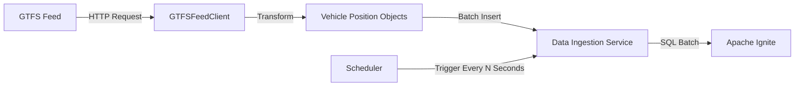

# Building the Data Ingestion Service

In this module, you'll implement a robust data ingestion service that forms the backbone of your transit monitoring application. This service will continuously fetch vehicle position data from GTFS feeds and store it in Apache Ignite, creating the real-time data foundation needed for monitoring and analysis.

## Understanding Data Ingestion Requirements

Real-time transit monitoring demands a reliable data pipeline with specific characteristics:

1. **Periodic data collection**: Regularly fetching the latest data to maintain freshness
2. **Efficient data storage**: Minimizing database overhead during insertion
3. **Fault tolerance**: Handling errors without service disruption
4. **Resource management**: Properly managing connections and threads
5. **Configurable behavior**: Adjusting parameters like frequency based on requirements



## Implementing the DataIngestionService

Let's create a `DataIngestionService.java` file that implements this pipeline:

```java
package com.example.transit;

import org.apache.ignite.client.IgniteClient;
import org.apache.ignite.client.SqlClientSession;
import org.apache.ignite.client.SqlParametersBatch;

import java.time.LocalDateTime;
import java.time.ZoneId;
import java.util.List;
import java.util.concurrent.Executors;
import java.util.concurrent.ScheduledExecutorService;
import java.util.concurrent.ScheduledFuture;
import java.util.concurrent.TimeUnit;
import java.util.concurrent.atomic.AtomicLong;

/**
 * Service responsible for periodically fetching transit data and storing it in Ignite.
 * Implements a resilient data ingestion pipeline with configurable scheduling.
 * 
 * This service uses a scheduled executor to periodically fetch data from the GTFS
 * feed and store it in the Ignite database using batch processing for efficiency.
 */
public class DataIngestionService {
    private final GTFSFeedClient feedClient;
    private final IgniteClient igniteClient;
    private final ScheduledExecutorService scheduler;
    private ScheduledFuture<?> scheduledTask;
    private int batchSize = 100; // Default batch size
    
    // Statistics tracking
    private final AtomicLong totalFetched = new AtomicLong(0);
    private final AtomicLong totalStored = new AtomicLong(0);
    private final AtomicLong lastFetchCount = new AtomicLong(0);
    private final AtomicLong lastFetchTime = new AtomicLong(0);
    private long startTime;
    
    /**
     * Constructs a new data ingestion service.
     * 
     * @param feedUrl The URL of the GTFS realtime feed
     */
    public DataIngestionService(String feedUrl) {
        this.feedClient = new GTFSFeedClient(feedUrl);
        this.igniteClient = IgniteConnection.getClient();
        this.scheduler = Executors.newSingleThreadScheduledExecutor(r -> {
            Thread t = new Thread(r, "data-ingestion-thread");
            t.setDaemon(true);
            return t;
        });
    }
    
    /**
     * Sets the batch size for database operations.
     * Larger batch sizes can improve performance but consume more memory.
     * 
     * @param batchSize Number of records to process in each batch
     * @return This DataIngestionService instance for method chaining
     */
    public DataIngestionService withBatchSize(int batchSize) {
        if (batchSize < 1) {
            throw new IllegalArgumentException("Batch size must be at least 1");
        }
        this.batchSize = batchSize;
        return this;
    }
    
    /**
     * Starts the data ingestion service with the specified interval.
     * 
     * @param intervalSeconds The interval between data fetches in seconds
     */
    public void start(int intervalSeconds) {
        if (scheduledTask != null) {
            System.out.println("Ingestion service is already running. Stop it first before restarting.");
            return;
        }
        
        this.startTime = System.currentTimeMillis();
        
        // Reset statistics
        totalFetched.set(0);
        totalStored.set(0);
        lastFetchCount.set(0);
        lastFetchTime.set(0);
        
        // Schedule the task with initial delay of 0 (start immediately)
        scheduledTask = scheduler.scheduleAtFixedRate(
            this::fetchAndStoreData,
            0,
            intervalSeconds,
            TimeUnit.SECONDS
        );
        
        System.out.println("Data ingestion service started with " 
            + intervalSeconds + " second interval");
    }
    
    /**
     * Stops the data ingestion service and cleans up resources.
     */
    public void stop() {
        if (scheduledTask != null) {
            scheduledTask.cancel(false); // Don't interrupt if running
            scheduledTask = null;
            
            // Don't shut down the executor - we might want to restart
            System.out.println("Data ingestion service stopped");
            printStatistics();
        } else {
            System.out.println("Ingestion service is not running");
        }
    }
    
    /**
     * Fetches data from the GTFS feed and stores it in Ignite.
     * This method is called periodically by the scheduler.
     */
    private void fetchAndStoreData() {
        long fetchStartTime = System.currentTimeMillis();
        try {
            // Step 1: Fetch the latest vehicle positions
            List<VehiclePosition> positions = feedClient.getVehiclePositions();
            lastFetchCount.set(positions.size());
            totalFetched.addAndGet(positions.size());
            
            if (!positions.isEmpty()) {
                // Step 2: Store the positions in the database
                int recordsStored = storeVehiclePositions(positions);
                totalStored.addAndGet(recordsStored);
                
                System.out.println("Fetched " + positions.size() + 
                                  " and stored " + recordsStored + 
                                  " vehicle positions");
            } else {
                System.out.println("No vehicle positions fetched from feed");
            }
            
        } catch (Exception e) {
            System.err.println("Error in data ingestion: " + e.getMessage());
            e.printStackTrace();
        } finally {
            lastFetchTime.set(System.currentTimeMillis() - fetchStartTime);
        }
    }
    
    /**
     * Stores vehicle positions in Ignite using efficient batch processing.
     * Batch processing significantly reduces network overhead and improves
     * insertion throughput compared to individual inserts.
     * 
     * @param positions List of vehicle positions to store
     * @return Number of records successfully stored
     */
    private int storeVehiclePositions(List<VehiclePosition> positions) {
        if (positions.isEmpty()) {
            return 0;
        }
        
        SqlClientSession sqlSession = igniteClient.sql();
        int recordsProcessed = 0;
        
        try {
            String insertSql = "INSERT INTO vehicle_positions "
                + "(vehicle_id, route_id, latitude, longitude, time_stamp, current_status) "
                + "VALUES (?, ?, ?, ?, ?, ?)";
            
            SqlParametersBatch batch = sqlSession.prepareNativeBatch(insertSql);
            
            for (int i = 0; i < positions.size(); i++) {
                VehiclePosition position = positions.get(i);
                
                // Convert epoch milliseconds to LocalDateTime for Ignite
                LocalDateTime timestamp = LocalDateTime.ofInstant(
                    position.getTimestampAsInstant(), 
                    ZoneId.systemDefault()
                );
                
                batch.addBatch(
                    position.getVehicleId(),
                    position.getRouteId(),
                    position.getLatitude(),
                    position.getLongitude(),
                    timestamp,
                    position.getCurrentStatus()
                );
                
                // Execute batch when reaching batch size or end of list
                if ((i + 1) % batchSize == 0 || i == positions.size() - 1) {
                    batch.execute();
                    recordsProcessed += batch.size();
                    batch = sqlSession.prepareNativeBatch(insertSql);
                }
            }
            
            return recordsProcessed;
            
        } catch (Exception e) {
            System.err.println("Error storing vehicle positions: " + e.getMessage());
            e.printStackTrace();
            return recordsProcessed;
        }
    }
    
    /**
     * Returns a snapshot of current ingestion statistics.
     * 
     * @return Map containing statistic values
     */
    public IngestStats getStatistics() {
        long runningTimeMs = System.currentTimeMillis() - startTime;
        
        return new IngestStats(
            totalFetched.get(),
            totalStored.get(),
            lastFetchCount.get(),
            lastFetchTime.get(),
            runningTimeMs,
            scheduledTask != null
        );
    }
    
    /**
     * Prints current statistics to the console.
     */
    public void printStatistics() {
        IngestStats stats = getStatistics();
        
        System.out.println("\n=== Data Ingestion Statistics ===");
        System.out.println("• Status: " + (stats.isRunning() ? "Running" : "Stopped"));
        System.out.println("• Running time: " + formatDuration(stats.getRunningTimeMs()));
        System.out.println("• Total records fetched: " + stats.getTotalFetched());
        System.out.println("• Total records stored: " + stats.getTotalStored());
        System.out.println("• Last fetch count: " + stats.getLastFetchCount());
        System.out.println("• Last fetch time: " + stats.getLastFetchTimeMs() + "ms");
        
        // Calculate rates if we have data
        if (stats.getRunningTimeMs() > 0 && stats.getTotalFetched() > 0) {
            double recordsPerSecond = stats.getTotalFetched() * 1000.0 / stats.getRunningTimeMs();
            System.out.println("• Ingestion rate: " + String.format("%.2f", recordsPerSecond) + " records/second");
        }
        System.out.println("==============================\n");
    }
    
    /**
     * Formats milliseconds into a human-readable duration string.
     */
    private String formatDuration(long milliseconds) {
        long seconds = milliseconds / 1000;
        long minutes = seconds / 60;
        long hours = minutes / 60;
        seconds %= 60;
        minutes %= 60;
        
        return String.format("%02d:%02d:%02d", hours, minutes, seconds);
    }
    
    /**
     * Immutable class representing ingestion statistics at a point in time.
     */
    public static class IngestStats {
        private final long totalFetched;
        private final long totalStored;
        private final long lastFetchCount;
        private final long lastFetchTimeMs;
        private final long runningTimeMs;
        private final boolean running;
        
        public IngestStats(long totalFetched, long totalStored, long lastFetchCount, 
                          long lastFetchTimeMs, long runningTimeMs, boolean running) {
            this.totalFetched = totalFetched;
            this.totalStored = totalStored;
            this.lastFetchCount = lastFetchCount;
            this.lastFetchTimeMs = lastFetchTimeMs;
            this.runningTimeMs = runningTimeMs;
            this.running = running;
        }
        
        // Getters
        public long getTotalFetched() { return totalFetched; }
        public long getTotalStored() { return totalStored; }
        public long getLastFetchCount() { return lastFetchCount; }
        public long getLastFetchTimeMs() { return lastFetchTimeMs; }
        public long getRunningTimeMs() { return runningTimeMs; }
        public boolean isRunning() { return running; }
    }
}
```

## Data Verification Utility

To ensure our data ingestion pipeline is working correctly, let's also create a verification utility that can check and analyze the data stored in Ignite:

```java
package com.example.transit;

import org.apache.ignite.client.IgniteClient;
import org.apache.ignite.client.SqlClientSession;
import org.apache.ignite.client.SqlResultCursor;
import org.apache.ignite.client.SqlRow;

import java.time.LocalDateTime;
import java.time.ZoneId;
import java.time.format.DateTimeFormatter;
import java.time.temporal.ChronoUnit;
import java.util.HashMap;
import java.util.Map;

/**
 * Utility class for verifying and examining data in the Ignite database.
 * This class provides methods to check data integrity and generate
 * summary statistics about the stored transit data.
 */
public class DataVerifier {
    
    private static final DateTimeFormatter DATETIME_FORMATTER = 
        DateTimeFormatter.ofPattern("yyyy-MM-dd HH:mm:ss");
    
    /**
     * Verifies the existence and integrity of vehicle position data in Ignite.
     * 
     * @return true if verification was successful, false otherwise
     */
    public static boolean verifyData() {
        IgniteClient client = null;
        
        try {
            client = IgniteConnection.getClient();
            SqlClientSession sqlSession = client.sql();
            
            System.out.println("Verifying data in vehicle_positions table...");
            
            // Check if table exists and has data
            String countSql = "SELECT COUNT(*) as count FROM vehicle_positions";
            SqlResultCursor cursor = sqlSession.execute(countSql);
            
            if (cursor.hasNext()) {
                SqlRow row = cursor.next();
                long count = row.getLong("count");
                
                System.out.println("Table exists");
                System.out.println("Table contains " + count + " records");
                
                if (count > 0) {
                    // Get data age range
                    String rangeSql = "SELECT MIN(time_stamp) as oldest, MAX(time_stamp) as newest FROM vehicle_positions";
                    cursor = sqlSession.execute(rangeSql);
                    
                    if (cursor.hasNext()) {
                        row = cursor.next();
                        LocalDateTime oldest = row.getTimestamp("oldest");
                        LocalDateTime newest = row.getTimestamp("newest");
                        LocalDateTime now = LocalDateTime.now();
                        
                        System.out.println("\nData timespan:");
                        System.out.println("• Oldest record: " + oldest.format(DATETIME_FORMATTER) + 
                                         " (" + ChronoUnit.MINUTES.between(oldest, now) + " minutes ago)");
                        System.out.println("• Newest record: " + newest.format(DATETIME_FORMATTER) + 
                                         " (" + ChronoUnit.MINUTES.between(newest, now) + " minutes ago)");
                    }
                    
                    // Sample some data
                    String sampleSql = "SELECT * FROM vehicle_positions ORDER BY time_stamp DESC LIMIT 3";
                    cursor = sqlSession.execute(sampleSql);
                    
                    System.out.println("\nSample records (most recent):");
                    while (cursor.hasNext()) {
                        SqlRow record = cursor.next();
                        LocalDateTime timestamp = record.getTimestamp("time_stamp");
                        
                        System.out.println("• Vehicle: " + record.getString("vehicle_id") + 
                                          ", Route: " + record.getString("route_id") +
                                          ", Status: " + record.getString("current_status") +
                                          ", Time: " + timestamp.format(DATETIME_FORMATTER));
                    }
                    
                    // Get route statistics
                    String routeStatsSql = "SELECT route_id, COUNT(*) as record_count " +
                                         "FROM vehicle_positions " +
                                         "GROUP BY route_id " +
                                         "ORDER BY record_count DESC " +
                                         "LIMIT 5";
                    
                    cursor = sqlSession.execute(routeStatsSql);
                    
                    System.out.println("\nTop routes by number of records:");
                    while (cursor.hasNext()) {
                        SqlRow record = cursor.next();
                        System.out.println("• Route " + record.getString("route_id") + 
                                          ": " + record.getLong("record_count") + " records");
                    }
                    
                    // Get status distribution
                    String statusSql = "SELECT current_status, COUNT(*) as status_count " +
                                      "FROM vehicle_positions " +
                                      "GROUP BY current_status";
                    
                    cursor = sqlSession.execute(statusSql);
                    Map<String, Long> statusCounts = new HashMap<>();
                    long totalStatusCount = 0;
                    
                    while (cursor.hasNext()) {
                        SqlRow record = cursor.next();
                        String status = record.getString("current_status");
                        long count = record.getLong("status_count");
                        statusCounts.put(status, count);
                        totalStatusCount += count;
                    }
                    
                    System.out.println("\nStatus distribution:");
                    for (Map.Entry<String, Long> entry : statusCounts.entrySet()) {
                        double percentage = (entry.getValue() * 100.0) / totalStatusCount;
                        System.out.println("• " + entry.getKey() + ": " + 
                                         entry.getValue() + " records (" + 
                                         String.format("%.1f", percentage) + "%)");
                    }
                    
                    System.out.println("\nVerification complete - data exists in Ignite");
                    return true;
                } else {
                    System.out.println("Table is empty. Let's start the ingestion service to load some data.");
                    return true;
                }
            }
            
            System.err.println("Error checking the table");
            return false;
            
        } catch (Exception e) {
            System.err.println("Error verifying data: " + e.getMessage());
            e.printStackTrace();
            return false;
        }
    }
}
```

This verifier provides insights into the data we've ingested, including:

- Total record count
- Data age range
- Sample records
- Route distribution
- Status distribution

## Testing Your Implementation

Let's create a simple test to verify our data ingestion service. Create a new file `DataIngestionTest.java`:

```java
package com.example.transit;

import io.github.cdimascio.dotenv.Dotenv;

/**
 * Test class for the data ingestion service.
 */
public class DataIngestionTest {

    public static void main(String[] args) {
        System.out.println("=== Data Ingestion Service Test ===");
        
        // Load environment variables from .env file
        Dotenv dotenv = Dotenv.configure().ignoreIfMissing().load();

        // Retrieve configuration values
        String apiToken = dotenv.get("API_TOKEN");
        String baseUrl = dotenv.get("GTFS_BASE_URL");
        String agency = dotenv.get("GTFS_AGENCY");

        // Validate configuration
        if (apiToken == null || baseUrl == null || agency == null) {
            System.err.println("Missing configuration. Please check your .env file.");
            System.err.println("Required variables: API_TOKEN, GTFS_BASE_URL, GTFS_AGENCY");
            return;
        }

        // Construct the full feed URL
        String feedUrl = String.format("%s?api_key=%s&agency=%s", baseUrl, apiToken, agency);

        try {
            // Create and start the schema
            System.out.println("\n--- Setting up database schema ---");
            SchemaSetup schemaSetup = new SchemaSetup();
            boolean schemaCreated = schemaSetup.createSchema();
            
            if (!schemaCreated) {
                System.err.println("Failed to create schema. Aborting test.");
                return;
            }
            
            // Verify initial state (should be empty or contain previous test data)
            System.out.println("\n--- Initial data state ---");
            DataVerifier.verifyData();
            
            // Create and start the data ingestion service
            System.out.println("\n--- Starting data ingestion service ---");
            DataIngestionService ingestService = new DataIngestionService(feedUrl)
                .withBatchSize(100); // Configure batch size
            
            ingestService.start(30); // Fetch every 30 seconds
            
            // Wait for some data to be ingested
            System.out.println("\nWaiting for data ingestion (45 seconds)...");
            
            // Sleep a bit longer than the fetch interval to ensure we get at least one cycle
            Thread.sleep(45000);
            
            // Print ingestion statistics
            ingestService.printStatistics();
            
            // Verify data after ingestion
            System.out.println("\n--- Data state after ingestion ---");
            DataVerifier.verifyData();
            
            // Stop the ingestion service
            System.out.println("\n--- Stopping data ingestion service ---");
            ingestService.stop();
            
            System.out.println("\nTest completed successfully!");
            
        } catch (Exception e) {
            System.err.println("Error during test: " + e.getMessage());
            e.printStackTrace();
        } finally {
            // Clean up connection
            IgniteConnection.close();
        }
    }
}
```

When you run this test, you should observe:

1. The schema being created (or verified if it already exists)
2. The initial data state (empty or containing previous test data)
3. The ingestion service starting and fetching data
4. Statistics about the ingestion process
5. Verification of the newly ingested data
6. The service shutting down cleanly

## Understanding Ignite's Batch Processing

One of the key performance optimizations in our ingestion service is the use of Ignite's batch processing capabilities. Let's explore this feature in more detail.

### What is Batch Processing?

Batch processing involves grouping multiple operations (in our case, SQL inserts) into a single network request. This approach offers significant performance advantages over executing each operation individually:


### Benefits in Ignite

In Apache Ignite, batch processing provides several specific advantages:

1. **Reduced Network Overhead**: Fewer round-trips between client and server
2. **Statement Reuse**: The prepared statement is parsed and planned only once
3. **Bulk Data Transfer**: Data is transferred in larger, more efficient chunks
4. **Server-Side Optimizations**: The server can optimize execution of related operations

### Batch Size Considerations

The optimal batch size depends on several factors:

- **Data Size**: Larger records may require smaller batch sizes
- **Memory Constraints**: Each batch consumes memory on both client and server
- **Latency Requirements**: Larger batches introduce longer delays before data is visible
- **Transaction Boundaries**: In transactional contexts, batches affect commit scope

For our transit application, a batch size of 50-200 records typically provides a good balance of performance and resource utilization.

## Next Steps

Congratulations! You've now implemented a robust data ingestion service that:

1. Periodically fetches vehicle position data from a GTFS-realtime feed
2. Efficiently stores this data in Apache Ignite using batch processing
3. Handles errors gracefully to ensure continuous operation
4. Provides statistics to monitor the ingestion process
5. Manages resources properly through a clean lifecycle

This service forms the backbone of our transit monitoring system, ensuring our database is constantly updated with the latest vehicle positions.

In the next module, we'll build on this foundation by implementing SQL queries to analyze the transit data and extract valuable insights about vehicle locations, route performance, and potential service disruptions.

> **Next Steps:** Continue to [Module 6: Exploring Transit Data with SQL Queries](06-implementing-queries.md) to learn how to extract insights from your ingested data.
