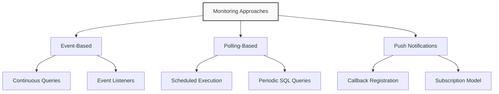
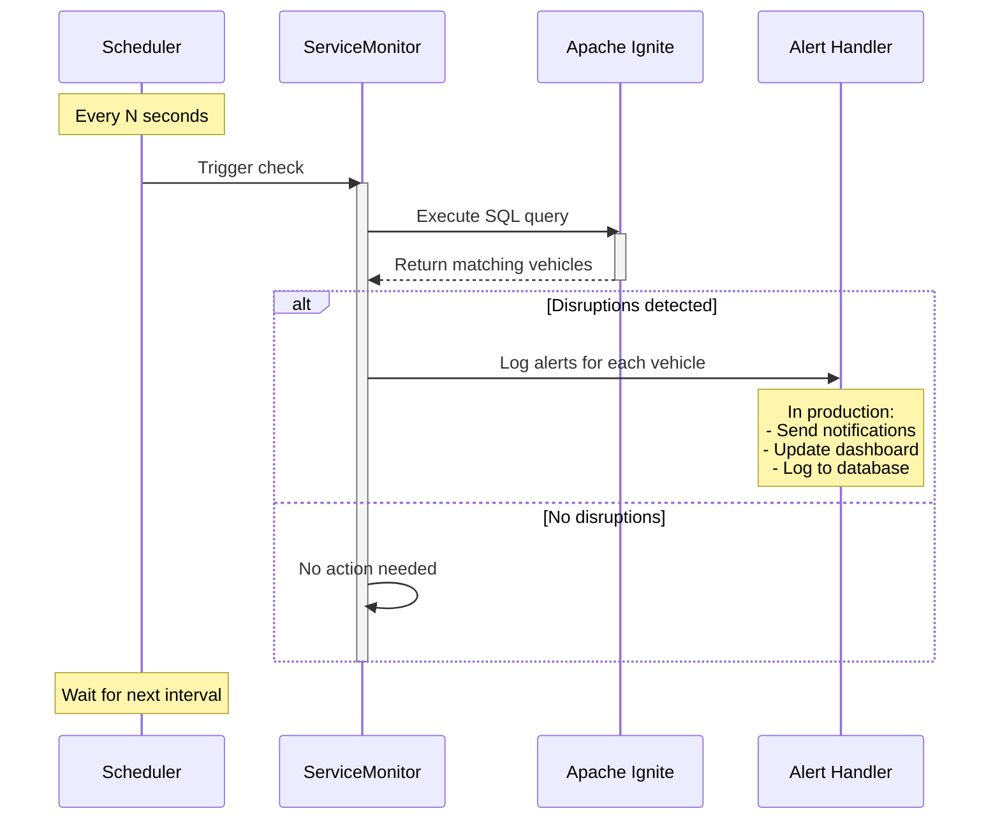

# Adding a Service Monitor

In this module, we'll implement a monitoring system that continuously polls for potential service disruptions in our transit network. Leveraging Apache Ignite's SQL query capability, we can detect specific conditions and trigger appropriate responses when those conditions are met.

## Understanding Monitoring Approaches in Distributed Systems

When building monitoring solutions for distributed systems like our transit application, there are several common approaches to consider:



For our transit monitoring system, we'll implement a **polling-based approach** using scheduled SQL queries. This approach offers several advantages in this tutorial:

1. **Simplicity**: Easy to implement and understand
2. **Flexibility**: Can modify query criteria without redeploying
3. **Control**: Precise control over monitoring frequency
4. **Resource Management**: Predictable resource usage pattern

> [!note]
> A polling-based approach periodically checks the system state by executing queries at fixed intervals. While it may not be as real-time as event-based approaches, it's more straightforward to implement and often sufficient for transit monitoring where conditions change relatively slowly (on the order of seconds or minutes rather than milliseconds).

Let's implement this pattern to monitor for vehicles that have been stopped for an extended period, potentially indicating service disruptions.

Create a file `MonitorService.java`:

```java
package com.example.transit.service;

import org.apache.ignite.client.IgniteClient;

import java.time.LocalDateTime;
import java.time.format.DateTimeFormatter;
import java.util.ArrayList;
import java.util.HashMap;
import java.util.List;
import java.util.Map;
import java.util.concurrent.Executors;
import java.util.concurrent.ScheduledExecutorService;
import java.util.concurrent.TimeUnit;
import java.util.concurrent.atomic.AtomicInteger;

/**
 * Monitors vehicle positions for potential service disruptions.
 * This class periodically checks for various conditions that might
 * indicate issues in the transit system, such as delayed vehicles,
 * bunching, or insufficient route coverage.
 */
public class MonitorService {
    // Thresholds for monitoring conditions
    private static final int STOPPED_THRESHOLD_MINUTES = 5;
    private static final int BUNCHING_DISTANCE_KM = 1;
    private static final int MINIMUM_VEHICLES_PER_ROUTE = 2;
    private static final int OFFLINE_THRESHOLD_MINUTES = 15;

    // Monitoring infrastructure
    private final ScheduledExecutorService scheduler = Executors.newScheduledThreadPool(1);
    private final IgniteClient client;
    private final DateTimeFormatter timeFormatter = DateTimeFormatter.ofPattern("HH:mm:ss");

    // Statistics tracking
    private final Map<String, AtomicInteger> alertCounts = new HashMap<>();
    private final List<ServiceAlert> recentAlerts = new ArrayList<>();
    private final int maxRecentAlerts = 100;

    // Quiet Mode
    private boolean quietMode = false;
    public void setQuietMode(boolean quietMode) {
        this.quietMode = quietMode;
    }

    /**
     * Creates a new monitoring service connected to the Ignite cluster.
     *
     * @param connectionService The service providing the Ignite client connection
     */
    public MonitorService(ConnectService connectionService) {
        this.client = connectionService.getClient();
        initializeAlertCounters();
    }

    /**
     * Initializes alert counters for each type of monitored condition.
     */
    private void initializeAlertCounters() {
        alertCounts.put("DELAYED_VEHICLE", new AtomicInteger(0));
        alertCounts.put("VEHICLE_BUNCHING", new AtomicInteger(0));
        alertCounts.put("LOW_ROUTE_COVERAGE", new AtomicInteger(0));
        alertCounts.put("OFFLINE_VEHICLE", new AtomicInteger(0));
    }

    /**
     * Starts monitoring for service disruptions by polling the database at regular
     * intervals.
     *
     * @param intervalSeconds The polling interval in seconds
     */
    public void startMonitoring(int intervalSeconds) {
        System.out.println("--- Starting service disruption monitoring (polling every " + intervalSeconds + " seconds)");

        // Schedule all monitoring tasks
        scheduler.scheduleAtFixedRate(
                this::checkForDelayedVehicles,
                5,
                intervalSeconds,
                TimeUnit.SECONDS);

        scheduler.scheduleAtFixedRate(
                this::checkForVehicleBunching,
                10,
                intervalSeconds,
                TimeUnit.SECONDS);

        scheduler.scheduleAtFixedRate(
                this::checkForLowRouteCoverage,
                15,
                intervalSeconds,
                TimeUnit.SECONDS);

        scheduler.scheduleAtFixedRate(
                this::checkForOfflineVehicles,
                20,
                intervalSeconds,
                TimeUnit.SECONDS);

    }

    /**
     * Stops the monitoring service.
     */
    public void stopMonitoring() {
        scheduler.shutdown();
        try {
            if (!scheduler.awaitTermination(10, TimeUnit.SECONDS)) {
                scheduler.shutdownNow();
            }
        } catch (InterruptedException e) {
            scheduler.shutdownNow();
            Thread.currentThread().interrupt();
        }
        System.out.println("+++ Service monitoring stopped");
    }

    /**
     * Checks for vehicles that have been stopped for longer than the threshold.
     */
    private void checkForDelayedVehicles() {
        try {
            // Query to detect vehicles stopped for more than the threshold time
            String querySql = "SELECT " +
                    "    v.vehicle_id, " +
                    "    v.route_id, " +
                    "    v.current_status, " +
                    "    v.latitude, " +
                    "    v.longitude, " +
                    "    v.time_stamp, " +
                    "    TIMESTAMPDIFF(MINUTE, v.time_stamp, CURRENT_TIMESTAMP) as stopped_minutes " +
                    "FROM vehicle_positions v " +
                    "JOIN (" +
                    "    SELECT vehicle_id, MAX(time_stamp) as latest_ts " +
                    "    FROM vehicle_positions " +
                    "    GROUP BY vehicle_id " +
                    ") l ON v.vehicle_id = l.vehicle_id AND v.time_stamp = l.latest_ts " +
                    "WHERE " +
                    "    v.current_status = 'STOPPED_AT' " +
                    "    AND TIMESTAMPDIFF(MINUTE, v.time_stamp, CURRENT_TIMESTAMP) >= ?";

            // Execute the query with the threshold parameter
            var result = client.sql().execute(null, querySql, STOPPED_THRESHOLD_MINUTES);

            int count = 0;
            // Process each row in the result
            while (result.hasNext()) {
                var row = result.next();
                count++;

                String vehicleId = row.stringValue("vehicle_id");
                String routeId = row.stringValue("route_id");
                LocalDateTime timestamp = row.value("time_stamp");
                int stoppedMinutes = row.intValue("stopped_minutes");

                // Create and record the alert
                ServiceAlert alert = new ServiceAlert(
                        "DELAYED_VEHICLE",
                        "Vehicle " + vehicleId + " on route " + routeId +
                                " has been stopped for " + stoppedMinutes + " minutes",
                        routeId,
                        vehicleId,
                        row.doubleValue("latitude"),
                        row.doubleValue("longitude"),
                        stoppedMinutes);

                recordAlert(alert);

                // Only log the alert if not in quiet mode
                if (!quietMode) {
                    // Log the alert
                    System.out.println("[" + LocalDateTime.now().format(timeFormatter) +
                            "] ALERT: " + alert.getMessage());
                }
            }

            if (count > 0) {
                System.out.println("--- Found " + count + " delayed vehicles");
            }
        } catch (Exception e) {
            System.err.println("Error checking for delayed vehicles: " + e.getMessage());
            e.printStackTrace();
        }
    }

    /**
     * Checks for vehicles on the same route that are too close together (bunching).
     */
    private void checkForVehicleBunching() {
        try {
            // This query finds pairs of vehicles on the same route that are close to each
            // other
            String querySql = "WITH latest_positions AS (" +
                    "    SELECT v.vehicle_id, v.route_id, v.latitude, v.longitude " +
                    "    FROM vehicle_positions v " +
                    "    JOIN (" +
                    "        SELECT vehicle_id, MAX(time_stamp) as latest_ts " +
                    "        FROM vehicle_positions " +
                    "        GROUP BY vehicle_id " +
                    "    ) l ON v.vehicle_id = l.vehicle_id AND v.time_stamp = l.latest_ts " +
                    "    WHERE v.current_status = 'IN_TRANSIT_TO' " + // Only consider moving vehicles
                    ") " +
                    "SELECT " +
                    "    a.vehicle_id as vehicle1, " +
                    "    b.vehicle_id as vehicle2, " +
                    "    a.route_id, " +
                    "    a.latitude as lat1, " +
                    "    a.longitude as lon1, " +
                    "    b.latitude as lat2, " +
                    "    b.longitude as lon2, " +
                    "    SQRT(POWER(a.latitude - b.latitude, 2) + POWER(a.longitude - b.longitude, 2)) * 111 as distance_km "
                    +
                    "FROM latest_positions a " +
                    "JOIN latest_positions b ON a.route_id = b.route_id AND a.vehicle_id < b.vehicle_id " +
                    "WHERE SQRT(POWER(a.latitude - b.latitude, 2) + POWER(a.longitude - b.longitude, 2)) * 111 < ? " +
                    "ORDER BY distance_km";

            var result = client.sql().execute(null, querySql, BUNCHING_DISTANCE_KM);

            int count = 0;
            while (result.hasNext()) {
                var row = result.next();
                count++;

                String vehicle1 = row.stringValue("vehicle1");
                String vehicle2 = row.stringValue("vehicle2");
                String routeId = row.stringValue("route_id");
                double distanceKm = row.doubleValue("distance_km");

                // Create and record the alert
                ServiceAlert alert = new ServiceAlert(
                        "VEHICLE_BUNCHING",
                        "Vehicles " + vehicle1 + " and " + vehicle2 + " on route " + routeId +
                                " are only " + String.format("%.2f", distanceKm) + " km apart",
                        routeId,
                        vehicle1 + "," + vehicle2,
                        (row.doubleValue("lat1") + row.doubleValue("lat2")) / 2, // Midpoint
                        (row.doubleValue("lon1") + row.doubleValue("lon2")) / 2,
                        (int) (distanceKm * 100) // Convert to integer value for severity (smaller = more severe)
                );

                recordAlert(alert);

                // Only log the alert if not in quiet mode
                if (!quietMode) {
                    // Log the alert
                    System.out.println("[" + LocalDateTime.now().format(timeFormatter) +
                            "] ALERT: " + alert.getMessage());
                }
            }

            if (count > 0) {
                System.out.println("--- Found " + count + " instances of vehicle bunching");
            }
        } catch (Exception e) {
            System.err.println("Error checking for vehicle bunching: " + e.getMessage());
            e.printStackTrace();
        }
    }

    /**
     * Checks for routes with insufficient vehicle coverage.
     */
    private void checkForLowRouteCoverage() {
        try {
            String querySql = "WITH active_vehicles AS (" +
                    "    SELECT DISTINCT v.route_id, v.vehicle_id " +
                    "    FROM vehicle_positions v " +
                    "    JOIN (" +
                    "        SELECT vehicle_id, MAX(time_stamp) as latest_ts " +
                    "        FROM vehicle_positions " +
                    "        GROUP BY vehicle_id " +
                    "    ) l ON v.vehicle_id = l.vehicle_id AND v.time_stamp = l.latest_ts " +
                    "    WHERE TIMESTAMPDIFF(MINUTE, v.time_stamp, CURRENT_TIMESTAMP) < 15" + // Only consider recent
                                                                                              // positions
                    ") " +
                    "SELECT route_id, COUNT(*) as vehicle_count " +
                    "FROM active_vehicles " +
                    "GROUP BY route_id " +
                    "HAVING COUNT(*) < ? " +
                    "ORDER BY vehicle_count";

            var result = client.sql().execute(null, querySql, MINIMUM_VEHICLES_PER_ROUTE);

            int count = 0;
            while (result.hasNext()) {
                var row = result.next();
                count++;

                String routeId = row.stringValue("route_id");
                int vehicleCount = (int) row.longValue("vehicle_count");

                // Create and record the alert
                ServiceAlert alert = new ServiceAlert(
                        "LOW_ROUTE_COVERAGE",
                        "Route " + routeId + " has only " + vehicleCount +
                                " vehicle(s) in service (minimum " + MINIMUM_VEHICLES_PER_ROUTE + " required)",
                        routeId,
                        null,
                        0, 0, // No specific location
                        MINIMUM_VEHICLES_PER_ROUTE - vehicleCount // Severity is the shortage amount
                );

                recordAlert(alert);

                // Only log the alert if not in quiet mode
                if (!quietMode) {
                    // Log the alert
                    System.out.println("[" + LocalDateTime.now().format(timeFormatter) +
                            "] ALERT: " + alert.getMessage());
                }
            }

            if (count > 0) {
                System.out.println("--- Found " + count + " routes with insufficient vehicle coverage");
            }
        } catch (Exception e) {
            System.err.println("Error checking for low route coverage: " + e.getMessage());
            e.printStackTrace();
        }
    }

    /**
     * Checks for vehicles that haven't reported positions recently.
     */
    private void checkForOfflineVehicles() {
        try {
            String querySql = "WITH latest_timestamps AS (" +
                    "    SELECT vehicle_id, MAX(time_stamp) as latest_ts " +
                    "    FROM vehicle_positions " +
                    "    GROUP BY vehicle_id " +
                    "), active_routes AS (" +
                    "    SELECT DISTINCT route_id " +
                    "    FROM vehicle_positions v " +
                    "    JOIN latest_timestamps l ON v.vehicle_id = l.vehicle_id AND v.time_stamp = l.latest_ts " +
                    "    WHERE TIMESTAMPDIFF(MINUTE, v.time_stamp, CURRENT_TIMESTAMP) < 15" +
                    ") " +
                    "SELECT v.vehicle_id, v.route_id, v.latitude, v.longitude, v.time_stamp, " +
                    "       TIMESTAMPDIFF(MINUTE, v.time_stamp, CURRENT_TIMESTAMP) as offline_minutes " +
                    "FROM vehicle_positions v " +
                    "JOIN latest_timestamps l ON v.vehicle_id = l.vehicle_id AND v.time_stamp = l.latest_ts " +
                    "WHERE v.route_id IN (SELECT route_id FROM active_routes) " + // Only check routes with some active
                                                                                  // vehicles
                    "  AND TIMESTAMPDIFF(MINUTE, v.time_stamp, CURRENT_TIMESTAMP) >= ? " +
                    "ORDER BY offline_minutes DESC";

            var result = client.sql().execute(null, querySql, OFFLINE_THRESHOLD_MINUTES);

            int count = 0;
            while (result.hasNext()) {
                var row = result.next();
                count++;

                String vehicleId = row.stringValue("vehicle_id");
                String routeId = row.stringValue("route_id");
                int offlineMinutes = row.intValue("offline_minutes");

                // Create and record the alert
                ServiceAlert alert = new ServiceAlert(
                        "OFFLINE_VEHICLE",
                        "Vehicle " + vehicleId + " on route " + routeId +
                                " has not reported for " + offlineMinutes + " minutes",
                        routeId,
                        vehicleId,
                        row.doubleValue("latitude"),
                        row.doubleValue("longitude"),
                        offlineMinutes);

                recordAlert(alert);

                // Only log the alert if not in quiet mode
                if (!quietMode) {
                    // Log the alert
                    System.out.println("[" + LocalDateTime.now().format(timeFormatter) +
                            "] ALERT: " + alert.getMessage());
                }
            }

            if (count > 0) {
                System.out.println("--- Found " + count + " offline vehicles");
            }
        } catch (Exception e) {
            System.err.println("Error checking for offline vehicles: " + e.getMessage());
            e.printStackTrace();
        }
    }

    /**
     * Records an alert for tracking and statistics.
     */
    private synchronized void recordAlert(ServiceAlert alert) {
        // Increment the count for this alert type
        alertCounts.get(alert.getType()).incrementAndGet();

        // Add to recent alerts
        recentAlerts.add(alert);

        // Trim list if needed
        while (recentAlerts.size() > maxRecentAlerts) {
            recentAlerts.remove(0);
        }

    }

    /**
     * Gets the list of recent alerts.
     */
    public synchronized List<ServiceAlert> getRecentAlerts() {
        return new ArrayList<>(recentAlerts);
    }

    /**
     * Gets the alert counts by type.
     */
    public Map<String, Integer> getAlertCounts() {
        Map<String, Integer> counts = new HashMap<>();
        alertCounts.forEach((type, count) -> counts.put(type, count.get()));
        return counts;
    }

    /**
     * Class representing a service alert in the monitoring system.
     */
    public static class ServiceAlert {
        private final String type;
        private final String message;
        private final String routeId;
        private final String vehicleId;
        private final double latitude;
        private final double longitude;
        private final int severity;
        private final LocalDateTime timestamp;

        public ServiceAlert(String type, String message, String routeId, String vehicleId,
                double latitude, double longitude, int severity) {
            this.type = type;
            this.message = message;
            this.routeId = routeId;
            this.vehicleId = vehicleId;
            this.latitude = latitude;
            this.longitude = longitude;
            this.severity = severity;
            this.timestamp = LocalDateTime.now();
        }

        // Getters
        public String getType() {
            return type;
        }

        public String getMessage() {
            return message;
        }

        public String getRouteId() {
            return routeId;
        }

        public String getVehicleId() {
            return vehicleId;
        }

        public double getLatitude() {
            return latitude;
        }

        public double getLongitude() {
            return longitude;
        }

        public int getSeverity() {
            return severity;
        }

        public LocalDateTime getTimestamp() {
            return timestamp;
        }
    }
}
```

> [!note]
> This service monitors four different transit conditions: delayed vehicles, vehicle bunching (multiple vehicles too close together), low route coverage, and offline vehicles. Each condition is checked using a separate SQL query executed on a regular schedule. This modular approach makes it easy to add or remove monitoring conditions as needed.

## Understanding the Key Monitoring Conditions

Let's explore each of the four monitoring conditions in more detail:

### Delayed Vehicles

This condition identifies vehicles that have been stopped at a location for longer than expected. Potential causes include:

- Traffic congestion
- Mechanical problems
- Driver breaks or shift changes
- Accidents or road blockages

The query finds the most recent position for each vehicle and checks if it has been stopped for more than the threshold time (5 minutes by default):

```sql
SELECT 
    v.vehicle_id, 
    v.route_id, 
    v.current_status, 
    v.latitude, 
    v.longitude, 
    v.time_stamp, 
    TIMESTAMPDIFF(MINUTE, v.time_stamp, CURRENT_TIMESTAMP) as stopped_minutes 
FROM vehicle_positions v 
JOIN (
    SELECT vehicle_id, MAX(time_stamp) as latest_ts 
    FROM vehicle_positions 
    GROUP BY vehicle_id 
) l ON v.vehicle_id = l.vehicle_id AND v.time_stamp = l.latest_ts 
WHERE 
    v.current_status = 'STOPPED_AT' 
    AND TIMESTAMPDIFF(MINUTE, v.time_stamp, CURRENT_TIMESTAMP) >= ?
```

### Vehicle Bunching

Vehicle bunching occurs when multiple vehicles on the same route end up too close together, often resulting in irregular service intervals. Causes include:

- Inconsistent passenger loading times
- Traffic light timing
- Traffic congestion
- Accidents or road closures

The query finds pairs of vehicles on the same route that are closer than the threshold distance (1 km by default):

```sql
WITH latest_positions AS (
    SELECT v.vehicle_id, v.route_id, v.latitude, v.longitude 
    FROM vehicle_positions v 
    JOIN (
        SELECT vehicle_id, MAX(time_stamp) as latest_ts 
        FROM vehicle_positions 
        GROUP BY vehicle_id 
    ) l ON v.vehicle_id = l.vehicle_id AND v.time_stamp = l.latest_ts 
    WHERE v.current_status = 'IN_TRANSIT_TO'  -- Only consider moving vehicles
) 
SELECT 
    a.vehicle_id as vehicle1, 
    b.vehicle_id as vehicle2, 
    a.route_id, 
    a.latitude as lat1, 
    a.longitude as lon1, 
    b.latitude as lat2, 
    b.longitude as lon2, 
    SQRT(POWER(a.latitude - b.latitude, 2) + POWER(a.longitude - b.longitude, 2)) * 111 as distance_km 
FROM latest_positions a 
JOIN latest_positions b ON a.route_id = b.route_id AND a.vehicle_id < b.vehicle_id 
WHERE SQRT(POWER(a.latitude - b.latitude, 2) + POWER(a.longitude - b.longitude, 2)) * 111 < ? 
ORDER BY distance_km
```

> [!note]
> The distance calculation multiplies by 111 to convert the degree-based distance to approximate kilometers (there are roughly 111 kilometers per degree of latitude or longitude at the equator). While not perfectly accurate for all locations, this approximation is sufficient for our monitoring purposes.

### Low Route Coverage

This condition detects routes that have fewer than the minimum required number of vehicles in service, which could result in longer wait times for passengers. Causes include:

- Vehicle breakdowns
- Driver shortages
- Scheduled service reductions
- Emergency service diversions

The query counts active vehicles on each route and identifies those with fewer than the threshold (2 by default):

```sql
WITH active_vehicles AS (
    SELECT DISTINCT v.route_id, v.vehicle_id 
    FROM vehicle_positions v 
    JOIN (
        SELECT vehicle_id, MAX(time_stamp) as latest_ts 
        FROM vehicle_positions 
        GROUP BY vehicle_id 
    ) l ON v.vehicle_id = l.vehicle_id AND v.time_stamp = l.latest_ts 
    WHERE TIMESTAMPDIFF(MINUTE, v.time_stamp, CURRENT_TIMESTAMP) < 15  -- Only consider recent positions
) 
SELECT route_id, COUNT(*) as vehicle_count 
FROM active_vehicles 
GROUP BY route_id 
HAVING COUNT(*) < ? 
ORDER BY vehicle_count
```

### Offline Vehicles

This condition identifies vehicles that haven't reported their position recently, potentially indicating communication or hardware issues. Causes include:

- GPS equipment failure
- Communication system outages
- Vehicle power issues
- Software malfunctions

The query finds vehicles on active routes that haven't reported in more than the threshold time (15 minutes by default):

```sql
WITH latest_timestamps AS (
    SELECT vehicle_id, MAX(time_stamp) as latest_ts 
    FROM vehicle_positions 
    GROUP BY vehicle_id 
), active_routes AS (
    SELECT DISTINCT route_id 
    FROM vehicle_positions v 
    JOIN latest_timestamps l ON v.vehicle_id = l.vehicle_id AND v.time_stamp = l.latest_ts 
    WHERE TIMESTAMPDIFF(MINUTE, v.time_stamp, CURRENT_TIMESTAMP) < 15
) 
SELECT v.vehicle_id, v.route_id, v.latitude, v.longitude, v.time_stamp, 
       TIMESTAMPDIFF(MINUTE, v.time_stamp, CURRENT_TIMESTAMP) as offline_minutes 
FROM vehicle_positions v 
JOIN latest_timestamps l ON v.vehicle_id = l.vehicle_id AND v.time_stamp = l.latest_ts 
WHERE v.route_id IN (SELECT route_id FROM active_routes)  -- Only check routes with some active vehicles
  AND TIMESTAMPDIFF(MINUTE, v.time_stamp, CURRENT_TIMESTAMP) >= ? 
ORDER BY offline_minutes DESC
```

> [!important]
> **Checkpoint**: Make sure you understand:
>
> - The purpose of each monitoring condition
> - How each SQL query works to detect the condition
> - The potential real-world causes for each condition
> - How the monitoring thresholds affect what gets detected

## Testing the Service Monitor

Let's create a simple test application to verify our service monitor. Create a file `ServiceMonitorExample.java`:

```java
package com.example.transit.examples;

import com.example.transit.service.*;
import com.example.transit.util.LoggingUtil;

import java.util.List;
import java.util.Map;
import java.util.concurrent.Executors;
import java.util.concurrent.ScheduledExecutorService;
import java.util.concurrent.TimeUnit;
import java.util.stream.Collectors;

/**
 * Example application demonstrating the use of the monitoring service.
 * Shows how to set up and run the monitoring service to detect transit system
 * issues.
 */
public class ServiceMonitorExample {

    private static final ScheduledExecutorService scheduler = Executors.newScheduledThreadPool(1);

    public static void main(String[] args) {
        System.out.println("=== Service Monitor Example ===");

        // Configure logging to suppress unnecessary output
        LoggingUtil.setLogs("OFF");

        // Create a connection service that will be used throughout the application
        try (ConnectService connectionService = new ConnectService()) {
            // Create reporting service
            ReportService reportingService = new ReportService(connectionService.getClient());

            // First, verify we have data to monitor
            System.out.println("\n--- Verifying database data...");
            reportingService.sampleVehicleData();

            // Create and start the monitoring service
            System.out.println("\n=== Starting monitoring service...");
            MonitorService monitor = new MonitorService(connectionService);

            // Set quiet mode to true to suppress individual alert output
            monitor.setQuietMode(true);

            monitor.startMonitoring(60); // Check every 60 seconds

            // Schedule a task to regularly print monitoring statistics
            System.out.println("\n=== Setting up statistics reporting...");
            scheduler.scheduleAtFixedRate(
                    () -> reportingService.displayAlertStatistics(monitor.getAlertCounts()),
                    30,  // Initial delay of 30 seconds
                    30,  // Print stats every 30 seconds
                    TimeUnit.SECONDS
            );

            // Let the monitor run and wait for user input to stop
            System.out.println("\n--- Monitor is running. Press Enter to stop...");
            System.in.read();

            // Stop the monitor and scheduler
            System.out.println("\n=== Stopping monitoring service...");
            monitor.stopMonitoring();

            scheduler.shutdown();
            try {
                if (!scheduler.awaitTermination(10, TimeUnit.SECONDS)) {
                    scheduler.shutdownNow();
                }
            } catch (InterruptedException e) {
                scheduler.shutdownNow();
                Thread.currentThread().interrupt();
            }

            // Display final results
            List<MonitorService.ServiceAlert> alerts = monitor.getRecentAlerts();
            Map<String, Integer> alertCounts = monitor.getAlertCounts();

            System.out.println("\n=== Monitoring Results ===");
            System.out.println("Total alerts detected: " +
                    alertCounts.values().stream().mapToInt(Integer::intValue).sum());

            // Display alert statistics
            reportingService.displayAlertStatistics(alertCounts);

            if (!alerts.isEmpty()) {
                System.out.println("\nSample alerts:");
                reportingService.displayRecentAlerts(alerts.stream().limit(5).collect(Collectors.toList()));
            }

            System.out.println("\nExample completed successfully!");
        } catch (Exception e) {
            System.err.println("Error during monitor example: " + e.getMessage());
            e.printStackTrace();
        }
    }
}
```

Execute the test to validate the service monitor:

```bash
mvn compile exec:java -Dexec.mainClass="com.example.transit.examples.ServiceMonitorExample"
```

> [!note]
> This test will run until you press **Enter**, giving the monitor time to detect any issues in your transit data. The longer you let it run, the more alerts it may detect, depending on the state of your data.

**Expected Output**: The exact alerts detected will depend on your data, but you should see something like:

```text
=== Service Monitor Example ===
--- Successfully connected to Ignite cluster: [ClientClusterNode [id=269b35be-01cb-4013-9333-add1ef38e05a, name=node3, address=127.0.0.1:10802, nodeMetadata=null]]

--- Verifying database data...
Verifying data in vehicle_positions table...
Table contains 2154 records

Sample records (most recent):
Vehicle: 5730, Route: 22, Status: STOPPED_AT, Time: 2025-03-25 16:54:46
Vehicle: 1010, Route: F, Status: IN_TRANSIT_TO, Time: 2025-03-25 16:54:46
Vehicle: 5813, Route: 1, Status: IN_TRANSIT_TO, Time: 2025-03-25 16:54:46

Top routes by number of records:
Route 29: 88 records
Route 14R: 88 records
Route 49: 88 records
Route 1: 80 records
Route 22: 80 records

=== Starting monitoring service...
--- Starting service disruption monitoring (polling every 60 seconds)

=== Setting up statistics reporting...

--- Monitor is running. Press Enter to stop...
--- Found 206 delayed vehicles
--- Found 76 instances of vehicle bunching

...
```

> [!important]
> **Checkpoint**: After running the test, verify that:
>
> - The monitor successfully connected to the database
> - At least some alerts were detected (you may need to run the test for longer to see multiple alerts)
> - The statistics were correctly compiled
> - The monitor shut down gracefully

## The Monitoring Process Workflow

When the service monitoring system runs, it follows this workflow:



This polling-based approach gives us regular checks on system status without overloading the database or application. By adjusting the polling interval, we can balance responsiveness against system load.

## Next Steps

In this module, we've implemented a service monitoring system that:

1. Continuously checks for potential service disruptions
2. Detects multiple types of issues, including:
   - Vehicles stopped for too long
   - Vehicles bunching on routes
   - Routes with insufficient coverage
   - Vehicles that have gone offline
3. Tracks statistics about detected issues
4. Provides a foundation for integration with external systems

This monitoring system transforms our transit application from a passive data collection system into an active monitoring tool that can alert operators to potential problems before they significantly impact service.

> [!important]
> **Final Module Checkpoint**: Before proceeding to the next module, ensure:
>
> - You understand the polling-based monitoring approach
> - You can explain the four monitoring conditions and their SQL queries
> - You've successfully run the `ServiceMonitorTest` and seen alerts generated
> - You understand how the alert management system works
> - You've considered how you might extend the system with additional checks

In the next module, we'll bring all the components together to create the complete transit monitoring application, including a simple dashboard to visualize the system status.

> [!tip]
> **Next Steps:** Continue to [Module 8: Putting It All Together](08-putting-together.md) to create the main application that combines all these components into a complete system.
