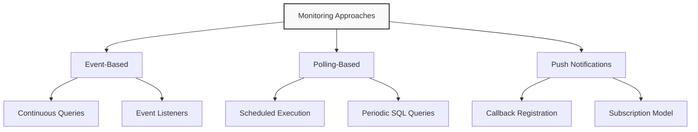
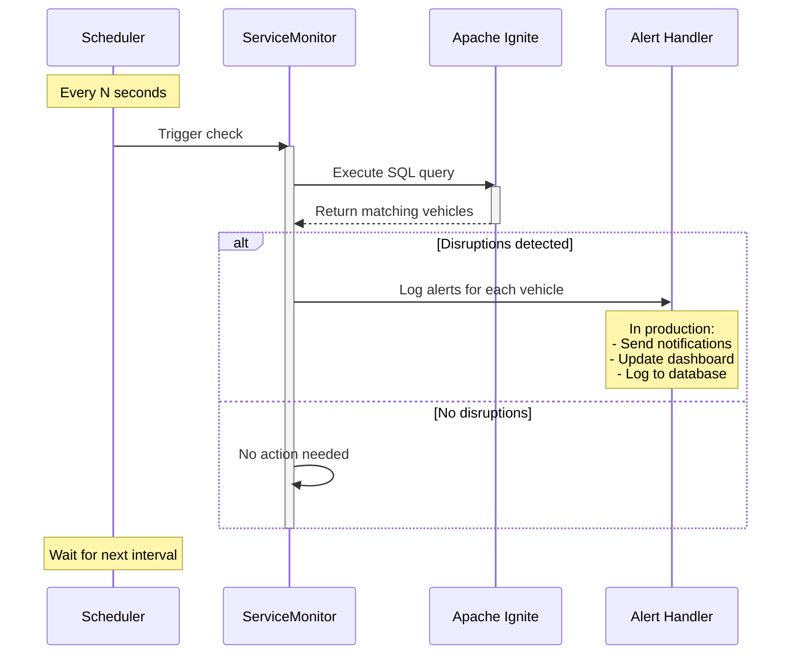

# Adding a Service Monitor

In this module, we'll implement a monitoring system that continuously watches for potential service disruptions in our transit network. By leveraging Apache Ignite's continuous SQL query capability, we can detect specific conditions and trigger appropriate responses when those conditions are met.

## Understanding Monitoring Approaches in Distributed Systems

When building monitoring solutions for distributed systems like our transit application, there are several common approaches to consider:



For our transit monitoring system, we'll implement a **polling-based approach** using scheduled SQL queries. This approach offers several advantages:

1. **Simplicity**: Easy to implement and understand
2. **Flexibility**: Can modify query criteria without redeploying
3. **Control**: Precise control over monitoring frequency
4. **Resource Management**: Predictable resource usage pattern

Let's implement this pattern to monitor for vehicles that have been stopped for an extended period, potentially indicating service disruptions.

Create a file `ServiceMonitor.java`:

```java
package com.example.transit;

import org.apache.ignite.client.IgniteClient;

import java.time.LocalDateTime;
import java.time.format.DateTimeFormatter;
import java.util.ArrayList;
import java.util.HashMap;
import java.util.List;
import java.util.Map;
import java.util.concurrent.Executors;
import java.util.concurrent.ScheduledExecutorService;
import java.util.concurrent.TimeUnit;
import java.util.concurrent.atomic.AtomicInteger;

/**
 * Monitors vehicle positions for potential service disruptions.
 * This class periodically checks for various conditions that might
 * indicate issues in the transit system, such as delayed vehicles,
 * bunching, or insufficient route coverage.
 */
public class ServiceMonitor {
    // Thresholds for monitoring conditions
    private static final int STOPPED_THRESHOLD_MINUTES = 5;
    private static final int BUNCHING_DISTANCE_KM = 1;
    private static final int MINIMUM_VEHICLES_PER_ROUTE = 2;
    private static final int OFFLINE_THRESHOLD_MINUTES = 15;
    
    // Monitoring infrastructure
    private final ScheduledExecutorService scheduler = Executors.newScheduledThreadPool(1);
    private final IgniteClient client;
    private final DateTimeFormatter timeFormatter = DateTimeFormatter.ofPattern("HH:mm:ss");
    
    // Statistics tracking
    private final Map<String, AtomicInteger> alertCounts = new HashMap<>();
    private final List<ServiceAlert> recentAlerts = new ArrayList<>();
    private final int maxRecentAlerts = 100;
    
    /**
     * Creates a new service monitor connected to the Ignite cluster.
     */
    public ServiceMonitor() {
        this.client = IgniteConnection.getClient();
        initializeAlertCounters();
    }
    
    /**
     * Initializes alert counters for each type of monitored condition.
     */
    private void initializeAlertCounters() {
        alertCounts.put("DELAYED_VEHICLE", new AtomicInteger(0));
        alertCounts.put("VEHICLE_BUNCHING", new AtomicInteger(0));
        alertCounts.put("LOW_ROUTE_COVERAGE", new AtomicInteger(0));
        alertCounts.put("OFFLINE_VEHICLE", new AtomicInteger(0));
    }
    
    /**
     * Starts monitoring for service disruptions by polling the database at regular intervals.
     * 
     * @param intervalSeconds The polling interval in seconds
     */
    public void startMonitoring(int intervalSeconds) {
        System.out.println("Starting service disruption monitoring (polling every " + intervalSeconds + " seconds)");
        
        // Schedule all monitoring tasks
        scheduler.scheduleAtFixedRate(
            this::checkForDelayedVehicles, 
            5, 
            intervalSeconds, 
            TimeUnit.SECONDS
        );
        
        scheduler.scheduleAtFixedRate(
            this::checkForVehicleBunching, 
            10, 
            intervalSeconds, 
            TimeUnit.SECONDS
        );
        
        scheduler.scheduleAtFixedRate(
            this::checkForLowRouteCoverage, 
            15, 
            intervalSeconds, 
            TimeUnit.SECONDS
        );
        
        scheduler.scheduleAtFixedRate(
            this::checkForOfflineVehicles, 
            20, 
            intervalSeconds, 
            TimeUnit.SECONDS
        );
        
        // Also schedule a task to regularly print monitoring statistics
        scheduler.scheduleAtFixedRate(
            this::printMonitoringStatistics, 
            30, 
            300, 
            TimeUnit.SECONDS  // Print stats every 5 minutes
        );
    }
    
    /**
     * Stops the monitoring service.
     */
    public void stopMonitoring() {
        scheduler.shutdown();
        try {
            if (!scheduler.awaitTermination(10, TimeUnit.SECONDS)) {
                scheduler.shutdownNow();
            }
        } catch (InterruptedException e) {
            scheduler.shutdownNow();
            Thread.currentThread().interrupt();
        }
        System.out.println("Service disruption monitoring stopped");
        printMonitoringStatistics(); // Print final statistics
    }
    
    /**
     * Checks for vehicles that have been stopped for longer than the threshold.
     */
    private void checkForDelayedVehicles() {
        try {
            // Query to detect vehicles stopped for more than the threshold time
            String querySql = 
                "SELECT " +
                "    v.vehicle_id, " +
                "    v.route_id, " +
                "    v.current_status, " +
                "    v.latitude, " +
                "    v.longitude, " +
                "    v.time_stamp, " +
                "    TIMESTAMPDIFF(MINUTE, v.time_stamp, CURRENT_TIMESTAMP) as stopped_minutes " +
                "FROM vehicle_positions v " +
                "JOIN (" +
                "    SELECT vehicle_id, MAX(time_stamp) as latest_ts " +
                "    FROM vehicle_positions " +
                "    GROUP BY vehicle_id " +
                ") l ON v.vehicle_id = l.vehicle_id AND v.time_stamp = l.latest_ts " +
                "WHERE " +
                "    v.current_status = 'STOPPED_AT' " +
                "    AND TIMESTAMPDIFF(MINUTE, v.time_stamp, CURRENT_TIMESTAMP) >= ?";
            
            // Execute the query with the threshold parameter
            var result = client.sql().execute(null, querySql, STOPPED_THRESHOLD_MINUTES);
            
            int count = 0;
            // Process each row in the result
            while (result.hasNext()) {
                var row = result.next();
                count++;
                
                String vehicleId = row.stringValue("vehicle_id");
                String routeId = row.stringValue("route_id");
                LocalDateTime timestamp = row.value("time_stamp");
                int stoppedMinutes = row.intValue("stopped_minutes");
                
                // Create and record the alert
                ServiceAlert alert = new ServiceAlert(
                    "DELAYED_VEHICLE",
                    "Vehicle " + vehicleId + " on route " + routeId + 
                    " has been stopped for " + stoppedMinutes + " minutes",
                    routeId,
                    vehicleId,
                    row.doubleValue("latitude"),
                    row.doubleValue("longitude"),
                    stoppedMinutes
                );
                
                recordAlert(alert);
                
                // Log the alert
                System.out.println("[" + LocalDateTime.now().format(timeFormatter) + 
                                  "] ALERT: " + alert.getMessage());
            }
            
            if (count > 0) {
                System.out.println("Found " + count + " delayed vehicles");
            }
        } catch (Exception e) {
            System.err.println("Error checking for delayed vehicles: " + e.getMessage());
            e.printStackTrace();
        }
    }
    
    /**
     * Checks for vehicles on the same route that are too close together (bunching).
     */
    private void checkForVehicleBunching() {
        try {
            // This query finds pairs of vehicles on the same route that are close to each other
            String querySql = 
                "WITH latest_positions AS (" +
                "    SELECT v.vehicle_id, v.route_id, v.latitude, v.longitude " +
                "    FROM vehicle_positions v " +
                "    JOIN (" +
                "        SELECT vehicle_id, MAX(time_stamp) as latest_ts " +
                "        FROM vehicle_positions " +
                "        GROUP BY vehicle_id " +
                "    ) l ON v.vehicle_id = l.vehicle_id AND v.time_stamp = l.latest_ts " +
                "    WHERE v.current_status = 'IN_TRANSIT_TO' " +  // Only consider moving vehicles
                ") " +
                "SELECT " +
                "    a.vehicle_id as vehicle1, " +
                "    b.vehicle_id as vehicle2, " +
                "    a.route_id, " +
                "    a.latitude as lat1, " +
                "    a.longitude as lon1, " +
                "    b.latitude as lat2, " +
                "    b.longitude as lon2, " +
                "    SQRT(POWER(a.latitude - b.latitude, 2) + POWER(a.longitude - b.longitude, 2)) * 111 as distance_km " +
                "FROM latest_positions a " +
                "JOIN latest_positions b ON a.route_id = b.route_id AND a.vehicle_id < b.vehicle_id " +
                "WHERE SQRT(POWER(a.latitude - b.latitude, 2) + POWER(a.longitude - b.longitude, 2)) * 111 < ? " +
                "ORDER BY distance_km";
            
            var result = client.sql().execute(null, querySql, BUNCHING_DISTANCE_KM);
            
            int count = 0;
            while (result.hasNext()) {
                var row = result.next();
                count++;
                
                String vehicle1 = row.stringValue("vehicle1");
                String vehicle2 = row.stringValue("vehicle2");
                String routeId = row.stringValue("route_id");
                double distanceKm = row.doubleValue("distance_km");
                
                // Create and record the alert
                ServiceAlert alert = new ServiceAlert(
                    "VEHICLE_BUNCHING",
                    "Vehicles " + vehicle1 + " and " + vehicle2 + " on route " + routeId + 
                    " are only " + String.format("%.2f", distanceKm) + " km apart",
                    routeId,
                    vehicle1 + "," + vehicle2,
                    (row.doubleValue("lat1") + row.doubleValue("lat2")) / 2, // Midpoint
                    (row.doubleValue("lon1") + row.doubleValue("lon2")) / 2,
                    (int)(distanceKm * 100) // Convert to integer value for severity (smaller = more severe)
                );
                
                recordAlert(alert);
                
                // Log the alert
                System.out.println("[" + LocalDateTime.now().format(timeFormatter) + 
                                  "] ALERT: " + alert.getMessage());
            }
            
            if (count > 0) {
                System.out.println("Found " + count + " instances of vehicle bunching");
            }
        } catch (Exception e) {
            System.err.println("Error checking for vehicle bunching: " + e.getMessage());
            e.printStackTrace();
        }
    }
    
    /**
     * Checks for routes with insufficient vehicle coverage.
     */
    private void checkForLowRouteCoverage() {
        try {
            String querySql = 
                "WITH active_vehicles AS (" +
                "    SELECT DISTINCT v.route_id, v.vehicle_id " +
                "    FROM vehicle_positions v " +
                "    JOIN (" +
                "        SELECT vehicle_id, MAX(time_stamp) as latest_ts " +
                "        FROM vehicle_positions " +
                "        GROUP BY vehicle_id " +
                "    ) l ON v.vehicle_id = l.vehicle_id AND v.time_stamp = l.latest_ts " +
                "    WHERE TIMESTAMPDIFF(MINUTE, v.time_stamp, CURRENT_TIMESTAMP) < 15" +  // Only consider recent positions
                ") " +
                "SELECT route_id, COUNT(*) as vehicle_count " +
                "FROM active_vehicles " +
                "GROUP BY route_id " +
                "HAVING COUNT(*) < ? " +
                "ORDER BY vehicle_count";
            
            var result = client.sql().execute(null, querySql, MINIMUM_VEHICLES_PER_ROUTE);
            
            int count = 0;
            while (result.hasNext()) {
                var row = result.next();
                count++;
                
                String routeId = row.stringValue("route_id");
                int vehicleCount = (int)row.longValue("vehicle_count");
                
                // Create and record the alert
                ServiceAlert alert = new ServiceAlert(
                    "LOW_ROUTE_COVERAGE",
                    "Route " + routeId + " has only " + vehicleCount + 
                    " vehicle(s) in service (minimum " + MINIMUM_VEHICLES_PER_ROUTE + " required)",
                    routeId,
                    null,
                    0, 0, // No specific location
                    MINIMUM_VEHICLES_PER_ROUTE - vehicleCount // Severity is the shortage amount
                );
                
                recordAlert(alert);
                
                // Log the alert
                System.out.println("[" + LocalDateTime.now().format(timeFormatter) + 
                                  "] ALERT: " + alert.getMessage());
            }
            
            if (count > 0) {
                System.out.println("Found " + count + " routes with insufficient vehicle coverage");
            }
        } catch (Exception e) {
            System.err.println("Error checking for low route coverage: " + e.getMessage());
            e.printStackTrace();
        }
    }
    
    /**
     * Checks for vehicles that haven't reported positions recently.
     */
    private void checkForOfflineVehicles() {
        try {
            String querySql = 
                "WITH latest_timestamps AS (" +
                "    SELECT vehicle_id, MAX(time_stamp) as latest_ts " +
                "    FROM vehicle_positions " +
                "    GROUP BY vehicle_id " +
                "), active_routes AS (" +
                "    SELECT DISTINCT route_id " +
                "    FROM vehicle_positions v " +
                "    JOIN latest_timestamps l ON v.vehicle_id = l.vehicle_id AND v.time_stamp = l.latest_ts " +
                "    WHERE TIMESTAMPDIFF(MINUTE, v.time_stamp, CURRENT_TIMESTAMP) < 15" +
                ") " +
                "SELECT v.vehicle_id, v.route_id, v.latitude, v.longitude, v.time_stamp, " +
                "       TIMESTAMPDIFF(MINUTE, v.time_stamp, CURRENT_TIMESTAMP) as offline_minutes " +
                "FROM vehicle_positions v " +
                "JOIN latest_timestamps l ON v.vehicle_id = l.vehicle_id AND v.time_stamp = l.latest_ts " +
                "WHERE v.route_id IN (SELECT route_id FROM active_routes) " +  // Only check routes with some active vehicles
                "  AND TIMESTAMPDIFF(MINUTE, v.time_stamp, CURRENT_TIMESTAMP) >= ? " +
                "ORDER BY offline_minutes DESC";
            
            var result = client.sql().execute(null, querySql, OFFLINE_THRESHOLD_MINUTES);
            
            int count = 0;
            while (result.hasNext()) {
                var row = result.next();
                count++;
                
                String vehicleId = row.stringValue("vehicle_id");
                String routeId = row.stringValue("route_id");
                int offlineMinutes = row.intValue("offline_minutes");
                
                // Create and record the alert
                ServiceAlert alert = new ServiceAlert(
                    "OFFLINE_VEHICLE",
                    "Vehicle " + vehicleId + " on route " + routeId + 
                    " has not reported for " + offlineMinutes + " minutes",
                    routeId,
                    vehicleId,
                    row.doubleValue("latitude"),
                    row.doubleValue("longitude"),
                    offlineMinutes
                );
                
                recordAlert(alert);
                
                // Log the alert
                System.out.println("[" + LocalDateTime.now().format(timeFormatter) + 
                                  "] ALERT: " + alert.getMessage());
            }
            
            if (count > 0) {
                System.out.println("Found " + count + " offline vehicles");
            }
        } catch (Exception e) {
            System.err.println("Error checking for offline vehicles: " + e.getMessage());
            e.printStackTrace();
        }
    }
    
    /**
     * Records an alert for tracking and statistics.
     */
    private synchronized void recordAlert(ServiceAlert alert) {
        // Increment the count for this alert type
        alertCounts.get(alert.getType()).incrementAndGet();
        
        // Add to recent alerts
        recentAlerts.add(alert);
        
        // Trim list if needed
        while (recentAlerts.size() > maxRecentAlerts) {
            recentAlerts.remove(0);
        }
    }
    
    /**
     * Prints statistics about monitoring activities.
     */
    public void printMonitoringStatistics() {
        System.out.println("\n===== SERVICE MONITORING STATISTICS =====");
        System.out.println("Time: " + LocalDateTime.now().format(DateTimeFormatter.ofPattern("yyyy-MM-dd HH:mm:ss")));
        System.out.println("\nAlert counts by type:");
        
        alertCounts.forEach((type, count) -> {
            System.out.println("• " + type + ": " + count.get());
        });
        
        int totalAlerts = alertCounts.values().stream()
            .mapToInt(AtomicInteger::get)
            .sum();
            
        System.out.println("\nTotal alerts detected: " + totalAlerts);
        
        if (!recentAlerts.isEmpty()) {
            System.out.println("\nMost recent alerts:");
            recentAlerts.stream()
                .limit(5)
                .forEach(alert -> System.out.println("• " + alert.getMessage()));
        }
        
        System.out.println("\nMonitoring thresholds:");
        System.out.println("• Delayed vehicle: " + STOPPED_THRESHOLD_MINUTES + " minutes");
        System.out.println("• Vehicle bunching: " + BUNCHING_DISTANCE_KM + " km");
        System.out.println("• Minimum vehicles per route: " + MINIMUM_VEHICLES_PER_ROUTE);
        System.out.println("• Offline threshold: " + OFFLINE_THRESHOLD_MINUTES + " minutes");
        
        System.out.println("===========================================\n");
    }
    
    /**
     * Gets the list of recent alerts.
     */
    public synchronized List<ServiceAlert> getRecentAlerts() {
        return new ArrayList<>(recentAlerts);
    }
    
    /**
     * Gets the alert counts by type.
     */
    public Map<String, Integer> getAlertCounts() {
        Map<String, Integer> counts = new HashMap<>();
        alertCounts.forEach((type, count) -> counts.put(type, count.get()));
        return counts;
    }
    
    /**
     * Class representing a service alert in the monitoring system.
     */
    public static class ServiceAlert {
        private final String type;
        private final String message;
        private final String routeId;
        private final String vehicleId;
        private final double latitude;
        private final double longitude;
        private final int severity;
        private final LocalDateTime timestamp;
        
        public ServiceAlert(String type, String message, String routeId, String vehicleId, 
                          double latitude, double longitude, int severity) {
            this.type = type;
            this.message = message;
            this.routeId = routeId;
            this.vehicleId = vehicleId;
            this.latitude = latitude;
            this.longitude = longitude;
            this.severity = severity;
            this.timestamp = LocalDateTime.now();
        }
        
        // Getters
        public String getType() { return type; }
        public String getMessage() { return message; }
        public String getRouteId() { return routeId; }
        public String getVehicleId() { return vehicleId; }
        public double getLatitude() { return latitude; }
        public double getLongitude() { return longitude; }
        public int getSeverity() { return severity; }
        public LocalDateTime getTimestamp() { return timestamp; }
    }
}
```

## Understanding the Service Monitor Implementation

Let's explore the key features of our service monitor:

### Multiple Monitoring Tasks

Our monitor implements several distinct monitoring tasks:

- **Delayed Vehicles**: Detects vehicles that have been stopped for too long
- **Vehicle Bunching**: Finds vehicles on the same route that are too close together
- **Low Route Coverage**: Identifies routes with insufficient vehicle coverage
- **Offline Vehicles**: Detects vehicles that haven't reported positions recently

Each task is scheduled independently, allowing for different check frequencies if needed.

### SQL-Based Monitoring

Each monitoring task uses a SQL query to detect the condition of interest:

```java
String querySql = 
    "SELECT " +
    "    v.vehicle_id, " +
    "    v.route_id, " +
    "    v.current_status, " +
    //... more columns ...
    "FROM vehicle_positions v " +
    "JOIN (" +
    "    SELECT vehicle_id, MAX(time_stamp) as latest_ts " +
    "    FROM vehicle_positions " +
    "    GROUP BY vehicle_id " +
    ") l ON v.vehicle_id = l.vehicle_id AND v.time_stamp = l.latest_ts " +
    "WHERE " +
    "    v.current_status = 'STOPPED_AT' " +
    "    AND TIMESTAMPDIFF(MINUTE, v.time_stamp, CURRENT_TIMESTAMP) >= ?";
```

This approach leverages Ignite's distributed SQL engine to efficiently process large datasets and detect specific patterns.

### Alert Management

The monitor tracks detected issues using a `ServiceAlert` class:

```java
ServiceAlert alert = new ServiceAlert(
    "DELAYED_VEHICLE",
    "Vehicle " + vehicleId + " on route " + routeId + 
    " has been stopped for " + stoppedMinutes + " minutes",
    routeId,
    vehicleId,
    row.doubleValue("latitude"),
    row.doubleValue("longitude"),
    stoppedMinutes
);
```

Each alert includes:

- Type identifier
- Human-readable message
- Associated route and vehicle
- Geographic location
- Severity metric
- Timestamp

### Statistics Tracking

The monitor maintains statistics on detected issues:

```java
private final Map<String, AtomicInteger> alertCounts = new HashMap<>();
private final List<ServiceAlert> recentAlerts = new ArrayList<>();
```

These statistics help operators understand the overall health of the transit system and track patterns over time.

### Scheduled Execution

The monitoring tasks run on configurable intervals using Java's `ScheduledExecutorService`:

```java
scheduler.scheduleAtFixedRate(
    this::checkForDelayedVehicles, 
    5, 
    intervalSeconds, 
    TimeUnit.SECONDS
);
```

This approach ensures regular monitoring without blocking the main application thread.

## Testing the Service Monitor

Let's create a simple test application to verify our service monitor. Create a file `ServiceMonitorTest.java`:

```java
package com.example.transit;

import java.util.List;
import java.util.Map;

/**
 * Test application for the service monitor.
 * Demonstrates setting up and running the monitoring service.
 */
public class ServiceMonitorTest {

    public static void main(String[] args) {
        System.out.println("=== Service Monitor Test ===");

        try {
            // First, verify we have data to monitor
            System.out.println("\nVerifying database data...");
            DataVerifier.verifyData();

            // Create and start the service monitor
            System.out.println("\nStarting service monitor...");
            ServiceMonitor monitor = new ServiceMonitor();
            monitor.startMonitoring(60); // Check every 60 seconds

            // Let the monitor run for a while
            System.out.println("\nMonitor is running. Press Enter to stop...");
            System.in.read();

            // Stop the monitor
            System.out.println("\nStopping service monitor...");
            monitor.stopMonitoring();

            // Display final results
            List<ServiceMonitor.ServiceAlert> alerts = monitor.getRecentAlerts();
            Map<String, Integer> alertCounts = monitor.getAlertCounts();

            System.out.println("\n=== Monitoring Results ===");
            System.out.println("Total alerts detected: " + alerts.size());

            alertCounts.forEach((type, count) -> {
                System.out.println("• " + type + ": " + count);
            });

            if (!alerts.isEmpty()) {
                System.out.println("\nSample alerts:");
                alerts.stream()
                        .limit(5)
                        .forEach(alert -> {
                            System.out.println("• " + alert.getMessage() +
                                    " (Severity: " + alert.getSeverity() + ")");
                        });
            }

            System.out.println("\nTest completed successfully!");

        } catch (Exception e) {
            System.err.println("Error during monitor test: " + e.getMessage());
            e.printStackTrace();
        } finally {
            // Clean up connection
            IgniteConnection.close();
        }
    }
}
```

Execute the test to validate the service monitor:

```bash
mvn compile exec:java -Dexec.mainClass="com.example.transit.ServiceMonitorTest"
```

> Note: Hit ENTER to end the Service Monitor Test.

## The Monitoring Process Workflow

When the service monitoring system runs, it follows this workflow:



## Benefits of SQL-Based Monitoring

Using SQL queries for monitoring provides several advantages:

1. **Declarative Definition**: You can express complex conditions directly in SQL
2. **Server-Side Processing**: Filtering happens on the server, minimizing network traffic
3. **Flexibility**: Easily adjust thresholds or add new conditions
4. **Integration**: Works seamlessly with your existing data model

This SQL-based monitoring approach demonstrates how Ignite can be used not just for data storage but as an intelligent processing platform for real-time applications.

## Next Steps

In this module, we've implemented a comprehensive service monitoring system that:

1. Continuously checks for potential service disruptions
2. Detects multiple types of issues, including:
   - Vehicles stopped for too long
   - Vehicles bunching on routes
   - Routes with insufficient coverage
   - Vehicles that have gone offline

3. Tracks statistics about detected issues
4. Provides a foundation for integration with external systems

This monitoring system transforms our transit application from a passive data collection system into an active monitoring tool that can alert operators to potential problems before they significantly impact service.

The SQL-based approach leverages Ignite's distributed query capabilities to efficiently process large volumes of transit data and detect specific patterns that might indicate service issues.

In the next module, we'll bring all the components together to create the complete transit monitoring application, including a simple dashboard to visualize the system status.

> **Next Steps:** Continue to [Module 8: Putting It All Together](08-putting-together.md) to create the main application that combines all these components into a complete system.
