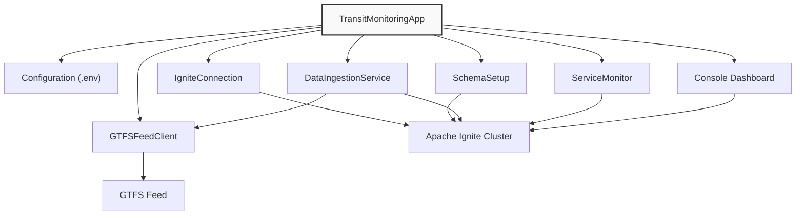

# Putting It All Together and Next Steps

In this final module, we'll orchestrate all the components we've built into a cohesive application and explore how to test, verify, and extend your transit monitoring system. By the end, you'll have a complete, running application and a roadmap for future enhancements.

## The Application Architecture

Before diving into the code, let's review the complete architecture of our transit monitoring system:



This architecture demonstrates several important design principles:

1. **Component Separation**: Each class has a clear, focused responsibility
2. **Clean Integration**: Components interact through well-defined interfaces
3. **Central Coordination**: The main application orchestrates all components
4. **Configuration Management**: External configuration keeps credentials secure
5. **Resource Lifecycle**: Components are properly started and stopped

> [!note]
> This architecture follows the Single Responsibility Principle, where each component has one primary function. This makes the system easier to understand, test, and maintain. It also allows components to be developed and tested independently before being integrated into the complete application.

> [!important]
> **Checkpoint**: Review the architecture diagram and make sure you understand:
>
> - The purpose of each component
> - How data flows through the system
> - How components interact with each other
> - The central role of the main application in orchestrating components

## Creating the Main Application

The `TransitMonitoringApp` class serves as our application's entry point, bringing together all the components we've developed:

```java
package com.example.transit.app;

import com.example.transit.service.DataIngestionService;
import com.example.transit.service.GTFSFeedService;
import com.example.transit.service.IgniteConnectionService;
import com.example.transit.service.MonitoringService;
import com.example.transit.service.SchemaSetupService;
import com.example.transit.util.LoggingUtil;
import com.example.transit.util.TerminalUtil;

import io.github.cdimascio.dotenv.Dotenv;
import org.apache.ignite.client.IgniteClient;

import java.time.LocalDateTime;
import java.util.HashMap;
import java.util.List;
import java.util.Map;
import java.util.Scanner;
import java.util.concurrent.Executors;
import java.util.concurrent.ScheduledExecutorService;
import java.util.concurrent.TimeUnit;
import java.util.concurrent.atomic.AtomicInteger;

/**
 * Main application class that orchestrates all components of the transit monitoring system.
 * This class initializes and manages:
 * - The connection to the Ignite cluster
 * - The database schema
 * - The data ingestion service
 * - The service monitor
 * - The console dashboard
 */
public class TransitMonitorApp {
    // Configuration options
    private static final int INGESTION_INTERVAL_SECONDS = 30;
    private static final int MONITORING_INTERVAL_SECONDS = 60;
    private static final int DASHBOARD_REFRESH_SECONDS = 10;

    // Dashboard views
    private static final int SUMMARY_VIEW = 0;
    private static final int ALERTS_VIEW = 1;
    private static final int DETAILS_VIEW = 2;
    private static final int TOTAL_VIEWS = 3;

    // Components
    private final IgniteConnectionService connectionService;
    private final IgniteClient client;
    private final DataIngestionService ingestionService;
    private final MonitoringService monitoringService;
    private final ScheduledExecutorService dashboardScheduler;

    // Dashboard state
    private final Map<String, Integer> previousRouteCounts = new HashMap<>();
    private final Map<String, Long> previousStatusCounts = new HashMap<>();
    private final AtomicInteger currentView = new AtomicInteger(0);

    // State tracking
    private boolean isRunning = false;

    /**
     * Creates a new transit monitoring application with all required components.
     *
     * @param feedUrl The URL of the GTFS feed to monitor
     */
    public TransitMonitorApp(String feedUrl) {
        // Configure logging to suppress unnecessary output
        LoggingUtil.suppressLogs();

        // Initialize Ignite connection service
        this.connectionService = new IgniteConnectionService();

        // Get the Ignite client from the connection service
        this.client = connectionService.getClient();

        // Initialize data ingestion service with connection service
        this.ingestionService = new DataIngestionService(
                new GTFSFeedService(feedUrl),
                connectionService)
                .withBatchSize(100);

        // Initialize service monitor with connection service
        this.monitoringService = new MonitoringService(connectionService);

        // Initialize dashboard scheduler with daemon threads
        this.dashboardScheduler = Executors.newSingleThreadScheduledExecutor(r -> {
            Thread t = new Thread(r, "dashboard-thread");
            t.setDaemon(true);
            return t;
        });
    }

    /**
     * Starts all components of the transit monitoring system.
     *
     * @return true if startup was successful, false otherwise
     */
    public boolean start() {
        if (isRunning) {
            TerminalUtil.logInfo("Transit monitoring system is already running");
            return true;
        }

        try {
            TerminalUtil.logInfo(TerminalUtil.ANSI_BOLD + "Starting Transit Monitoring System" + TerminalUtil.ANSI_RESET);

            // Clear screen and show startup animation
            TerminalUtil.clearScreen();
            TerminalUtil.showStartupAnimation();

            // Test GTFS connection via the ingestion service
            TerminalUtil.logInfo("Testing GTFS connection...");
            testGtfsConnection();

            // Set up schema
            TerminalUtil.logInfo("Setting up database schema...");
            SchemaSetupService schemaSetup = new SchemaSetupService(connectionService);
            boolean schemaCreated = schemaSetup.createSchema();

            if (!schemaCreated) {
                TerminalUtil.logError("Failed to create schema. Aborting startup.");
                return false;
            }

            // Start data ingestion
            TerminalUtil.logInfo("Starting data ingestion service (interval: " + INGESTION_INTERVAL_SECONDS + "s)...");
            ingestionService.start(INGESTION_INTERVAL_SECONDS);

            // Start service monitoring
            TerminalUtil.logInfo("Starting service monitor (interval: " + MONITORING_INTERVAL_SECONDS + "s)...");
            monitoringService.startMonitoring(MONITORING_INTERVAL_SECONDS);

            // Start dashboard
            TerminalUtil.logInfo("Starting console dashboard (refresh: " + DASHBOARD_REFRESH_SECONDS + "s)...");
            startConsoleDashboard(DASHBOARD_REFRESH_SECONDS);

            isRunning = true;
            TerminalUtil.logInfo(TerminalUtil.ANSI_GREEN + "Transit monitoring system started successfully" + TerminalUtil.ANSI_RESET);

            return true;
        } catch (Exception e) {
            TerminalUtil.logError("Error starting transit monitoring system: " + e.getMessage());
            e.printStackTrace();
            stop();
            return false;
        }
    }

    /**
     * Stops all components of the transit monitoring system.
     */
    public void stop() {
        TerminalUtil.logInfo(TerminalUtil.ANSI_BOLD + "Stopping Transit Monitoring System" + TerminalUtil.ANSI_RESET);

        // Show shutdown animation
        TerminalUtil.showShutdownAnimation();

        // Stop dashboard
        dashboardScheduler.shutdown();
        try {
            if (!dashboardScheduler.awaitTermination(5, TimeUnit.SECONDS)) {
                dashboardScheduler.shutdownNow();
            }
        } catch (InterruptedException e) {
            dashboardScheduler.shutdownNow();
            Thread.currentThread().interrupt();
        }

        // Stop service monitor
        monitoringService.stopMonitoring();

        // Stop ingestion service
        ingestionService.stop();

        // Close Ignite connection with try-with-resources
        try {
            connectionService.close();
        } catch (Exception e) {
            TerminalUtil.logError("Error closing Ignite connection: " + e.getMessage());
        }

        isRunning = false;
        TerminalUtil.logInfo(TerminalUtil.ANSI_GREEN + "Transit monitoring system stopped" + TerminalUtil.ANSI_RESET);
    }

    /**
     * Tests the connection to the GTFS feed.
     *
     * @throws Exception if the connection fails
     */
    private void testGtfsConnection() throws Exception {
        try {
            // Check if we can get statistics from the service
            DataIngestionService.IngestStats stats = ingestionService.getStatistics();

            TerminalUtil.logInfo(TerminalUtil.ANSI_GREEN + "GTFS feed client initialized successfully." + TerminalUtil.ANSI_RESET);
            TerminalUtil.logInfo("Connection will be tested when the ingestion service starts.");

        } catch (Exception e) {
            TerminalUtil.logError("GTFS client initialization failed: " + e.getMessage());
            throw e;
        }
    }

    /**
     * Starts the console dashboard that periodically displays system status.
     *
     * @param refreshSeconds How often to refresh the dashboard
     */
    private void startConsoleDashboard(int refreshSeconds) {
        dashboardScheduler.scheduleAtFixedRate(() -> {
            try {
                // Rotate the dashboard view periodically
                printDashboard(currentView.get());
                currentView.set((currentView.get() + 1) % TOTAL_VIEWS);
            } catch (Exception e) {
                TerminalUtil.logError("Error updating dashboard: " + e.getMessage());
            }
        }, refreshSeconds, refreshSeconds, TimeUnit.SECONDS);
    }

    /**
     * Prints the console dashboard with current system status.
     *
     * @param viewType The type of view to display (0=summary, 1=alerts, 2=details)
     */
    private void printDashboard(int viewType) {
        // Get terminal width if available
        int terminalWidth = TerminalUtil.getTerminalWidth();

        // Clear the screen before drawing
        TerminalUtil.clearScreen();

        String header = "TRANSIT MONITORING DASHBOARD";
        String currentTime = LocalDateTime.now().format(TerminalUtil.DATE_TIME_FORMATTER);

        TerminalUtil.printCenteredBox(header, terminalWidth);
        System.out.println(TerminalUtil.ANSI_CYAN + "Current time: " + TerminalUtil.ANSI_BOLD + currentTime + TerminalUtil.ANSI_RESET);
        System.out.println();

        switch (viewType) {
            case SUMMARY_VIEW:
                printSummaryView(terminalWidth);
                break;
            case ALERTS_VIEW:
                printAlertsView(terminalWidth);
                break;
            case DETAILS_VIEW:
                printDetailsView(terminalWidth);
                break;
        }

        // Always show navigation help at bottom
        System.out.println();
        System.out.println(TerminalUtil.ANSI_BLUE + "Views rotate automatically every " + DASHBOARD_REFRESH_SECONDS + " seconds" + TerminalUtil.ANSI_RESET);
        System.out.println(TerminalUtil.ANSI_BLUE + "Press ENTER at any time to exit" + TerminalUtil.ANSI_RESET);
    }

    /**
     * Prints the summary view of the dashboard
     */
    private void printSummaryView(int width) {
        System.out.println(TerminalUtil.ANSI_BOLD + "SUMMARY VIEW" + TerminalUtil.ANSI_RESET);
        System.out.println("─".repeat(width > 80 ? 80 : width));

        // Get active vehicle counts
        printActiveVehicleCounts();

        // Get status distribution
        System.out.println();
        System.out.println(TerminalUtil.ANSI_BOLD + "VEHICLE STATUS DISTRIBUTION" + TerminalUtil.ANSI_RESET);
        printStatusDistribution();

        // Data ingestion status
        System.out.println();
        System.out.println(TerminalUtil.ANSI_BOLD + "DATA INGESTION STATUS" + TerminalUtil.ANSI_RESET);
        printDataIngestionStatus();
    }

    /**
     * Prints the alerts view of the dashboard
     */
    private void printAlertsView(int width) {
        System.out.println(TerminalUtil.ANSI_BOLD + "SERVICE ALERTS VIEW" + TerminalUtil.ANSI_RESET);
        System.out.println("─".repeat(width > 80 ? 80 : width));

        // Print service alerts
        List<MonitoringService.ServiceAlert> alerts = monitoringService.getRecentAlerts();
        System.out.println(TerminalUtil.ANSI_BOLD + "RECENT SERVICE ALERTS" + TerminalUtil.ANSI_RESET);

        if (alerts.isEmpty()) {
            System.out.println(TerminalUtil.ANSI_GREEN + "No active alerts at this time" + TerminalUtil.ANSI_RESET);
        } else {
            System.out.println(TerminalUtil.ANSI_YELLOW + "Found " + alerts.size() + " active alerts:" + TerminalUtil.ANSI_RESET);

            alerts.stream()
                    .limit(15)  // Show more alerts in this view
                    .forEach(alert -> {
                        String color = TerminalUtil.ANSI_YELLOW;
                        if (alert.getSeverity() > 20) { // Higher severity values
                            color = TerminalUtil.ANSI_RED;
                        } else if (alert.getSeverity() < 5) { // Lower severity values
                            color = TerminalUtil.ANSI_BLUE;
                        }

                        System.out.println(color + "• " + alert.getMessage() + TerminalUtil.ANSI_RESET +
                                " [" + alert.getTimestamp().format(TerminalUtil.TIME_FORMATTER) + "]");
                    });
        }

        // Alert statistics
        System.out.println();
        System.out.println(TerminalUtil.ANSI_BOLD + "ALERT STATISTICS" + TerminalUtil.ANSI_RESET);
        Map<String, Integer> alertCounts = monitoringService.getAlertCounts();

        if (alertCounts.isEmpty()) {
            System.out.println("No alerts have been generated yet");
        } else {
            alertCounts.forEach((type, count) -> {
                String color = count > 10 ? TerminalUtil.ANSI_RED : count > 0 ? TerminalUtil.ANSI_YELLOW : TerminalUtil.ANSI_GREEN;
                System.out.println(color + "• " + type + ": " + count + " alerts" + TerminalUtil.ANSI_RESET);
            });
        }
    }

    /**
     * Prints the detailed system view
     */
    private void printDetailsView(int width) {
        System.out.println(TerminalUtil.ANSI_BOLD + "SYSTEM DETAILS VIEW" + TerminalUtil.ANSI_RESET);
        System.out.println("─".repeat(width > 80 ? 80 : width));

        // System statistics
        System.out.println(TerminalUtil.ANSI_BOLD + "SYSTEM STATISTICS" + TerminalUtil.ANSI_RESET);
        printSystemStatistics();

        // Service monitor status
        System.out.println();
        System.out.println(TerminalUtil.ANSI_BOLD + "MONITORING THRESHOLDS" + TerminalUtil.ANSI_RESET);
        printMonitoringThresholds();

        // Connection status
        System.out.println();
        System.out.println(TerminalUtil.ANSI_BOLD + "CONNECTION STATUS" + TerminalUtil.ANSI_RESET);
        printConnectionStatus();
    }

    /**
     * Prints active vehicle counts by route
     */
    private void printActiveVehicleCounts() {
        System.out.println(TerminalUtil.ANSI_BOLD + "ACTIVE VEHICLES BY ROUTE (last 15 minutes)" + TerminalUtil.ANSI_RESET);

        try {
            String routeCountSql =
                    "SELECT route_id, COUNT(DISTINCT vehicle_id) as vehicle_count " +
                            "FROM vehicle_positions " +
                            "WHERE TIMESTAMPDIFF(MINUTE, time_stamp, CURRENT_TIMESTAMP) <= 15 " +
                            "GROUP BY route_id " +
                            "ORDER BY vehicle_count DESC " +
                            "LIMIT 10";

            // Execute SQL query
            var resultSet = client.sql().execute(null, routeCountSql);
            boolean hasData = false;

            while (resultSet.hasNext()) {
                hasData = true;
                var row = resultSet.next();
                String routeId = row.stringValue("route_id");
                int count = (int)row.longValue("vehicle_count");

                // Show trend indicators compared to previous counts
                String trend = "";
                if (previousRouteCounts.containsKey(routeId)) {
                    int prevCount = previousRouteCounts.get(routeId);
                    if (count > prevCount) {
                        trend = TerminalUtil.ANSI_GREEN + " ↑" + TerminalUtil.ANSI_RESET;
                    } else if (count < prevCount) {
                        trend = TerminalUtil.ANSI_RED + " ↓" + TerminalUtil.ANSI_RESET;
                    } else {
                        trend = TerminalUtil.ANSI_BLUE + " =" + TerminalUtil.ANSI_RESET;
                    }
                }

                previousRouteCounts.put(routeId, count);
                System.out.printf("• Route %-8s: %3d vehicles%s%n", routeId, count, trend);
            }

            if (!hasData) {
                System.out.println(TerminalUtil.ANSI_YELLOW + "No active vehicles found in the last 15 minutes." + TerminalUtil.ANSI_RESET);
            }
        } catch (Exception e) {
            System.out.println(TerminalUtil.ANSI_RED + "Error retrieving vehicle counts: " + e.getMessage() + TerminalUtil.ANSI_RESET);
            System.out.println(TerminalUtil.ANSI_YELLOW + "Suggestion: Check the vehicle_positions table schema" + TerminalUtil.ANSI_RESET);
        }
    }

    /**
     * Prints vehicle status distribution
     */
    private void printStatusDistribution() {
        try {
            String statusSql =
                    "SELECT current_status, COUNT(*) as status_count " +
                            "FROM vehicle_positions " +
                            "WHERE TIMESTAMPDIFF(MINUTE, time_stamp, CURRENT_TIMESTAMP) <= 15 " +
                            "GROUP BY current_status";

            var resultSet = client.sql().execute(null, statusSql);
            boolean hasData = false;

            while (resultSet.hasNext()) {
                hasData = true;
                var row = resultSet.next();
                String status = row.stringValue("current_status");
                long count = row.longValue("status_count");

                // Show trend indicators
                String trend = "";
                if (previousStatusCounts.containsKey(status)) {
                    long prevCount = previousStatusCounts.get(status);
                    if (count > prevCount) {
                        trend = TerminalUtil.ANSI_GREEN + " ↑" + TerminalUtil.ANSI_RESET;
                    } else if (count < prevCount) {
                        trend = TerminalUtil.ANSI_RED + " ↓" + TerminalUtil.ANSI_RESET;
                    } else {
                        trend = TerminalUtil.ANSI_BLUE + " =" + TerminalUtil.ANSI_RESET;
                    }
                }

                previousStatusCounts.put(status, count);

                // Status-specific colors
                String statusColor = TerminalUtil.ANSI_RESET;
                if ("STOPPED_AT".equals(status)) {
                    statusColor = TerminalUtil.ANSI_RED;
                } else if ("IN_TRANSIT_TO".equals(status)) {
                    statusColor = TerminalUtil.ANSI_GREEN;
                } else if ("INCOMING_AT".equals(status)) {
                    statusColor = TerminalUtil.ANSI_BLUE;
                }

                System.out.printf("• %s%-15s%s: %5d vehicles%s%n",
                        statusColor, status, TerminalUtil.ANSI_RESET, count, trend);
            }

            if (!hasData) {
                System.out.println(TerminalUtil.ANSI_YELLOW + "No status data available." + TerminalUtil.ANSI_RESET);
            }
        } catch (Exception e) {
            System.out.println(TerminalUtil.ANSI_RED + "Error retrieving status distribution: " + e.getMessage() + TerminalUtil.ANSI_RESET);
            System.out.println(TerminalUtil.ANSI_YELLOW + "Suggestion: Check if the current_status column exists" + TerminalUtil.ANSI_RESET);
        }
    }

    /**
     * Prints data ingestion status
     */
    private void printDataIngestionStatus() {
        DataIngestionService.IngestStats stats = ingestionService.getStatistics();

        System.out.println("• Status: " +
                (stats.isRunning() ? TerminalUtil.ANSI_GREEN + "Running" : TerminalUtil.ANSI_RED + "Stopped") + TerminalUtil.ANSI_RESET);
        System.out.println("• Total records fetched: " + stats.getTotalFetched());
        System.out.println("• Total records stored: " + stats.getTotalStored());
        System.out.println("• Last fetch count: " + stats.getLastFetchCount());

        if (stats.getLastFetchTimeMs() > 0) {
            System.out.println("• Last fetch time: " + stats.getLastFetchTimeMs() + "ms");
        }

        if (stats.getRunningTimeMs() > 0) {
            System.out.println("• Running time: " + TerminalUtil.formatDuration(stats.getRunningTimeMs() / 1000));

            if (stats.getTotalFetched() > 0 && stats.getRunningTimeMs() > 0) {
                double rate = (double) stats.getTotalFetched() / (stats.getRunningTimeMs() / 1000.0);
                System.out.printf("• Ingestion rate: %.2f records/second%n", rate);
            }
        }
    }

    /**
     * Prints system statistics
     */
    private void printSystemStatistics() {
        try {
            // Get total record count
            var countResult = client.sql().execute(null, "SELECT COUNT(*) as total FROM vehicle_positions");

            if (countResult.hasNext()) {
                var row = countResult.next();
                long totalRecords = row.longValue("total");
                System.out.println("• Total position records: " + TerminalUtil.ANSI_BOLD + totalRecords + TerminalUtil.ANSI_RESET);
            }

            // Get total unique vehicles
            var vehiclesResult = client.sql().execute(null,
                    "SELECT COUNT(DISTINCT vehicle_id) as total FROM vehicle_positions");

            if (vehiclesResult.hasNext()) {
                var row = vehiclesResult.next();
                long totalVehicles = row.longValue("total");
                System.out.println("• Total unique vehicles: " + TerminalUtil.ANSI_BOLD + totalVehicles + TerminalUtil.ANSI_RESET);
            }

            // Get timespan simplified with direct string display
            var timeResult = client.sql().execute(null,
                    "SELECT MIN(time_stamp) as oldest, MAX(time_stamp) as newest FROM vehicle_positions");

            if (timeResult.hasNext()) {
                var row = timeResult.next();

                // Extract timestamp values directly as strings to avoid type conversion issues
                Object oldest = row.value("oldest");
                Object newest = row.value("newest");

                if (oldest != null && newest != null) {
                    System.out.println("• Oldest record: " + oldest);
                    System.out.println("• Newest record: " + newest);
                    System.out.println("• Data collection active");
                }
            }

        } catch (Exception e) {
            System.out.println(TerminalUtil.ANSI_RED + "Error retrieving system statistics: " + e.getMessage() + TerminalUtil.ANSI_RESET);
        }
    }

    /**
     * Prints monitoring thresholds (simplified fixed values)
     */
    private void printMonitoringThresholds() {
        // Use static values directly from known threshold constants
        System.out.println("• Delayed vehicle threshold: 5 minutes");
        System.out.println("• Vehicle bunching distance: 1 km");
        System.out.println("• Minimum vehicles per route: 2");
        System.out.println("• Vehicle offline threshold: 15 minutes");
    }

    /**
     * Prints connection status information
     */
    private void printConnectionStatus() {
        try {
            System.out.println("• Ignite cluster: " + TerminalUtil.ANSI_GREEN + "Connected" + TerminalUtil.ANSI_RESET);

            // Simplified connection reporting
            System.out.println("• Database: vehicle_positions table accessible");
            System.out.println("• Data ingestion service: " +
                    (ingestionService.getStatistics().isRunning() ?
                            TerminalUtil.ANSI_GREEN + "Active" :
                            TerminalUtil.ANSI_RED + "Inactive") +
                    TerminalUtil.ANSI_RESET);

            System.out.println("• Monitoring service: Active");
        } catch (Exception e) {
            System.out.println(TerminalUtil.ANSI_RED + "Error retrieving connection status: " + e.getMessage() + TerminalUtil.ANSI_RESET);
        }
    }

    /**
     * Main method to run the transit monitoring application.
     */
    public static void main(String[] args) {
        // Show welcome banner
        TerminalUtil.printWelcomeBanner();

        // Load environment variables from .env file
        Dotenv dotenv = Dotenv.configure().ignoreIfMissing().load();

        // Retrieve configuration values
        String apiToken = dotenv.get("API_TOKEN");
        String baseUrl = dotenv.get("GTFS_BASE_URL");
        String agency = dotenv.get("GTFS_AGENCY");

        // Validate configuration
        if (apiToken == null || baseUrl == null || agency == null) {
            System.err.println(TerminalUtil.ANSI_RED + "ERROR: Missing configuration. Please check your .env file." + TerminalUtil.ANSI_RESET);
            System.err.println(TerminalUtil.ANSI_YELLOW + "Required variables: API_TOKEN, GTFS_BASE_URL, GTFS_AGENCY" + TerminalUtil.ANSI_RESET);
            return;
        }

        // Construct the full feed URL
        String feedUrl = String.format("%s?api_key=%s&agency=%s", baseUrl, apiToken, agency);

        // Create and start the application
        TransitMonitorApp app = new TransitMonitorApp(feedUrl);

        if (app.start()) {
            // Wait for user input to stop
            System.out.println("\n" + TerminalUtil.ANSI_BOLD + "═".repeat(60) + TerminalUtil.ANSI_RESET);
            System.out.println(TerminalUtil.ANSI_GREEN + "Transit monitoring system is now running" + TerminalUtil.ANSI_RESET);
            System.out.println(TerminalUtil.ANSI_BLUE + "Press ENTER to exit" + TerminalUtil.ANSI_RESET);
            System.out.println(TerminalUtil.ANSI_BOLD + "═".repeat(60) + TerminalUtil.ANSI_RESET + "\n");

            try {
                new Scanner(System.in).nextLine();
            } catch (Exception e) {
                // Handle potential Scanner issues
                try {
                    Thread.sleep(60000); // Wait 1 minute if input doesn't work
                } catch (InterruptedException ie) {
                    Thread.currentThread().interrupt();
                }
            }

            // Stop the application
            app.stop();
        }
    }
}
```

And it's supporting `TerminalUtils` utility class.

> [!note]
> The `TerminalUtil` class provides terminal manipulation and formatting functions that improve the user experience. The ANSI escape codes allow for colored text and visual effects in terminal environments that support them, which helps make the dashboard more readable and visually appealing.

```java
package com.example.transit.util;

import java.time.LocalDateTime;
import java.time.format.DateTimeFormatter;

/**
 * Utility class for terminal output and formatting.
 * This class provides common terminal operations like:
 * - ANSI color codes for text formatting
 * - Screen clearing and animation
 * - Logging utilities with timestamp
 * - Text formatting utilities
 */
public class TerminalUtil {
    // Terminal colors - ANSI escape codes
    public static final String ANSI_RESET = "\u001B[0m";
    public static final String ANSI_RED = "\u001B[31m";
    public static final String ANSI_GREEN = "\u001B[32m";
    public static final String ANSI_YELLOW = "\u001B[33m";
    public static final String ANSI_BLUE = "\u001B[34m";
    public static final String ANSI_BRIGHT_BLUE = "\u001B[94m";
    public static final String ANSI_CYAN = "\u001B[36m";
    public static final String ANSI_BOLD = "\u001B[1m";

    // Date and time formatters
    public static final DateTimeFormatter TIME_FORMATTER = DateTimeFormatter.ofPattern("HH:mm:ss");
    public static final DateTimeFormatter DATE_TIME_FORMATTER = DateTimeFormatter.ofPattern("yyyy-MM-dd HH:mm:ss");

    /**
     * Clears the terminal screen
     */
    public static void clearScreen() {
        System.out.print("\033[H\033[2J");
        System.out.flush();
    }

    /**
     * Shows a simple startup animation using ASCII art
     */
    public static void showStartupAnimation() {
        String[] frames = {
                "Starting Transit Monitor [    ]",
                "Starting Transit Monitor [=   ]",
                "Starting Transit Monitor [==  ]",
                "Starting Transit Monitor [=== ]",
                "Starting Transit Monitor [====]"
        };

        try {
            for (String frame : frames) {
                System.out.print("\r" + ANSI_CYAN + frame + ANSI_RESET);
                Thread.sleep(200);
            }
            System.out.println();
        } catch (InterruptedException e) {
            Thread.currentThread().interrupt();
        }
    }

    /**
     * Shows a simple shutdown animation
     */
    public static void showShutdownAnimation() {
        String[] frames = {
                "Stopping system [====]",
                "Stopping system [=== ]",
                "Stopping system [==  ]",
                "Stopping system [=   ]",
                "Stopping system [    ]"
        };

        try {
            for (String frame : frames) {
                System.out.print("\r" + ANSI_YELLOW + frame + ANSI_RESET);
                Thread.sleep(200);
            }
            System.out.println();
        } catch (InterruptedException e) {
            Thread.currentThread().interrupt();
        }
    }

    /**
     * Get the current terminal width if possible
     */
    public static int getTerminalWidth() {
        try {
            return Integer.parseInt(System.getenv("COLUMNS"));
        } catch (Exception e) {
            return 80; // Default width
        }
    }

    /**
     * Prints a centered box with a title
     */
    public static void printCenteredBox(String title, int width) {
        int boxWidth = Math.min(width, 80);
        int padding = (boxWidth - title.length()) / 2;

        System.out.println(ANSI_BRIGHT_BLUE + "╔" + "═".repeat(boxWidth - 2) + "╗" + ANSI_RESET);
        System.out.println(ANSI_BRIGHT_BLUE + "║" + " ".repeat(padding) +
                ANSI_BOLD + title + ANSI_RESET + ANSI_BRIGHT_BLUE +
                " ".repeat(boxWidth - title.length() - padding - 2) + "║" + ANSI_RESET);
        System.out.println(ANSI_BRIGHT_BLUE + "╚" + "═".repeat(boxWidth - 2) + "╝" + ANSI_RESET);
    }

    /**
     * Prints the welcome banner
     */
    public static void printWelcomeBanner() {
        System.out.println(ANSI_CYAN  + ANSI_RESET + "╔══════════════════════════════════════════════════════════════╗");
        System.out.println("║                TRANSIT MONITORING SYSTEM                     ║");
        System.out.println("║                      v1.0.0                                  ║");
        System.out.println("╚══════════════════════════════════════════════════════════════╝");
    }

    /**
     * Formats a duration in seconds to a human-readable format
     */
    public static String formatDuration(long seconds) {
        long hours = seconds / 3600;
        long minutes = (seconds % 3600) / 60;
        long secs = seconds % 60;

        return String.format("%02d:%02d:%02d", hours, minutes, secs);
    }

    /**
     * Formats a threshold name for display
     */
    public static String formatThresholdName(String key) {
        // Convert camelCase to Title Case with spaces
        String result = key.replaceAll("([a-z])([A-Z])", "$1 $2");
        return result.substring(0, 1).toUpperCase() + result.substring(1);
    }

    /**
     * Logs an informational message with timestamp.
     */
    public static void logInfo(String message) {
        System.out.println("[" + LocalDateTime.now().format(TIME_FORMATTER) + "] " + ANSI_GREEN + "INFO: " + ANSI_RESET + message);
    }

    /**
     * Logs an error message with timestamp.
     */
    public static void logError(String message) {
        System.err.println("[" + LocalDateTime.now().format(TIME_FORMATTER) + "] " + ANSI_RED + "ERROR: " + ANSI_RESET + message);
    }
}
```

> [!important]
> **Checkpoint**: Take a moment to understand the structure of the main application:
>
> - How it initializes and connects all the components we've developed
> - The dashboard refresh cycle and multiple view types
> - The proper startup and shutdown sequence
> - How it handles user interaction

## Running the Application

To run the complete transit monitoring application:

1. Ensure your Ignite cluster is running (see [Module 2](02-project-setup.md))
2. Configure your `.env` file with the appropriate GTFS feed details
3. Build the project: `mvn clean package`
4. Run the application:

   ```bash
   java -jar target/transit-monitoring-1.0.jar
   ```

5. Hit ENTER to end the application

When the application starts successfully, you'll see:

- Confirmation messages as each component initializes
- The console dashboard updating every few seconds
- A prompt to press Enter to exit

> [!note]
> The application uses a rotating dashboard that cycles through three views:
>
> 1. **Summary View**: Shows active vehicles by route, status distribution, and ingestion statistics
> 2. **Alerts View**: Displays service alerts and alert statistics
> 3. **Details View**: Shows system-wide statistics, monitoring thresholds, and connection status

> [!important]
> **Checkpoint**: After starting the application, verify that:
>
> - All components initialize without errors
> - Data is being ingested (check the ingestion statistics)
> - The dashboard updates regularly
> - You can exit cleanly by pressing Enter

## A Complete Transit Monitoring System

Congratulations! You've now built a complete transit monitoring system using Apache Ignite 3. Your application:

1. **Connects to real-time transit data** using the GTFS-realtime standard
2. **Stores and processes this data** in a distributed Ignite database
3. **Monitors for service disruptions** using SQL-based analysis
4. **Visualizes system status** through a console dashboard
5. **Manages the complete lifecycle** of all components

This system demonstrates the power of Apache Ignite for real-time data processing and monitoring applications. The architecture patterns you've learned can be applied to many other domains beyond transit monitoring, including IoT systems, financial transaction monitoring, logistics tracking, and more.

> [!important]
> **Final Checkpoint**: As you wrap up the tutorial, ensure you:
>
> - Understand how all components work together in the integrated application
> - Can run the complete application and interpret its dashboard output
> - Know how to troubleshoot common issues that might arise
> - Have ideas for how you might extend or customize the system for your needs

Thank you for completing this guide! We hope you've gained a practical understanding of Apache Ignite 3.0's capabilities for real-time data processing and monitoring applications.

Happy coding with Apache Ignite!
