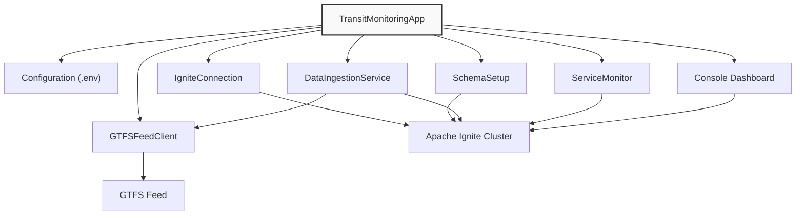

# Putting It All Together and Next Steps

In this final module, we'll orchestrate all the components we've built into a cohesive application and explore how to test, verify, and extend your transit monitoring system. By the end, you'll have a complete, running application and a roadmap for future enhancements.

## The Application Architecture

Before diving into the code, let's review the complete architecture of our transit monitoring system:



This architecture demonstrates several important design principles:

1. **Component Separation**: Each class has a clear, focused responsibility
2. **Clean Integration**: Components interact through well-defined interfaces
3. **Central Coordination**: The main application orchestrates all components
4. **Configuration Management**: External configuration keeps credentials secure
5. **Resource Lifecycle**: Components are properly started and stopped

## Creating the Main Application

The `TransitMonitoringApp` class serves as our application's entry point, bringing together all the components we've developed:

```java
package com.example.transit;

import org.apache.ignite.client.IgniteClient;
import io.github.cdimascio.dotenv.Dotenv;

import java.time.LocalDateTime;
import java.time.format.DateTimeFormatter;
import java.util.Date;
import java.util.Scanner;
import java.util.concurrent.Executors;
import java.util.concurrent.ScheduledExecutorService;
import java.util.concurrent.TimeUnit;
import java.util.List;
import java.util.Map;

/**
 * Main application class that orchestrates all components of the transit monitoring system.
 * This class initializes and manages:
 * - The connection to the Ignite cluster
 * - The database schema
 * - The data ingestion service
 * - The service monitor
 * - The console dashboard
 */
public class TransitMonitoringApp {
    // Configuration options
    private static final int INGESTION_INTERVAL_SECONDS = 30;
    private static final int MONITORING_INTERVAL_SECONDS = 60;
    private static final int DASHBOARD_REFRESH_SECONDS = 10;
    
    // Components
    private final IgniteClient client;
    private final GTFSFeedClient feedClient;
    private final DataIngestionService ingestionService;
    private final ServiceMonitor serviceMonitor;
    private final ScheduledExecutorService dashboardScheduler;
    
    // State tracking
    private boolean isRunning = false;
    private final DateTimeFormatter timeFormatter = DateTimeFormatter.ofPattern("HH:mm:ss");
    
    /**
     * Creates a new transit monitoring application with all required components.
     * 
     * @param feedUrl The URL of the GTFS feed to monitor
     */
    public TransitMonitoringApp(String feedUrl) {
        // Initialize Ignite client
        this.client = IgniteConnection.getClient();
        
        // Initialize GTFS client
        this.feedClient = new GTFSFeedClient(feedUrl);
        
        // Initialize data ingestion service
        this.ingestionService = new DataIngestionService(feedUrl)
            .withBatchSize(100);
            
        // Initialize service monitor
        this.serviceMonitor = new ServiceMonitor();
        
        // Initialize dashboard scheduler
        this.dashboardScheduler = Executors.newSingleThreadScheduledExecutor(r -> {
            Thread t = new Thread(r, "dashboard-thread");
            t.setDaemon(true);
            return t;
        });
    }
    
    /**
     * Starts all components of the transit monitoring system.
     * 
     * @return true if startup was successful, false otherwise
     */
    public boolean start() {
        if (isRunning) {
            System.out.println("Transit monitoring system is already running");
            return true;
        }
        
        try {
            logInfo("Starting Transit Monitoring System");
            
            // Test GTFS connection
            logInfo("Testing GTFS connection...");
            testGtfsConnection();
            
            // Set up schema
            logInfo("Setting up database schema...");
            SchemaSetup schemaSetup = new SchemaSetup();
            boolean schemaCreated = schemaSetup.createSchema();
            
            if (!schemaCreated) {
                logError("Failed to create schema. Aborting startup.");
                return false;
            }
            
            // Start data ingestion
            logInfo("Starting data ingestion service (interval: " + INGESTION_INTERVAL_SECONDS + "s)...");
            ingestionService.start(INGESTION_INTERVAL_SECONDS);
            
            // Start service monitoring
            logInfo("Starting service monitor (interval: " + MONITORING_INTERVAL_SECONDS + "s)...");
            serviceMonitor.startMonitoring(MONITORING_INTERVAL_SECONDS);
            
            // Start dashboard
            logInfo("Starting console dashboard (refresh: " + DASHBOARD_REFRESH_SECONDS + "s)...");
            startConsoleDashboard(DASHBOARD_REFRESH_SECONDS);
            
            isRunning = true;
            logInfo("Transit monitoring system started successfully");
            
            return true;
        } catch (Exception e) {
            logError("Error starting transit monitoring system: " + e.getMessage());
            e.printStackTrace();
            stop();
            return false;
        }
    }
    
    /**
     * Stops all components of the transit monitoring system.
     */
    public void stop() {
        logInfo("Stopping Transit Monitoring System");
        
        // Stop dashboard
        dashboardScheduler.shutdown();
        try {
            if (!dashboardScheduler.awaitTermination(5, TimeUnit.SECONDS)) {
                dashboardScheduler.shutdownNow();
            }
        } catch (InterruptedException e) {
            dashboardScheduler.shutdownNow();
            Thread.currentThread().interrupt();
        }
        
        // Stop service monitor
        serviceMonitor.stopMonitoring();
        
        // Stop ingestion service
        ingestionService.stop();
        
        // Close Ignite connection
        IgniteConnection.close();
        
        isRunning = false;
        logInfo("Transit monitoring system stopped");
    }
    
    /**
     * Tests the connection to the GTFS feed.
     * 
     * @throws Exception if the connection fails
     */
    private void testGtfsConnection() throws Exception {
        try {
            List<VehiclePosition> positions = feedClient.getVehiclePositions();
            logInfo("GTFS connection successful. Found " + positions.size() + " vehicle positions.");
            
            if (!positions.isEmpty()) {
                VehiclePosition sample = positions.get(0);
                logInfo("Sample vehicle: " + sample.getVehicleId() + 
                      " on route " + sample.getRouteId() + 
                      " at (" + sample.getLatitude() + ", " + sample.getLongitude() + ")");
            }
            
        } catch (Exception e) {
            logError("GTFS connection failed: " + e.getMessage());
            throw e;
        }
    }
    
    /**
     * Starts the console dashboard that periodically displays system status.
     * 
     * @param refreshSeconds How often to refresh the dashboard
     */
    private void startConsoleDashboard(int refreshSeconds) {
        dashboardScheduler.scheduleAtFixedRate(() -> {
            try {
                printDashboard();
            } catch (Exception e) {
                logError("Error updating dashboard: " + e.getMessage());
            }
        }, refreshSeconds, refreshSeconds, TimeUnit.SECONDS);
    }
    
    /**
     * Prints the console dashboard with current system status.
     */
    private void printDashboard() {
        System.out.println("\n\n");
        System.out.println("╔══════════════════════════════════════════════════════════════╗");
        System.out.println("║                  TRANSIT MONITORING DASHBOARD                ║");
        System.out.println("╠══════════════════════════════════════════════════════════════╣");
        System.out.println("║ Current time: " + LocalDateTime.now().format(
            DateTimeFormatter.ofPattern("yyyy-MM-dd HH:mm:ss")) + "                      ║");
        System.out.println("╠══════════════════════════════════════════════════════════════╣");
        
        // Display active vehicles by route
        System.out.println("║ ACTIVE VEHICLES BY ROUTE (last 15 minutes)                   ║");
        System.out.println("╠══════════════════════════════════════════════════════════════╣");
        
        try {
            // Query to get vehicle counts by route for active vehicles
            String routeCountSql = 
                "SELECT route_id, COUNT(DISTINCT vehicle_id) as vehicle_count " +
                "FROM vehicle_positions " +
                "WHERE TIMESTAMPDIFF(MINUTE, time_stamp, CURRENT_TIMESTAMP) <= 15 " +
                "GROUP BY route_id " +
                "ORDER BY vehicle_count DESC " +
                "LIMIT 10";
            
            var resultSet = client.sql().execute(null, routeCountSql);
            boolean hasData = false;
            
            while (resultSet.hasNext()) {
                hasData = true;
                var row = resultSet.next();
                String routeId = row.stringValue("route_id");
                int count = (int) row.longValue("vehicle_count");
                System.out.printf("║ Route %-10s: %3d vehicles %33s ║%n", routeId, count, "");
            }
            
            if (!hasData) {
                System.out.println("║ No active vehicles found in the last 15 minutes.           ║");
            }
        } catch (Exception e) {
            System.out.println("║ Error retrieving vehicle counts: " + e.getMessage());
        }
        
        // Display status distribution
        System.out.println("╠══════════════════════════════════════════════════════════════╣");
        System.out.println("║ VEHICLE STATUS DISTRIBUTION                                   ║");
        System.out.println("╠══════════════════════════════════════════════════════════════╣");
        
        try {
            String statusSql = 
                "SELECT current_status, COUNT(*) as status_count " +
                "FROM vehicle_positions " +
                "WHERE TIMESTAMPDIFF(MINUTE, time_stamp, CURRENT_TIMESTAMP) <= 15 " +
                "GROUP BY current_status";
            
            var resultSet = client.sql().execute(null, statusSql);
            boolean hasData = false;
            
            while (resultSet.hasNext()) {
                hasData = true;
                var row = resultSet.next();
                String status = row.stringValue("current_status");
                long count = row.longValue("status_count");
                System.out.printf("║ %-15s: %5d vehicles %33s ║%n", status, count, "");
            }
            
            if (!hasData) {
                System.out.println("║ No status data available.                                   ║");
            }
        } catch (Exception e) {
            System.out.println("║ Error retrieving status distribution: " + e.getMessage());
        }
        
        // Display alerts
        System.out.println("╠══════════════════════════════════════════════════════════════╣");
        System.out.println("║ RECENT SERVICE ALERTS                                         ║");
        System.out.println("╠══════════════════════════════════════════════════════════════╣");
        
        List<ServiceMonitor.ServiceAlert> alerts = serviceMonitor.getRecentAlerts();
        if (alerts.isEmpty()) {
            System.out.println("║ No active alerts.                                             ║");
        } else {
            alerts.stream()
                .limit(5)
                .forEach(alert -> {
                    String message = alert.getMessage();
                    if (message.length() > 60) {
                        message = message.substring(0, 57) + "...";
                    }
                    System.out.printf("║ %-60s ║%n", message);
                });
        }
        
        // Display system stats
        System.out.println("╠══════════════════════════════════════════════════════════════╣");
        System.out.println("║ SYSTEM STATISTICS                                             ║");
        System.out.println("╠══════════════════════════════════════════════════════════════╣");
        
        try {
            // Get total record count
            var countResult = client.sql().execute(null, 
                    "SELECT COUNT(*) as total FROM vehicle_positions");
            
            if (countResult.hasNext()) {
                long totalRecords = countResult.next().longValue("total");
                System.out.printf("║ Total position records: %-38d ║%n", totalRecords);
            }
            
            // Get total unique vehicles
            var vehiclesResult = client.sql().execute(null, 
                    "SELECT COUNT(DISTINCT vehicle_id) as total FROM vehicle_positions");
            
            if (vehiclesResult.hasNext()) {
                long totalVehicles = vehiclesResult.next().longValue("total");
                System.out.printf("║ Total unique vehicles: %-39d ║%n", totalVehicles);
            }
            
            // Get timespan
            var timeResult = client.sql().execute(null, 
                    "SELECT MIN(time_stamp) as oldest, MAX(time_stamp) as newest FROM vehicle_positions");
            
            if (timeResult.hasNext()) {
                var row = timeResult.next();
                LocalDateTime oldest = row.getTimestamp("oldest");
                LocalDateTime newest = row.getTimestamp("newest");
                
                System.out.printf("║ Data timespan: %-46s ║%n", 
                        java.time.Duration.between(oldest, newest).toHours() + " hours");
            }
        } catch (Exception e) {
            System.out.println("║ Error retrieving system statistics: " + e.getMessage());
        }
        
        System.out.println("╚══════════════════════════════════════════════════════════════╝");
    }
    
    /**
     * Logs an informational message with timestamp.
     */
    private void logInfo(String message) {
        System.out.println("[" + LocalDateTime.now().format(timeFormatter) + "] INFO: " + message);
    }
    
    /**
     * Logs an error message with timestamp.
     */
    private void logError(String message) {
        System.err.println("[" + LocalDateTime.now().format(timeFormatter) + "] ERROR: " + message);
    }
    
    /**
     * Main method to run the transit monitoring application.
     */
    public static void main(String[] args) {
        // Load environment variables from .env file
        Dotenv dotenv = Dotenv.configure().ignoreIfMissing().load();
        
        // Retrieve configuration values
        String apiToken = dotenv.get("API_TOKEN");
        String baseUrl = dotenv.get("GTFS_BASE_URL");
        String agency = dotenv.get("GTFS_AGENCY");
        
        // Validate configuration
        if (apiToken == null || baseUrl == null || agency == null) {
            System.err.println("Missing configuration. Please check your .env file.");
            System.err.println("Required variables: API_TOKEN, GTFS_BASE_URL, GTFS_AGENCY");
            return;
        }
        
        // Construct the full feed URL
        String feedUrl = String.format("%s?api_key=%s&agency=%s", baseUrl, apiToken, agency);
        
        // Create and start the application
        TransitMonitoringApp app = new TransitMonitoringApp(feedUrl);
        
        if (app.start()) {
            // Wait for user input to stop
            System.out.println("\n===============================================");
            System.out.println("Transit monitoring system is now running");
            System.out.println("Press ENTER to exit");
            System.out.println("===============================================\n");
            
            try {
                new Scanner(System.in).nextLine();
            } catch (Exception e) {
                // Handle potential Scanner issues
                try {
                    Thread.sleep(60000); // Wait 1 minute if input doesn't work
                } catch (InterruptedException ie) {
                    Thread.currentThread().interrupt();
                }
            }
            
            // Stop the application
            app.stop();
        }
    }
}
```

## Running the Application

To run the complete transit monitoring application:

1. Ensure your Ignite cluster is running (see [Module 2](02-project-setup.md))
2. Configure your `.env` file with the appropriate GTFS feed details
3. Build the project: `mvn clean package`
4. Run the application:

   ```bash
   java -jar target/transit-monitoring-1.0.jar
   ```

When the application starts successfully, you'll see:

- Confirmation messages as each component initializes
- The console dashboard updating every few seconds
- A prompt to press Enter to exit

## Troubleshooting

If you encounter issues with your application, check these common areas:

### Connection Problems

- Verify your Ignite cluster is running with `docker compose ps`
- Check if all nodes are initialized with the CLI's `cluster state` command
- Examine network connectivity between your application and Docker containers

### Data Issues

- Validate your API token for the GTFS feed
- Check for schema errors by examining the database directly
- Verify timezone handling in timestamp conversions

### Runtime Errors

- Look for exceptions in the application logs
- Run individual components separately to isolate issues
- Use the Ignite CLI to verify table structure and data integrity

## A Complete Transit Monitoring System

Congratulations! You've now built a complete transit monitoring system using Apache Ignite 3. Your application:

1. **Connects to real-time transit data** using the GTFS-realtime standard
2. **Stores and processes this data** in a distributed Ignite database
3. **Monitors for service disruptions** using SQL-based analysis
4. **Visualizes system status** through a console dashboard
5. **Manages the complete lifecycle** of all components

This system demonstrates the power of Apache Ignite for real-time data processing and monitoring applications. The architecture patterns you've learned can be applied to many other domains beyond transit monitoring, including IoT systems, financial transaction monitoring, logistics tracking, and more.

Thank you for completing this guide! We hope you've gained a practical understanding of Apache Ignite 3.0's capabilities for real-time data processing and monitoring applications.

Happy coding with Apache Ignite!
